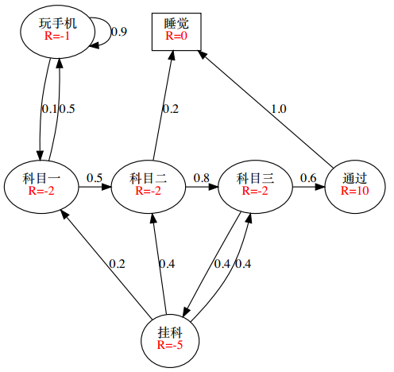
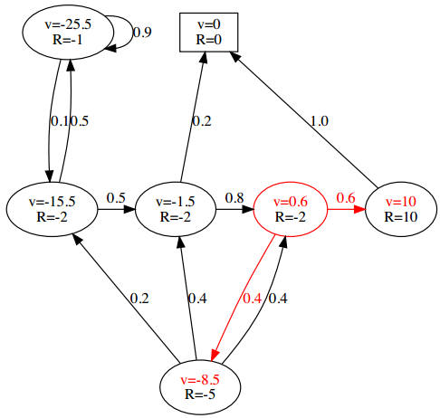
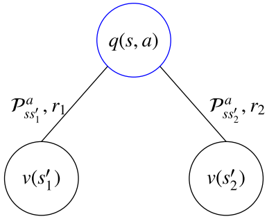
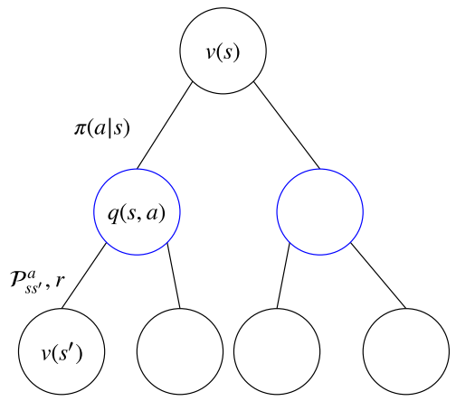
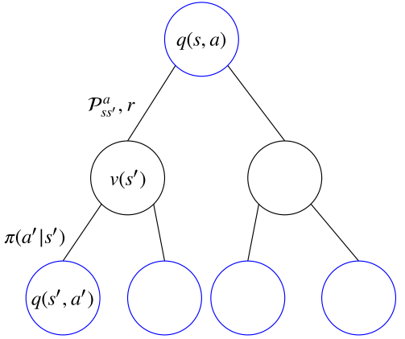
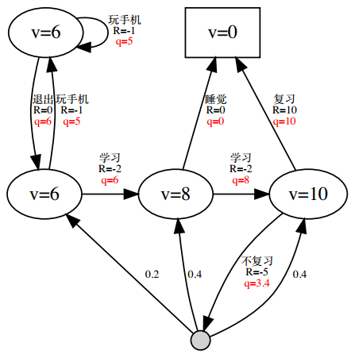
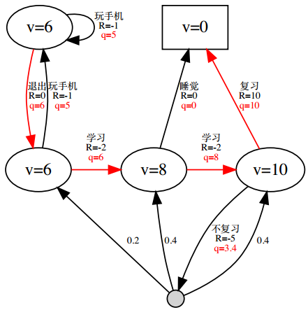
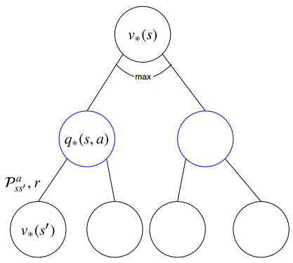
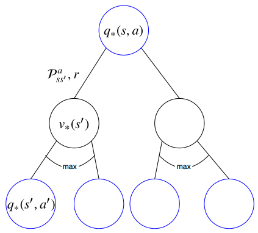

# 马尔科夫决策过程

* [返回上层目录](../reinforcement-learning.md)
* [本章在学习地图中的位置](#本章在学习地图中的位置)
* [马尔科夫决策过程简介](#马尔科夫决策过程简介)
* [符号约定](#符号约定)
* [马尔科夫过程](#马尔科夫过程)
  * [马尔科夫性](#马尔科夫性)
  * [状态转移矩阵](#状态转移矩阵)
  * [状态转移函数](#状态转移函数)
  * [马尔科夫过程](#马尔科夫过程)
  * [片段](#片段)
  * [马尔科夫链的例子](#马尔科夫链的例子)
* [马尔科夫奖励过程](#马尔科夫奖励过程)
  * [马尔科夫奖励过程例子](#马尔科夫奖励过程例子)
  * [回报值](#回报值)
  * [再聊片段](#再聊片段)
  * [再聊衰减值](#再聊衰减值)
  * [值函数](#值函数)
  * [例子：回报值和值函数](#例子：回报值和值函数)
    * [回报值](#回报值)
    * [针对例子的V函数值](#针对例子的V函数值)
  * [MRPs中的贝尔曼方程](#MRPs中的贝尔曼方程)
    * [针对例子的贝尔曼方程](#针对例子的贝尔曼方程)
    * [贝尔曼方程的矩阵形式](#贝尔曼方程的矩阵形式)
* [马尔科夫决策过程](#马尔科夫决策过程)
  * [马尔科夫决策过程的定义](#马尔科夫决策过程的定义)
    * [MDPs例子](#MDPs例子)
  * [策略](#策略)
  * [MDPs和MRPs之间的关系](#MDPs和MRPs之间的关系)
  * [MDPs中的值函数](#MDPs中的值函数)
  * [贝尔曼期望方程](#贝尔曼期望方程)
    * [V函数与Q函数之间的相互转化](#V函数与Q函数之间的相互转化)
    * [贝尔曼期望方程—V函数](#贝尔曼期望方程—V函数)
    * [贝尔曼期望方程—Q函数](#贝尔曼期望方程—Q函数)
    * [贝尔曼期望方程例子](#贝尔曼期望方程例子)
    * [贝尔曼期望方程的矩阵形式](#贝尔曼期望方程的矩阵形式)
  * [最优值函数](#最优值函数)
    * [最优V函数](#最优V函数)
    * [最优Q函数](#最优Q函数)
  * [最优策略](#最优策略)
    * [最优策略定理](#最优策略定理)
    * [怎么得到最优策略](#怎么得到最优策略)
    * [最优策略例子](#最优策略例子)
  * [v\*与q\*的相互转化](#v\*与q\*的相互转化)
  * [贝尔曼最优方程](#贝尔曼最优方程)
    * [最优V函数](#最优V函数)
    * [最优Q函数](#最优Q函数)
    * [和贝尔曼期望方程的关系](#和贝尔曼期望方程的关系)
    * [解贝尔曼最优方程](#解贝尔曼最优方程)
* [MDPs的扩展](#MDPs的扩展)
  * [无穷或连续MDPs](#无穷或连续MDPs)
  * [部分可观测MDPs](#部分可观测MDPs)
  * [无衰减MDPs](#无衰减MDPs)

# 本章在学习地图中的位置

马尔科夫决策过程是强化学习的数学基础，也是将强化学习从直观定义到数学定义的一个桥梁。

# 马尔科夫决策过程简介

* **马尔科夫决策过程（Markov Decision Process, MDPs）**是对强化学习问题的**数学描述**。
* 要求环境是全观测的。（原因后述）
* 几乎所有的RL问题都能用MDPs来描述
  * 最优控制问题可以描述成**连续MDPs**
  * 部分观测问题可以转化成POMDPs
  * 赌博机问题是只有**一个状态**的MDPs

注：虽然大部分RL问题都可以转化成MDPs，但是在我写的笔记中所描述的MDPs是在全观测的情况下。

# 符号约定

* 用大写字母表示随机变量：$S,A,R$
  
* 用小写字母表示某一个具体的值：$s,a,r$
  
* 用空心字母表示统计运算符：$\mathbb{E,P}$
  
* 用花体字母表示集合或函数：$\cal{S,A,P}$

# 马尔科夫过程

## 马尔科夫性

只要知道**现在**，将来和过去是条件独立的。

定义：

如果在$t$时刻的状态$S_t$满足如下等式，那么这个状态被称为马尔科夫状态，或者说该状态满足马尔科夫性：
$$
\mathbb{P}[S_{t+1}|S_t]=\mathbb{P}[S_{t+1}|S_1,...,S_t]
$$

* 状态$S_t$包含了所有历史**相关**信息（注：这里的相关指与问题相关，可能有一些问题无关的信息没有在$S_t$中）
* 或者说历史的所有状态的相关信息都在当前状态$S_t$上体现出来
* 一旦$S_t$知道了，那么$S_1,S_2,...,S_{t-1}$都可以被抛弃
* 数学上可以认为：状态是将来的充分统计量
* 因此，这里要求环境全观测（马尔科夫性与状态的定义息息相关，比如打砖块，就要求状态是当前画面帧和上一次的画面帧，不然得不到砖块下落速度）
* 例子
  * 下棋时，只用关心当前局面
  * 打俄罗斯方块时，只用关心屏幕
* 有了马尔科夫状态之后
  * 定义状态转移矩阵
  * 忽略时间的影响

## 状态转移矩阵

定义：状态转移概率指从一个马尔科夫状态$s$跳转到后继状态（successor state）$s'$的概率

$$
{P}_{ss'}=\mathbb{P}[S_{t+1}=s'|S_t=s]
$$
所有的状态组成行，所有的后继状态组成列，我们得到状态转移矩阵
$$
\begin{aligned}
\cal{P}=
\begin{bmatrix}
{P}_{11} & ... & {P}_{1n}\\ 
\vdots & \ddots & \vdots\\
{P}_{n1} & ... & {P}_{nn}\\ 
\end{bmatrix}
\end{aligned}
$$

* $n$表示状态的个数
* 由于$\cal{P}$代表了整个状态转移的集合，所以用花体
* 每行元素相加等于1

## 状态转移函数

我们也可以将状态转移概率写成函数的形式
$$
{P}_{ss'}=\mathbb{P}[S_{t+1}=s'|S_t=s]
$$

* 状态转移概率到下一各状态的和为1，即$\sum_{s'}\mathbb{P}(s'|s)=1$
  
* 状态数量太多或者是无穷大（连续状态）时，更适合使用状态转移函数，此时$\int_{s'}\mathbb{P}(s'|s)=1$

## 马尔科夫过程

一个马尔科夫过程（Markov process， MP）是一个无记忆的随机过程，即一些马尔科夫状态的序列

定义：马尔科夫过程可以由一个二元组来定义$<S,P>$

* $S$代表了状态的集合

* $P$代表了状态转移概率矩阵${P}_{ss'}=\mathbb{P}[S_{t+1}=s'|S_t=s]$

注：虽然我们有时候并不知道$P$的具体值，但是通常我们假设$P$是存在且稳定的

注：当$P$不稳定时，是不稳定环境，需要在线学习，快速学习

**马尔科夫过程的例子**：

* 一个学生每天需要学习三个科目，然后通过测验
* 不过也有可能只学完两个科目之后直接睡觉
* 一旦挂科，有可能需要重新学习某些科目
* 用椭圆表示普通状态，每一条线上的数字表示从一个状态跳转到另一个状态的概率
* 方块表示终止（terminal）状态
* 终止状态的定义有两种：
  * 时间终止
  * 状态终止

由于马尔科夫过程可以用图中的方块和线条组成，所以可以称马尔科夫过程为**马尔科夫链（MDPs chain）**

## 片段

定义：强化学习中，从**初始**状态$S_1$到终止状态的序列过程，被称为一个片段（episode）

$$
S_1,S_2,...,S_T
$$

* 如果一个任务总以终止状态结束，那么这个任务被称为**片段**（episodic task）
* 如果一个任务会没有终止状态，会被无限执行下去，这被称为**连续性任务**（continuing task）

## 马尔科夫链的例子

**片段**：

假设初始状态是“科目一”，从这个马尔科夫链中，我们可能采样到如下的片段

* “科目一”，“科目二”，“睡觉”
* “科目一”，“科目二”，“科目三”，“通过”，“睡觉”
* “科目一”，“玩手机”，“玩手机”，... ，“玩手机”，“科目一”，“科目二”，“睡觉”
* “科目一”，“科目二”，“科目三”，“挂科”，“科目二”，“科目三”，“挂科”，“科目一”，“科目二”，“科目三”，“挂科”，“科目三”，“通过”，“睡觉”

**转移矩阵**

分别用$s_1$~$s_7$代表“科目一”，“科目二”，“科目三”，“通过”，“挂科”，“玩手机”，“睡觉”
$$
\cal{P}=
\begin{bmatrix}
-& 0.5 & -& -& -& 0.5 & -\\
-& -& 0.8 & -& -& -& 0.2\\
-& -& -& 0.6 & 0.4 & -& -\\
-& -& -& -&- & -& 1.0\\
0.2 & 0.4 & 0.4 & -& -& -& -\\
0.1 & -& -& -& -& 0.9 & -\\
-& -& -& -&- & -& 1.0\\
\end{bmatrix}
$$

# 马尔科夫奖励过程

接下来我们在马尔科夫过程中加一个强化学习中三大交互学习组成中最重要的一个：奖励，这也是强化学习和其他机器学习问题中比较大的一个区别。

马尔科夫过程主要描述的是状态之间的转移关系，在这个转移关系上赋予不同的奖励值即得到了马尔科夫**奖励**过程。

定义：马尔科夫奖励过程（Markov Reward Process，MRP）过程由一个四元组组成$<S,P,R,\gamma>$

* $S$代表了状态的集合

* $P$描述了状态转移矩阵

  ${P}_{ss'}=\mathbb{P}[S_{t+1}=s'|S_t=s]$

* **$R$表示奖励函数，$R(s)$描述了在状态$s$的奖励**

  ${R}(s)=\mathbb{E}[R_{t+1}|S_t=s]$

  很多听众纠结为什么奖励是t+1时刻的。照此理解起来相当于离开这个状态才能获得奖励而不是进入这个状态即获得奖励。David指出这仅是一个约定，为了在描述RL问题中涉及到的观测$O$、行为$A$、和奖励$R$时比较方便。他同时指出如果把奖励改为$R_t$而不是$R_{t+1}$，只要规定好，本质上意义是相同的，在表述上可以把奖励描述为“当进入某个状态会获得相应的奖励”。

* $\gamma$表示衰减引子$\gamma\in [0,1]$

## 马尔科夫奖励过程例子

## 回报值

* 奖励值：对每一个**状态**的评价
* 回报值：对每一个**片段**的评价

定义：

回报值（return $G_t$）是从时间$t$处开始的累计衰减奖励。

* 对于片段性任务：
  
  $
  \begin{aligned}
  G_t&=R_{t+1}+\gamma R_{t+2}+...+\gamma^{T-t-1}R_T\\
  &=\sum_{k=0}^{T-t-1}\gamma^kR_{t+k+1}
  \end{aligned}
$
  
* 对于连续性任务：
  
  $
  \begin{aligned}
  G_t&=R_{t+1}+\gamma R_{t+2}+\gamma^2R_{t+3}+...\\
  &=\sum_{k=0}^{\infty}\gamma^kR_{t+k+1}
  \end{aligned}
  $

## 再聊片段

* 终止状态等价于自身转移概率为1，奖励为0的状态

* 因此我们能够将片段性任务和连续性任务统一表达：
  
  $G_t=\sum_{k=0}^{T-t-1}\gamma^kR_{t+k+1}$
  
  这里当$T=\infin$时，表示连续性任务，否则即为片段性任务。

## 再聊衰减值

为什么我们要使用这样的衰减指数值？

* 直观感觉
  * 影响未来的因素不仅仅包含当前
  * 我们对未来的把握也是逐渐衰减的
  * 一般情况下，我们更关注短时间的反馈
* 数学便利
  * 一个参数就描述了整个衰减过程，只需要调节这一个参数$\gamma$就可以来调节长时奖励和短时奖励的权衡（trade-off）
  * 指数衰减形式又很容易进行数学分析
  * 指数衰减是对回报值的有界保证，避免了循环MRP和连续性MRP情况下回报值变成无穷大

注：在一些特殊情况，也可以使用$\gamma=1$的回报值

## 值函数

为什么要值函数？

* 回报值是一次片段的结果，存在很大的样本偏差
* 回报值的脚标是$t$，值函数关注的是状态$s$

值函数定义：

一个马尔科夫奖励过程MRP的值函数定义如下：
$$
v(s)=\mathbb{E}[G_t|S_t=s]
$$
也是就是从这个状态出发的所有片段的回报值的按照概率加权的平均值（即期望值）。

* 这里的值函数针对的是状态$s$，所以称为**状态值函数**，又称$V$函数
* $G_t$是一个随机变量
* 这里使用小写的$v$函数，代表了真实存在的值函数

## 例子：回报值和值函数

### 回报值

针对初始状态$S_1$=“科目一”，且$\gamma=0.5$计算不同片段的回报值

* "科目一"，“科目二”，“睡觉”
  
  $
  \begin{aligned}
  g_1&=(-2)+0.5\times (-2)+0.5^2\times (0)\\
  &=-3
  \end{aligned}
$
  
* "科目一"，“科目二”，“科目三”，“通过”，“睡觉”
  
  $
  \begin{aligned}
  g_1&=(-2)+0.5\times (-2)+0.5^2\times (-2)+0.5^3\times (10)+0.5^4\times (0)\\
  &=-2.25
  \end{aligned}
$
  
* "科目一"，“玩手机”，“玩手机”，“玩手机”，"科目一"，“科目二”，“睡觉”
  
  $
  \begin{aligned}
  g_1=&(-2)+0.5\times (-1)+0.5^2\times (-1)+0.5^3\times (-1)\\
  &+0.5^4\times (-2)+0.5^5\times (-2)+0.5^6\times (0)\\
  =&-3.0625
  \end{aligned}
$
  
* "科目一"，“科目二”，“科目三”，“挂科”，“科目二”，“科目三”，“挂科”，"科目一"，“科目二”，“科目三”，“挂科”，“科目三”，“通过”，“睡觉”
  
  $
  \begin{aligned}
  g_1&=(-2)+0.5\times (-2)+0.5^2\times (-2)+...\\
  &=-4.4214...
  \end{aligned}
  $

**虽然都是从相同的初始状态开始，但是不同的片段有不同的回报值，而值函数是它们的期望值。**

### 针对例子的V函数值

当$\gamma=0$时

当$\gamma=1$时

## MRPs中的贝尔曼方程

值函数的表达式可以分解成两部分

* 瞬时奖励$R_{t+1}$

* 后继状态$S_{t+1}$的值函数乘上一个衰减系数

  $\begin{aligned}
  v(s)&=\mathbb{E}[G_t|S_t=s]\\
  &=\mathbb{E}[R_{t+1}+\gamma R_{t+2}+\gamma^2R_{t+3}+...|S_t=s]\\
  &=\mathbb{E}[R_{t+1}+\gamma (R_{t+2}+\gamma R_{t+3}+...)|S_t=s]\\
  &=\mathbb{E}[R_{t+1}+\gamma G_{t+1}|S_t=s]\\
  &=\mathbb{E}[R_{t+1}+\gamma v(S_{t+1})|S_t=s]\\
  \end{aligned}$

* 体现了$v(s)$与$v(S_{t+1})$之间的迭代关系
* 这是强化学习中的理论核心之一
* 注意$s$小写，$S_{t+1}$大写

如果我们已知转移矩阵$P$，那么
$$
\begin{aligned}
v(s)&=\mathbb{E}[R_{t+1}+\gamma v(S_{t+1})|S_t=s]\\
&=\mathbb{E}[R_{t+1}|S_t=s]+\gamma\mathbb{E}[v(S_{t+1})|S_t=s]\\
&={R}(s)+\gamma\sum_{s'\in S}{P}_{ss'}v(s')
\end{aligned}
$$

图中我们可以用$v(s_1), v(s_2), v(s_3)$去计算$v(s_0)$。

### 针对例子的贝尔曼方程

当$\gamma=1$时，我们来看下一状态可能性最多的“科目三”状态：
$$
0.6=(-2)+1.0\times[0.6\times 10+0.4\times(-8.5)]
$$

### 贝尔曼方程的矩阵形式

使用矩阵-向量的形式表达贝尔曼方程，即
$$
v={R}+\gamma{P}v
$$
假设状态集合为
$$
{S}={s_1,s_2,...,s_n}
$$
，那么
$$
\begin{aligned}
\begin{bmatrix}
v(s_1)\\
\vdots\\
v(s_n)\\
\end{bmatrix}
=
\begin{bmatrix}
{R}(s_1)\\
\vdots\\
{R}(s_n)\\
\end{bmatrix}
+
\gamma
\begin{bmatrix}
{P}_{11} & ... & {P}_{1n}\\ 
\vdots & \ddots & \vdots\\
{P}_{n1} & ... & {P}_{nn}\\ 
\end{bmatrix}
\end{aligned}
\begin{bmatrix}
v(s_1)\\
\vdots\\
v(s_n)\\
\end{bmatrix}
$$
贝尔曼方程本质上是一个线性方程，可以直接解
$$
\begin{aligned}
v&={R}+\gamma{P}v\\
(1-\gamma{P})v&={R}\\
v&=(1-\gamma{P})^{-1}{R}
\end{aligned}
$$

* 计算复杂度$O(n^3)$

* 要求已知状态转移矩阵$P$

* 直接求解的方式仅限于小的MRPs

* 大规模MRP的求解通常使用迭代法。常用的迭代方法有：

  * 动态规划Dynamic Programming、
  * 蒙特卡洛评估Monte-Carlo evaluation、
  * 时序差分学习Temporal-Difference，

  后文会逐步讲解这些方法。

# 马尔科夫决策过程

## 马尔科夫决策过程的定义

**与马尔科夫过程MP和马尔科夫奖励过程MRP的区别：**

* MP和MRP中，我们都是作为观察者，去观察其中的状态转移现象，去计算回报值。
* 对于一个RL问题，我们更希望去**改变**状态转移的流程，去**最大化**回报值。
* 通过在MRP中引入决策，即得到了**马尔科夫决策过程（Markov Decision Process，MDPs）**

**马尔科夫决策过程的定义**

一个马尔科夫决策过程（MDPs）由一个五元组构成
$$
<{S,A,P,R,\gamma}>
$$

* $S$代表了状态的集合

* $A$代表了**动作**的集合

* $P$描述了状态转移矩阵
  
  ${P}_{ss'}^a=\mathbb{P}[S_{t+1}=s'|S_t=s,A_t=a]$
  
* $R$表示奖励函数，$R(s,a)$描述了在状态$s$**做动作$a$**的奖励
  
  ${R}(s,a)=\mathbb{E}[R_{t+1}|S_t=s,A_t=a]$
  
* $\gamma$表示衰减引子，$\gamma\in [0,1]$

### MDPs例子

* 针对状态的奖励变成了针对$<s, a>$的奖励
* 能通过动作进行控制的状态转移，由原来的状态转移概率特换成了动作
* MDP只关注那些可以做出决策的动作
* 被动的状态转移关系被压缩成一个状态
  * “被动”指无论做任何动作，状态都会发生跳转。这样的状态不属于MDPs中考虑的状态
  * 原图中，由于“通过”后一定会去“睡觉”，因此进行了压缩
  * 原图中，“挂科”后的跳转不受控制

注：图中除了在“科目三”的状态上执行“不复习”动作外，其他的所有状态跳转都是不确定性的，我们通过在不同的状态上执行不同的动作，即可实现不同的状态跳转。

## 策略

我们将之前的MRPs中的状态转移矩阵分成了两个部分

* 能被智能体控制的**策略，Policy**
* MDPs中的转移矩阵$P$（不受智能体控制，认为是环境的一部分）

策略的定义：在MDPs中，一个策略（Policy）$\pi$是给定状态下的动作的概率分布

$$
\pi(a|s)=\mathbb{P}[A_t=a|S_t=s]
$$
策略的特点

* 策略是对智能体行为的全部描述
* MDPs中的策略是基于马尔科夫状态的（而不是基于历史）
* 策略是时间稳定的，只与状态$s$有关，与时间$t$无关
* **策略是RL问题的终极目标**
* 如果策略的概率分布输出都是**独热的**（one-hot）的，那么称为确定性策略，否则即为随机性策略

## MDPs和MRPs之间的关系

对于一个MDP问题$<S,A,P,R,\gamma>$，如果给定了策略$\pi$

* MDP将会退化成MRP，$<{S},{P}^{\pi},{R}^{\pi},\gamma>$
  
* 此时
  
  $\begin{aligned}
  {P}_{ss'}^{\pi}&=\sum_{a\in {A}}\pi(a|s){P}_{ss'}^a\\
  {R}_s^{\pi}&=\sum_{a\in {A}}\pi(a|s){R}_{s}^a
  \end{aligned}$

注：注意由于策略$\pi$代表：1，一个动作；2，一个动作分布，所以有时候，$\pi$和$a$会存在一定的混淆。

## MDPs中的值函数

在MDPs问题中，由于动作的引入，值函数分为了两种：

1. 状态值函数（$V$函数）
2. 状态动作值函数（$Q$函数）

定义：MDPs中的**状态值函数**是从状态$s$开始，使用策略$\pi$得到的期望回报值

$$
v_{\pi}(s)=\mathbb{E}_{\pi}[G_t|S_t=s]
$$
定义：MDPs中的**状态动作值函数**是从状态$s$开始，执行动作$a$，然后对接下来的状态使用策略$\pi$得到的期望回报值

$$
q_{\pi}(s,a)=\mathbb{E}_{\pi}[G_t|S_t=s,A_t=a]
$$
这个怎么理解呢？

假设一条马尔可夫链为$s_1, a_1, s_2, a_2, s_3, a_3...$

$q(s, a)$表示初始状态和初始动作确定了$s=s_1$, $a=a_1$，之后的动作$a_2, a_3, ...$都是来自策略$\pi$的：$a_2, a_3, ...$服从$\pi$

也就是与下式是等价的：

给定当前状态$s$和当前动作$a$，在未来遵循策略$\pi$，那么系统将以概率$p(s'|s,a)$转向下个状态$s'$，上式可以重写为：
$$
Q^{\pi}(s,a)=\sum_{s'\in S}P(s'|s,a)[R(s'|s,a)+\gamma V^{\pi}(s')]
$$
注：在MDPs中，任何不说明策略$\pi$的情况下，讨论值函数都是在耍流氓！

## 贝尔曼期望方程

和MRP相似，MDPs中的值函数也能分为瞬时奖励和后继状态的值函数两部分
$$
\begin{aligned}
v_{\pi}(s)&=\mathbb{E}_{\pi}[R_{t+1}+\gamma v_{\pi}(S_{t+1})|S_t=s]\\
q_{\pi}(s,a)&=\mathbb{E}_{\pi}[R_{t+1}+\gamma q_{\pi}(S_{t+1},A_{t+1})|S_t=s,A_t=a]\\
\end{aligned}
$$
例子：

* 当对于所有的s和a，都有π(a|s)=0.5时，v_π(s)如上图
* 将图中的圆圈状态从上到下从左到右
  分别记为s1,s2,s3,s4，将终止状态记
  为s5，则对于所有的s和a，当π(a|s)=0.5时，状态转移矩阵为 

$$
{P}=
\begin{bmatrix}
0.5 & 0.5 & -& -& -\\
0.5 & -& 0.5 & -& -\\
-& -& -& 0.5 & 0.5 \\
-& 0.1 & 0.2 & 0.2 & 0.5 \\
- & - & - & -& 1\\
\end{bmatrix}
$$

### V函数与Q函数之间的相互转化

$$
v_{\pi}(s)=\sum_{a\in {A}}\pi(a|s)q_{\pi}(s,a)
$$
注：本质上是全概率公式

$$
q_{\pi}(s,a)={R}(s,a)+\gamma\sum_{s'\in S}{P}_{ss'}^av_{\pi}(s')
$$

### 贝尔曼期望方程—V函数

$$
\begin{aligned}
v_{\pi}(s)&=\sum_{a\in{A}}\pi(a|s)q_{\pi}(s,a)\\
&=\sum_{a\in {A}}\pi(a|s)\left({R}(s,a)+\gamma\sum_{s'\in S}{P}_{ss'}^av_{\pi}(s')\right)
\end{aligned}
$$
实际上等价于
$$
v_{\pi}(s)=\mathbb{E}_{\pi}[R_{t+1}+\gamma v_{\pi}(S_{t+1})|S_t=s]
$$
为什么？分别带进去就好了

### 贝尔曼期望方程—Q函数

$$
q_{\pi}(s,a)={R}(s,a)+\gamma\sum_{ss'}^a\sum_{a'\in{A}}\pi(a'|s')q_{\pi}(s',a')
$$
实际上等价于
$$
q_{\pi}(s,a)=\mathbb{E}[R_{t+1}+\gamma q_{\pi}(S_{t+1},A_{t+1})|S_t=s,A_t=a]
$$
，为什么？

### 贝尔曼期望方程例子

当γ=1，π(a|s)=0.5时
$$
2.8=0.5\times (10+0)+0.5\times (-5+0.2\times(-3.6)+0.4\times 0.4+0.4\times 2.8)
$$

### 贝尔曼期望方程的矩阵形式

MDPs下的贝尔曼期望方程和MRP的形式相同。
$$
v_{\pi}={R}^T+\gamma{P}^{\pi}v_{\pi}
$$
同样地，可以直接求解
$$
v_{\pi}=(I-\gamma{P}^{\pi})^{-1}{R}^{\pi}
$$
求解的要求：

* 已知π(a|s)
* 已知P(s'|s,a)

## 最优值函数

之前值函数，以及贝尔曼期望方程针对的都是给定策略π的情况，是一个**评价**的问题。

现在我们来考虑强化学习中的**优化**问题，即找出最好的策略。

定义：

最优值函数指的是在所有策略中的值函数最大值，其中包括最优V函数和最优Q函数
$$
\begin{aligned}
v_*(s)&=\mathop{\text{max}}_{\pi}\ v_{\pi}(s)\\
q_*(s,a)&=\mathop{\text{max}}_{\pi}\ q_{\pi}(s,a)
\end{aligned}
$$

* 最优值函数指的是一个MDP中所能达到的最佳性能
* 如果我们找到最优值函数，即相当于这个MDP已经解决了

### 最优V函数

当γ=1时的最优V函数v*(s)

### 最优Q函数

当γ=1时的最优Q函数q*(s,a)

## 最优策略

为了比较不同策略的好坏，我们首先应该定义策略的比较关系
$$
\pi\geq\pi'\quad\text{if}\quad v_{\pi}(s)\geq v_{\pi'}(s),\ \forall s
$$

### 最优策略定理

对于任何MDPs问题

* 总**存在**一个策略π*，要好于或等于其他所有的策略，π\*>π，∀π

* **所有**的最优策略都能够实现最优的V函数
  $
  v_{\pi*}(s)=v_*(s)
  $

* **所有**的最优策略都能够实现最优的Q函数
  $
  q_{\pi*}(s,a)=q_*(s,a)
  $

注：具体证明参考[《Total Expected Discounted Reward MDPs: Existence of Optimal Policies 》](http://www.ams.sunysb.edu/~feinberg/public/enc_dis.pdf)

### 怎么得到最优策略

我们已知了最优Q函数之后，我们能够马上求出最优策略，只要根据q*(s,a)选择相应的动作即可。
$$
\begin{aligned}
\pi_*(a|s)=
\left\{\begin{matrix}
&1\quad&\text{if  a = arg }\mathop{\text{max}}_{a\in A}q_*(s,a)\\ 
&0\quad&\text{otherwise}
\end{matrix}\right.
\end{aligned}
$$

* 可以看出对于任何MDPs问题，总存在一个确定性的最优策略
* 如果已知最优V函数，能不能找到最优策略呢？

### 最优策略例子

当γ=1时的最优策略π*(a|s)

## v\*与q\*的相互转化

* 之前我们已经讨论了vπ(s)和qπ(s,a)之前的关系——贝尔曼期望方程
* 同样地，v\*(s)和q\*(s,a)也存在着递归的关系——贝尔曼**最优**方程

**v->q：**

$$
v_*(s)=\mathop{\text{max}}_a\ q_*(s,a)
$$
和贝尔曼期望方程的关系：
$$
v_*(s)=v_{\pi*}(s)=\sum_{a\in A}\pi_*(a|s)q_{\pi}(s,a)=\mathop{\text{max}}_a\ q_{\pi*}(s,a)
$$
上式很好理解，因为最优动作对应的概率为1嘛。

**q->v：**

$$
q_*(s,a)=R(s,a)+\gamma\sum_{s'\in S}P_{ss'}^av_*(s')
$$

## 贝尔曼最优方程

### 最优V函数

$$
v_*(s)=\mathop{\text{max}}_a[R(s,a)+\gamma\sum_{s'\in S}P_{ss'}^av_*(s')]
$$

### 最优Q函数

$$
q_*(s,a)=R(s,a)+\gamma\sum_{s'\in S}P_{ss'}^a\ \mathop{\text{max}}_{a'}\ q_*(s',a')
$$

### 和贝尔曼期望方程的关系

* 贝尔曼最优方程本质上就是利用了π*的特点，将求期望的算子转化成了max_a
* 在贝尔曼期望方程中，π是已知的。而贝尔曼最优方程中，π*是未知的。
* 解贝尔曼期望方程的过程即对应了**评价**，解贝尔曼最优方程的过程即对应了**优化**。

### 解贝尔曼最优方程

* 贝尔曼最优方程不是线性的
* 一般很难有闭式的解
* 可以使用迭代优化的方法去解
  * 值迭代
  * 策略迭代
  * Q学习
  * SARSA
  * ...

# MDPs的扩展

* 无穷或连续MDPs
* 部分可观测MDPs（Partially observable MDPs, POMDPs）
* 无衰减MDPs

## 无穷或连续MDPs

* 动作空间或状态空间无限可数
* 动作空间或状态空间无限不可数 (连续)
* 时间连续 

## 部分可观测MDPs

* 此时观测不等于状态Ot≠St

* POMDPs由七元组成
  $
  <S,A,O,P,R,Z,\gamma>
  $

* 其中**Z**是观测函数
  $
  Z_{s'o}^a=\mathbb{P}[O_{t+1}=o|S_{t+1}=s',A_t=a]
  $

* 观测不满足马尔科夫性，因此也不满足贝尔曼方程

* 状态未知，隐马尔科夫过程

* 有时对于POMDPs来说，最优的策略是随机性的

## 无衰减MDPs

* 用于各态历经马尔科夫决策过程
  * 各态历经性：平稳随机过程的一种特性
* 存在独立于状态的平均奖赏ρ^π
* 求值函数时，需要减去该平均奖赏，否则有可能奖赏爆炸

# 参考文献

* [《强化学习理论与实践》第二章：马尔科夫决策过程](http://www.shenlanxueyuan.com/my/course/96)

本章内容是该课程这节课的笔记。

===

* [《强化学习》第二讲 马尔科夫决策过程](https://zhuanlan.zhihu.com/p/28084942)

