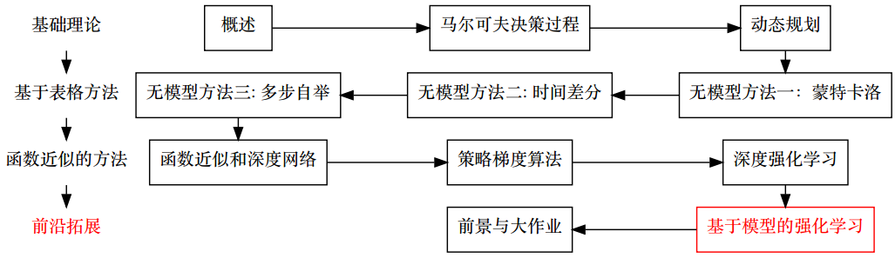
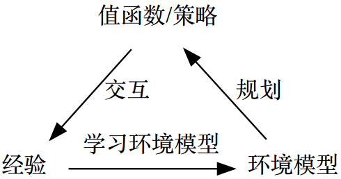
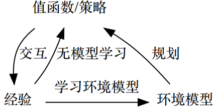
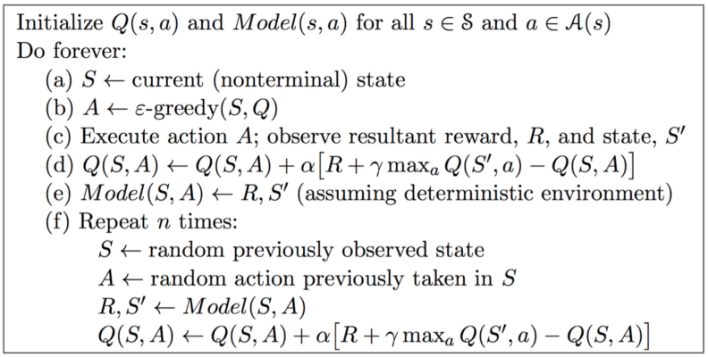
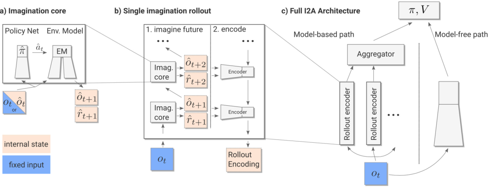
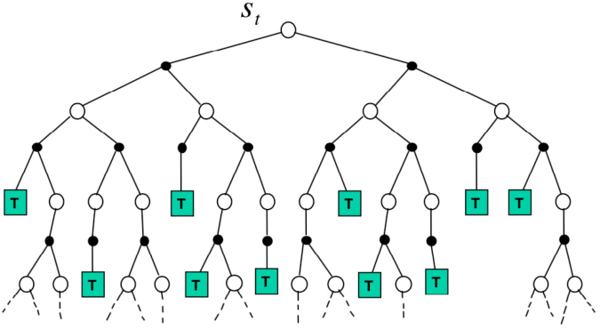
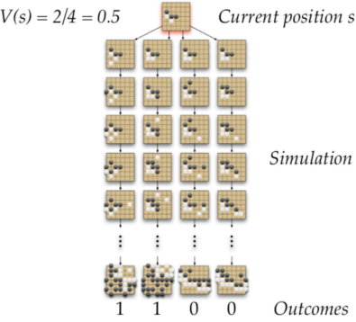
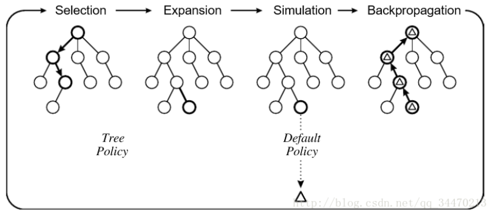

# 基于模型的强化学习

* [返回上层目录](../reinforcement-learning.md)
* [本章在学习地图中的位置](#本章在学习地图中的位置)
* [本章简介](#本章简介)
  * [学习与规划](#学习与规划)
  * [基于模型的强化学习](#基于模型的强化学习)
  * [无模型RL和基于模型的RL](#无模型RL和基于模型的RL)
* [基于模型的强化学习详述](#基于模型的强化学习详述)
  * [优势和劣势](#优势和劣势)
  * [什么是环境模型](#什么是环境模型)
  * [模型学习](#模型学习)
  * [模型的例子](#模型的例子)
  * [查表模型](#查表模型)
  * [根据模型规划](#根据模型规划)
  * [基于样本的规划](#基于样本的规划)
  * [使用不精确的模型规划](#使用不精确的模型规划)
* [整合无模型方法和基于模型的方法](#整合无模型方法和基于模型的方法)
  * [真实的和仿真的经验](#真实的和仿真的经验)
  * [整合学习和规划](#整合学习和规划)
  * [Dyna的结构图](#Dyna的结构图)
  * [Dyna-q的算法](#Dyna-q的算法)
  * [一个深度强化学习的例子](#一个深度强化学习的例子)
* [基于仿真的搜索](#基于仿真的搜索)
  * [仿真与环境模型](#仿真与环境模型)
  * [前向搜索（搜索树）](#前向搜索（搜索树）)
  * [基于仿真的搜索详述](#基于仿真的搜索详述)
  * [简单蒙特卡洛搜索](#简单蒙特卡洛搜索)
  * [蒙特卡洛树搜索（评价）](#蒙特卡洛树搜索（评价）)
  * [蒙特卡洛树搜索（仿真）](#蒙特卡洛树搜索（仿真）)
  * [例子：围棋](#例子：围棋)
  * [使用蒙特卡洛树搜索（MCTS）](#使用蒙特卡洛树搜索（MCTS）)
  * [蒙特卡洛树搜索（MCTS）](#蒙特卡洛树搜索（MCTS）)
  * [蒙特卡洛树搜索（MCTS）的优势](#蒙特卡洛树搜索（MCTS）的优势)
  * [时间差分（TD）树搜索](#时间差分（TD）树搜索)

# 本章在学习地图中的位置

其实本来截止到上一讲就结束了，本节和下节课是拓展。基于模型的强化学习作为强化学习的补充。

无模型是指在马尔科夫转移过程中，我们并不知道状态转移函数和奖励函数，所以说会通过采样的方式去获得。在动态规划这一节我们知道，如果已知状态转移函数和奖励函数，是不需要和环境发生交互的，直接使用动态规划的算法就可以得到。

基于模型的强化学习**将动态规划和无模型方法进行整合**，就类似于多步自举是时间差分和蒙特卡洛的整合一样。

为什么要讲基于模型的强化学习？

* 基于模型的强化学习是和我们之前讲的内容的并行的分支
* Alpha-GO用的最核心算法其实是基于模型的强化学习的一种：蒙特卡洛树搜索。其中也会结合值函数和策略梯度等。

# 本章简介

## 学习与规划

* 学习（Learning）
  * 未知环境模型P,R
  * 智能体与环境交互产生经验
  * 从经验中学习（学习值函数，策略等）
  * 无模型的方法（蒙特卡洛，时间差分等）
* 规划（Planning）
  * 已知环境模型P,R
  * 无需智能体的交互
  * 直接从模型学习
  * 动态规划的方法（DP）
* 相同点
  * 都是根据未来的结果，计算当前的估计

    利用贝尔曼方程

## 基于模型的强化学习

这个图是其中一种：用经验采用监督学习来拟合环境模型，再用环境模型做动态规划。就是先和环境进行交互，拟合出环境模型，后面就无需和环境模型交互了。

## 无模型RL和基于模型的RL

* 无模型RL
  * 没有环境模型
  * 从经验中学习值函数（或者策略）
* 基于模型的RL
  * 从经验中学习一个环境模型
  * 利用环境模型做动态规划，从而计算出值函数或者策略

基于模型的强化学习相当于一个虚拟的环境。

**疑惑**：无模型RL和基于模型的RL感觉没有本质区别呀。。

感觉无模型是用神经网络之类的拟合出一个值函数（Q的分布），而基于模型的LR是拟合出一个环境模型（P和R），而Q是可以根据P和R算出来的，那么他们是否就没有本质区别呢？

唯一的区别好像就是，无模型是动态和环境交互而拟合，而基于模型是用已标注的样本来拟合。

**回答**：

本质上都是做一样的事，都是想求出Q，但是一个是通过了采样去拟合，另一个是通过求出模型之后，用模型来求。都是一样的事，但是求的方法不同而已。

* 我猜你的意思是，反正学模型也需要样本，建立模型加了一道工序却看不到实际有什么好处。（对不？）我觉得好处在于，通过建模，可以大致推测出一些以前没有见过的样本。（请问老师这样理解是否正确？）
* 你说的很有道理。虽然不同的方法目的是一样，但是不同的方法总能达到不同的效果。通过采样一些样本学习出来一个环境模型，是能够通过这个环境模型生成大量的样本的。

# 基于模型的强化学习详述

## 优势和劣势

* 优势
  * 能够通过监督学习有效地学习环境模型
  * 能够利用环境模型有效地学习
  * 减少不精确的值函数带来的影响
  * 直接利用环境模型的不确定性
* 劣势
  * 先学习环境模型，再构建值函数
    * 存在两次近似误差，导致误差累计

## 什么是环境模型

* 环境模型即智能体能够预测环境的返回值

* 环境模型M是一个MDP\<S,A,P,R\>的参数化表达

* 我们假设状态空间S和动作空间A均已知

* 所以一个环境模型M=\<Pη,Rη\>表示状态转移函数Pη≈P和奖励函数Rη≈R
  $
  \begin{aligned}
  S_{t+1}&=P_{\eta}(S_{t+1}|S_t,A_t)\\
  R_{t+1}&=R_{\eta}(R_{t+1}|S_t,A_t)\\
  \end{aligned}
  $

* 特别地，我们假设了状态转移函数和奖励函数的条件独立，即可以解耦
  $
  \mathbb{P}[S_{t+1},R_{t+1}|S_t,A_t]=\mathbb{P}[S_{t+1}|S_t,A_t]\mathbb{P}[R_{t+1}|S_t,A_t]
  $

## 模型学习

* 从经验\{ S1, A1, R2, ..., ST \}估计环境模型Mη

* 这是一个监督学习问题，按如下形式构建样本：
  $
  \begin{aligned}
  S_1,A_1&\rightarrow R_2,S_2\\
  S_2,A_2&\rightarrow R_3,S_3\\
  &...\\
  S_{T-1},A_{T-1}&\rightarrow R_T,S_T\\
  \end{aligned}
  $

* 然后可以建立两个模型：

  * 学习s,a→r是一个回归问题，因为r是一个值
  * 学习s,a→s‘是一个概率分布估计问题，因为s’随机跳转

* 选用的损失函数：MSE（回归），KL距离（分布）

* 通过寻找参数η来最小化损失函数

## 模型的例子

* 查表模型
* 线性期望模型
* 线性高斯模型
* 高斯过程模型
* 神经网络
* 深度神经网络
* … 

## 查表模型

* 统计每个状态动作对出现的次数N(s,a)
  $$
  \begin{aligned}
  \hat{P}^a_{aa'}&=\frac{1}{N(s,a)}\sum_{t=1}^T1(=)\\
  \hat{R}^a_{s}&=\frac{1}{N(s,a)}\sum_{t=1}^T1(=)R_t\\
  \end{aligned}
  $$

另外，我们也可以

* 存储每个时刻的经验
  $
  <S_t, A_t, R_{t+1}, S_{t+1}>
  $

* 采样模型：采样匹配的经验\<s,a, . , .\>

**例子**

采样了8个片段

* A, 0, B, 0
* B, 1
* B, 1
* B, 1
* B, 1
* B, 1
* B, 1
* B, 0 

我们已经通过经验构建了一个表格查找模型

## 根据模型规划

* 给定学好的模型Mη=\<Pη, Rη\>
* 解MDP，\<S, A, Pη, Rη\>
* 使用动态规划算法
  * 值迭代
  * 策略迭代
  * 树搜索
  * ...

## 基于样本的规划

还有一种基于模型的强化学习的方式，并不用动态规划

* 一个简单但是有效的规划方法

* 只用环境模型**仅仅**用来生成大量虚拟样本

* 从模型中**采样**经验
  $
  \begin{aligned}
  S_{t+1}&\sim P_{\eta}(S_{t+1}|S_t,A_t)\\
  R_{t+1}&=R_{\eta}(R_{t+1}|S_t,A_t)\\
  \end{aligned}
  $

* 学习的时候仍然使用无模型的RL，比如

  * 蒙特卡洛优化
  * Sarsa
  * Q学习

* 这个方法效率通常很高

**例子**

* 首先根据真实经验构建表格查找模型
* 然后采样经验，一步一步地采样，不是一次性采样。
* 利用无模型的RL来学习值函数

|    真实经验    |   采样的经验    |
| :--------: | :--------: |
| A, 0, B, 0 |    B, 1    |
|    B, 1    |    B, 0    |
|    B, 1    |    B, 1    |
|    B, 1    | A, 0, B, 1 |
|    B, 1    |    B, 1    |
|    B, 1    | A, 0, B, 1 |
|    B, 1    |    B, 1    |
|    B, 0    |    B, 0    |

如果使用蒙特卡洛学习，可以估计得到 V(A) = 1，V(B) = 0.75。

## 使用不精确的模型规划

实际使用的时候还要考虑到模型不精确的情况，用不精确的模型去学习策略，即更新策略的话，会最终导致永远也找不到最优的策略，只能找到次优的策略。

* 给定一个不精确的模型\<Pη, Rη\>≠\<P, R\>
* 所解出来的最优解仅仅适合于近似的MDP\<S, A, Pη, Rη\>
* 当环境模型不精确时，动态规划只能计算到一个次优的策略
* 解决方法1：当环境模型错误时，使用无模型的RL
* 解决方法2：在求解时考虑到模型的不精确性

# 整合无模型方法和基于模型的方法

## 真实的和仿真的经验

我们考虑两种形式的经验

* **真实的经验**，从环境中真实采样（真实的MDP）
  $
  \begin{aligned}
  S'&\sim P_{ss'}^a\\
  R&=R_s^a\\
  \end{aligned}
  $

* **仿真的经验**，从环境模型中采样（近似的MDP）
  $
  \begin{aligned}
  S'&\sim P_{\eta}(S'|S,A)\\
  R&= R_{\eta}(R|S,A)\\
  \end{aligned}
  $

## 整合学习和规划

* 无模型RL
  * 没有环境模型
  * 从经验中学习值函数（或者策略）
* 基于模型的RL
  * 从经验中学习一个环境模型
  * 利用环境模型做动态规划，从而计算出值函数或者策略
* Dyna（混合的方法）
  * 从经验中学习一个环境模型
  * 同时利用真实的和仿真的经验来学习值函数和策略

## Dyna的结构图

Dyna和之前的基于模型的强化学习的区别是：采的经验不仅会更新环境模型，也会更新值函数。

## Dyna-q的算法

Dyna的Q学习算法：

abcd部分为Q学习，是和真实环境交互，得到真实经验。用真实经验去更新Q函数。

e部分，真实的经验不仅仅用来更新Q函数，也会来更新环境模型。

f部分，用更新后的环境模型重复n次（在等待真实反馈过程中，能做多少次就做多少次n），用环境模型生成一些经验样本，用生成的经验样本去更新Q函数

## 一个深度强化学习的例子

在深度强化学习里怎么把两者进行结合的例子，考虑了如何在不精确环境模型下的基于模型的强化学习。

Imagination-Augmented Agents for Deep Reinforcement Learning

* 混合了无模型的方法和基于模型的方法
* 考虑了环境模型的不精确性

左图就是用环境模型生成一些经验样本，用生成的经验样本去更新Q函数，这里它被称为“想象样本”

想象会有误差，随着想象的步长增加，误差会逐渐累积。不精确模型导致的累积误差会让模型越学越坏。

所以中图用了一个循环神经网络去不断纠正这个误差。具体怎么纠正，可以查看这篇paper。循环神经网络每一时刻都会有一个监督信号，用此监督信号，不断纠正环境模型的误差。

右图中，并没有直接学习环境模型生成的样本，而是两条路线兼顾（基于模型和无模型），兼顾了效率（基于模型）和准确性（无模型，没有累积误差）。

# 基于仿真的搜索

Alpha-GO用的最核心算法其实是基于模型的强化学习的一种：**蒙特卡洛树搜索**。其中也会结合值函数和策略梯度等。

前面大致的讲了基于模型的强化学习的思路。其实基于模型的强化学习是一个很大很大的门派，不仅仅包含上面讲的模型和方法，还有比如像贝叶斯推理啊等等。

而且，基于模型的强化学习里的**最大的特点就是，能把人为先验融入模型**。在解决问题的时候，无模型的方法讲究的是，不管问题是什么，只要让我和环境交互，然后给我奖励，我就能做。通用性很好，但是实际解决问题的效果不那么具有普适性，就是不是每一个问题都会解决得很好。

怎么解决一个具体的问题，还得深入问题的本质，把关于这个问题的人为先验写进去，基于模型的强化学习里的最大的特点就是把人为先验融入到这个模型里，会让学习方法非常鲁棒，解决问题非常有效。

## 仿真与环境模型

基于仿真的搜索，就是说，环境模型只是用来产生样本，有一套专门的搜索算法，更新值函数和选择策略的方法，跟我们以前的方法都不一样，它是来源于启发式搜索，就是说启发式搜索里面有一套策略更新和策略评价的机制，然后用这个机制去更新值函数。

* 环境模型指我们知道了状态转移函数和奖励函数Pη和Rη。

* 仿真和环境模型有一点点区别，仿真是一个更加弱化的条件

  * 我们不需要知道P和R的具体形式

    只需要有一个速度还可以的仿真器即可

    比如围棋，和真人对弈，效率很慢，搭建自我博弈的仿真器后，两个智能体左右互搏，那这个仿真器的速度就是比较快的

  * 只要能以某种过程，获得样本即可

    通过仿真器，直接能仿真出一些经验

* 如果已知环境模型，那么一定可以仿真

* 如果不已知环境模型，也有可能进行仿真

  只要有某种规则，能让仿真器以较快的速度运行下去，这就是仿真

---

在仿真条件下，怎么以较好的效果来解决强化学习问题呢？看下面

## 前向搜索（搜索树）

前向搜索也叫搜索树。其特点是只适用于离散的动作。

* **前向搜索**主要是为了选择最好的动作

  以前很简单，看哪个动作使Q最大就行了。但搜索树不会这么简单地用$\text{arg}\ \text{max}\ Q$来选择动作了，要多考虑几步。

* 以当前状态$s_t$为根建立了一颗**搜索树**

* 可以使用环境模型来向前搜索

  就是在脑海（仿真）里先根据第一反应（学得的值函数和策略，即先验）推演几步棋，再来判断第一反应是否正确，若不正确，则来判断第二反应。根据一系列的推导来选择比第一反应更好的动作。

  就比如alpha-go也会学一个值函数和策略，但是并不按照值函数和策略（第一反应，先验）去做，虽然会有个大的概率按照第一反应去做，但到底做不做，要在脑海（仿真器，脑海）中推演（仿真）一遍。

  本质上来说，树搜索是更强的策略提升器。之前的策略提升都只是简单的选max Q或者带ε的贪婪策略。但这里会用复杂的树搜索，保证此次选择是足够鲁棒的，即不会因为估计的不准而导致有很大的误差。

* 不需要解整个MDP，仅仅解从**当前状态**开始的部分MDP即可，并不全部展开。

## 基于仿真的搜索详述

* **前向搜索**算法使用了基于样本的规划算法

* 利用环境模型仿真了从当前状态开始的数个经验片段

* 然后对这些仿真的经验片段使用无模型的RL来学习

  最简单的无模型强化学习就是蒙特卡洛，所以用的比较多的就是蒙特卡洛树搜索（用子节点平均的回报值作为当前节点的值函数）

  时间差分就不用子节点的回报值了，用子节点的值函数做贝尔曼期望方程，得到当前节点的值函数

* 利用环境模型（或仿真规则）仿真了从当前状态开始的K个经验片段
  $
  \{ s_t^k,A_t^k,R_{t+1}^k, ..., S_T^k \}_{k=1}^K\sim M_v
  $

* 然后对这些仿真的片段使用无模型的RL来学习

  * 用蒙特卡洛优化方法，就得到了蒙特卡洛树搜索
  * 用Sarsa的方法，就得到了TD搜索

## 简单蒙特卡洛搜索

* 给定环境模型Mv和一个**仿真策略**π

* 对于每个动作$a\in A$

  * 从当前状态$s_t$开始采样$K$个片段
    $
    \{ s_t, a, R_{t+1}^k, S_{t+1}^k, A_{t+1}^k, ... , S_T^k \}_{k=1}^K\sim M_v,\pi
    $

  * 使用平均回报值评价Q函数（**蒙特卡洛评价**）

    只更新根节点
    $$
    Q(s_t,a)=\frac{1}{k}\sum_{k=1}^kG_t\rightarrow (P)\rightarrow q_{\pi}(s_t,a)
    $$

* 根据Q函数的最大值来选择当前的动作
  $$
  a_t=\text{arg }\mathop{\text{max}}_{a\in A}Q(_t, a)
  $$

树搜索的越深，复杂度也越高，计算量也越大。这也是一个权衡。每一步决策都要在脑海里过很久，虽然下的很好，但是效率会变低。

树搜索其实是用计算量换准确度。这是alpha-go打败人类的原因之一，用蒙特卡洛树搜索大幅扩充了计算量。

## 蒙特卡洛树搜索（评价）

* 给定一个模型Mv

* 从当前状态st开始使用当前仿真策略采样K个片段
  $
  \{ s_t,A_t^k,R_{t+1}^k,S_{t+1}^k,...,S_T^k \}_{k=1}^K\sim M_v,\pi
  $

* 建立一颗包含了所有访问的状态和动作的搜索树

* 使用从s, a开始的片段的回报值来评价Q(s,a)

  每次拜访，更新每一个节点，对每一个节点进行策略评价
  $
  Q(s,a)=\frac{1}{N(s,a)}\sum_{k=1}^K\sum_{u=t}^TI(S_u,A_u=s,a)G_u\rightarrow(P)\rightarrow q_{\pi}(s,a)
  $

* 搜索结束之后，选择Q值最大的动作
  $
  a_t=\text{arg }\mathop{\text{max}}_{a\in A}Q(s_t, a)
  $

## 蒙特卡洛树搜索（仿真）

真正做蒙特卡洛树搜索的时候，不仅要策略评价，还要做策略提升，是融到一起的。

* 在MCTS（Monte-Carlo Tree Search）中，**仿真策略π需要策略提升**

* 每次仿真有两个阶段（**树搜索内，树搜索外**）

  * **树策略**（提升）：选择动作以最大化Q(S, A)

  * **默认策略**（固定）：快速计算到终止状态

    最简单的策略是纯随机，比如下棋，刚下的时候，脑海里不可能推演到最后一步，也就推演四五步，这四五步就是树搜索，怎么判断四五步之后的局面？就是默认策略，人会用经验判断四五步之后的局面大概率是赢还是输，而电脑（alpha-go第一版）会用快速落子网络，用之前的规则算法快速把这一局下完，去判断这个局面会怎样。

* Repeat（每次仿真）

  * 使用MC评价来估计Q(S, A)

  * 提升树策略，比如ε贪婪，UCB等

    UCB也叫UCT（和树搜索结合），ε贪婪只考虑到最大Q函数的动作概率和非最大函数的动作概率。UCB不仅考虑这些，还会考虑值函数按照值大小排名的概率，也和访问的次数有关，即搜索的时候，访问次数越多，则置信度越高。这是一个很综合的搜索算法，在很多棋类游戏都会采用。

* 对仿真出来的经验做蒙特卡洛优化

* 收敛到最优的搜索树Q(S,A)→q*(S,A)

## 例子：围棋

* 被认为是最难的经典棋类博弈，是组合博弈
* 解空间 2361 ≈ 10108
* Combinatorial Game：零和，完美信息（状态完全观测），确定性，离散，序列化
* MCTS（蒙特卡洛树搜索）适合用来解Combinatorial Game的问题 

**围棋中的位置评价**

* 评价位置s有多好？

* 奖励函数
  $
  \begin{aligned}
  &R_t=0\ \text{对于所有非终止状态t}<\text{T}\\
  &R_T=\left\{\begin{matrix}
  1\ \text{黑棋赢}\\ 
  0\ \text{白棋赢}\\ 
  \end{matrix}\right.
  \end{aligned}
  $

* 策略π=\<πB,πW\>表示白方和黑方的策略

* 值函数（奖励无衰减）
  $
  \begin{aligned}
  &v_{\pi}=\mathbb{E}_{\pi}[R_T|S=s]=\mathbb{P}[\text{黑旗赢}|S=s]\\
  &v_*(s)=\mathop{\text{max}}_{\pi_B}\mathop{\text{min}}_{\pi_W}v_{\pi}(s)
  \end{aligned}
  $

**围棋中的蒙特卡洛评价**

怎么用蒙特卡洛树搜索？分两步

* 第一步：在当前位置用树搜索的方式搜四步。本身学得的策略网络会输出下到不同位置的概率分布，采样四次，就得到四个动作，则概率最大的被采到的次数就越多
* 第二步，对于每一个动作，用快速落子网络赶快落网，即仿真。仿真完，发现有两次赢了，那么该状态的V函数就是2/4=0.5。在这个过程中，就做了一次策略提升，因为其本身肯定不是0.5，因为还有一些比较垃圾的步，但是没选，蒙特卡洛树搜索选的只是最大的，这样就变相地太高了整体赢的概率。

## 使用蒙特卡洛树搜索（MCTS）

看下蒙特卡洛树搜索里是怎么做的。

分为两个策略，一个是树策略，一个是默认策略（快速仿真）

目前，树还没有建立，只有一个根节点（整体的一个叶子节点），每走到叶子节点，马上按照默认策略去走完，得到输赢的结果得分（状态值函数评价）

蒙特卡洛树搜索在每一步判断的时候，不只搜一次，继续搜。把下一个动作加到叶子节点中去，这一次值为0，所以分母加了1，分子没有加。

由于刚才的动作不好，那换一个动作，按照UCB的分去搜。此次是个好的结果，那分子分母各加1。

继续把下一个叶子节点加入。发现不行。

那么继续换一个动作

## 蒙特卡洛树搜索（MCTS）

整体来说，就分为如下四步，交替循环去做

* 在每一步下按照UCB打分，然后走，发现动作A（左）搜过了，就搜动作B（右）
* 对于没搜过的动作B，进行展开
* 然后用默认策略走完去评价
* 然后对于这条路上的所有值函数顺序，都去更新一次（即采样次数加1，值函数也更新）

搜索还没结束，继续循环，搜很多步之后，觉得这几个点估计的差不多了，再选择一个动作。所以蒙特卡洛树搜索在选择一个动作时，其实还挺麻烦的。以前选动作，直接求max，现在是这样四步还套了一个循环。循环还要走好多次，才能选一个动作，以时间换效果。

alpha-go就是以蒙特卡洛树搜索为核心，再结合一些经验上的调优和其他方法，包括值函数学习，策略梯度算法作为蒙特卡洛树的辅助，比如UCB打分用的就是值函数网络的输出，怎么采样用的就是策略网络的输出。用之前学的AC的网络作为蒙特卡洛树搜索的辅助。

## 蒙特卡洛树搜索（MCTS）的优势

* Highly selective best-first search，即最佳优先搜索

* 动态评价状态

  在维度很高时效果比较好，用树搜索加仿真

* 结合了采样去打破维度诅咒

* 适用于各种黑盒模型

* 计算有效，很容易并行

## 时间差分（TD）树搜索

TD树搜索不是蒙特卡洛优化算法，是Sarsa优化算法。TD树搜索一般来说没有蒙特卡洛树搜索用的那么广泛，因为既然已经仿真了，那何不仿真到结束呢。

* 基于采样的搜索

* 对于采样的经验使用TD去更新（使用了自举）

* 蒙特卡洛树搜索（MCTS）使用蒙特卡洛（MC）优化算法

* 时间差分树搜索（TDTS）使用Sarsa优化算法

* 从当前状态st开始采样片段

* 估计Q(s, a)

* 对于每一步的仿真，使用Sarsa算法更新Q函数
  $
  \bigtriangleup Q(S,A)=\alpha(R+\gamma Q(S',A;)-Q(S,A))
  $

* 基于Q(s, a)选择动作

这节课不并要求理解透彻，只是让大家了解alpha-go的核心（一套蒙特卡洛树搜索的方法），蒙特卡洛树搜索对解决组合博弈论非常有效。

# 参考资料

* [《强化学习理论与实践》第十章-基于模型的强化学习](http://www.shenlanxueyuan.com/my/course/96)

本章内容是该课程这节课的笔记。
