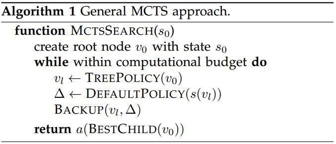
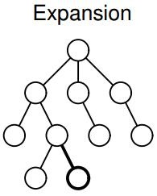
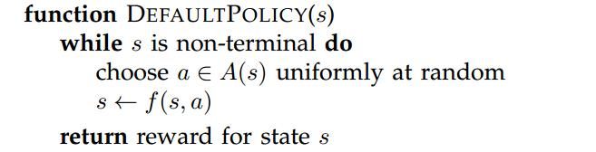
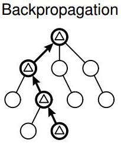

# MCTS蒙特卡罗树搜索

* [返回上层目录](../reinforcement-learning.md)
* [MCTS简介](#MCTS简介)
* [MCTS流程](#MCTS流程)
  * [MCTS总流程](#MCTS总流程)
  * [Selection选择和Expansion扩展](#Selection选择和Expansion扩展)
  * [Simulation模拟](#Simulation模拟)
  * [Backpropagation反向传播](#Backpropagation反向传播)
* [MCTS代码解析](#MCTS代码解析)
  * [人机轮流对战代码](#人机轮流对战代码)
  * [MCTS总流程代码](#MCTS总流程代码)
  * [Selection选择代码](#Selection选择代码)
  * [Expansion扩展代码](#Expansion扩展代码)
  * [Simulation模拟代码](#Simulation模拟代码)
  * [Backpropagation反向传播代码](#Backpropagation反向传播代码)
* [参考资料](#参考资料)
* [代码附录](#代码附录)
  * [人机对战主程序](#人机对战主程序)
  * [MCTS程序](#MCTS程序)


pdf: [*A Survey of Monte Carlo Tree Search Methods*](http://repository.essex.ac.uk/4117/1/MCTS-Survey.pdf)


# MCTS简介

**MCTS也就是蒙特卡罗树搜索（Monte Carlo Tree Search），是一类树搜索算法的统称**，可以较为有效地解决一些探索空间巨大的问题，例如一般的围棋算法都是基于MCTS实现的。


搜索路径如下：


其实上面的树状图叫游戏树。游戏树是一种常见的数据结构，其中每一个节点代表游戏的一个确定状态，从一个节点到该节点的一个子节点（如果存在）是一个移动。节点的子节点数目称为分支因子。游戏树的根节点代表游戏的初始状态。游戏树的终端节点是没有子节点的节点，至此游戏结束，无法再进行移动。终端节点的状态也就是游戏的结果（输/赢/平局）。

下面以井字棋游戏为例，形象地来看下什么是游戏树。


每个父节点的子节点数量对应着本次可以执行的Action的数量。

# MCTS流程

MCTS运行所在的框架/环境是一个游戏，它本身是一个非常抽象和宽泛的概念，因此这里我们只关注一种游戏类型：**双人有限零和顺序游戏**。这个名词一开始听起来会有些复杂，但是实际上非常简单，现在来让我们将它分解一下：

> 游戏：意味着我们在一种需要交互的情境中，交互通常会涉及一个或多个角色
>
> 有限：表明在任意时间点，角色之间存在的交互方式都是有限的
>
> 双人：游戏中只有两个角色
>
> 顺序：玩家依次交替进行他们的动作
>
> 零和：参与游戏的两方有完全相反的目标，换句话说就是，游戏的任意结束状态双方的收益之和等于零
>
> 我们可以很轻松的验证，围棋、国际象棋和井字棋都是双人有限零和顺序游戏：有两位玩家参与，玩家能进行的动作总是有限的，双方的游戏目标是完全相反的（所有游戏的结果之和等于0）

## MCTS总流程

以人和AI下棋对战为例，当每次轮到AI下棋时，在规定的时间内（或规定的模拟次数内），AI从当前节点（状态）反复进行如下步骤的循环，来得到最佳的下棋策略。

形象一点解释，AI在每次轮到它下棋时，都会从当前状态开始在规定时间或次数内，不断在脑子中模拟下一盘又一盘的棋，经过模拟很多盘下完的棋，就知道了每个状态的胜率，然后选择胜率最高的那个走法（状态或节点）。每一次模拟将棋下到终点后，都会更新走过的节点胜率。


总算法流程如下：



注意，`TreePolicy()`这一步包含了`Selection`和`Expansion`。

下面依次来解释上述四个步骤。

## Selection选择和Expansion扩展

`Selection`和`Expansion`被包含在了`TreePolicy()`中，`Selection`如红框所示。这两个过程衔接比较紧密，不方便分开说，就一块介绍了。


**Selection**：


`Selection`就是：如果该节点的所有可能的子节点都被探索完了，则选择得分（UCB）最高的子节点，并如此循环，直到某个节点存在从未被探索的子节点（可能不止一个），选择这个节点，停止`Selection`。`Selection`具体流程如下图所示：


这个公式就不解释了，看不懂的话先看多臂赌博机和UCB算法。

**Expansion**：



`Expansion`就是：从`Selection`所选节点的从未被探索的子节点中随机选一个，同时把随机选的这个子节点加入到所选节点中，作为已被探索过的节点（注意，新加入的这个子节点的奖励和遍历次数都为0）。`Expansion`具体流程如下图所示：


## Simulation模拟


从前面`Expansion`选出来的那个未被经历过的子节点开始，进行随机对战模拟，一直到游戏结束，然后计算奖励，赢了为正，输了为负。这个奖励值就作为该节点本次的奖励，留着用于反向传播。



## Backpropagation反向传播



从前面`Expansion`选出来的那个未被经历过的子节点开始，一直上溯父节点，并对每次经历的节点更新其总访问次数和总奖励值。


# MCTS代码解析

完整代码见本文最后的`代码附录`部分，这里选出关键代码进行讲解。

下图是运行完整代码的游戏截图（AI落子形状为1，人落子形状为-1）：


## 人机轮流对战代码

下面的代码是人机轮流对战总流程，很显然，人是通过脑子计算好然后手动输入落子位置，机器是通过`tree.search()`函数来计算好然后得到落子位置。所以`tree.search()`就是我们要研究的对象，看看AI是怎么计算落子位置的。

```python
s = TicTacToeState()
tree = MCTS(time_limit=1000)
while True:
    # 机器下棋
    action = tree.search(initial_state=s)
    s = s.take_action(action)
    if s.is_terminal():
        print("ai win")
        break
    
    # 人下棋 输入“0 0”代表左上角位置
    x, y = list(map(int, input().split()))
    action = Action(-1, x, y)
    s = s.take_action(action)
    if s.is_terminal():
        print("human win")
        break
```

## MCTS总流程代码

AI每次调用`search()`方法下棋，我们看到里面在时间期限内不断执行`self.execute_round()`，这个`self.execute_round()`就具体实行了一遍“选择->扩展->模拟->反向传播”。

```python
# AI每次调用该方法下棋
def search(self, initial_state):
    self.root = TreeNode(initial_state, None)

    time_limit = time.time() + self.time_limit / 1000
    while time.time() < time_limit:
        self.execute_round()

    best_child = self.get_best_child(self.root, 0)
    
    action = self.get_action(self.root, best_child)
    return action
```

下面我们看`execute_round()`方法究竟是怎么回事。先回想下前面说的“选择->扩展->模拟->反向传播”步骤，如下图所示。


然后看代码：

```python
# MCTS的核心：选择、扩展、模拟、反向传播
def execute_round(self):
    node = self.select_node(self.root)  # 选择、扩展
    reward = self.rollout(node.state)  # 模拟
    self.backpropogate(node, reward)  # 反向传播
```

这里代码注释的很清晰，就不多说什么了。接下来看其中的每一项即可。

## Selection选择代码


下面的代码这么理解：

反复进行迭代选择：

（1）若该节点可能的子节点若全部扩展完毕，则使用`get_best_child`方法获得UCT值最大的节点

（2）若存在未扩展的子节点, 则使用`expand`方法扩展子节点

```python
def select_node(self, node):
    while not node.is_terminal:
        if node.is_fully_expanded:  # expand中若子节点都被探索过，则标记为True
            node = self.get_best_child(node, self.exploration_constant)
        else:
            return self.expand(node)
    return node
```

代码对着上图对照看很容易理解，这里就不多说了。其中的`self.expand(node)`就是扩展方法了。

其中的`self.get_best_child()`就是计算所有子节点的UCB值，从中选取最大的那个，以解决“探索和利用难题”。

```python
def get_best_child(self, node, exploration_value):
    best_value = float("-inf")
    best_nodes = []
    for child in node.children.values():  # node.children = {action: node}
        # get_current_player作用：如果是AI，则正正为正，如果是人，则负负为正
        node_value = node.state.get_current_player() * child.total_reward / child.num_visits + exploration_value * math.sqrt(2 * math.log(node.num_visits) / child.num_visits)
        if node_value > best_value:
            best_value = node_value
            best_nodes = [child]
        elif node_value == best_value:
            best_nodes.append(child)
    return random.choice(best_nodes)
```

## Expansion扩展代码


获取当前状态下所有可能动作，返回一个没有经历的状态节点，并将该节点加入子节点。

```python
def expand(self, node):
    actions = node.state.get_possible_actions()
    for action in actions:
        if action not in node.children:
            new_node = TreeNode(node.state.take_action(action), node)
            node.children[action] = new_node
            if len(actions) == len(node.children):
                node.is_fully_expanded = True
            return new_node  # 每次只返回一个
    raise Exception("Should never reach here")
```

## Simulation模拟代码


还记得前面的MCTS总流程代码吗？AI每次落子前一遍遍执行下面的流程：

```python
# MCTS的核心：选择、扩展、模拟、反向传播
def execute_round(self):
    node = self.select_node(self.root)  # 选择、扩展
    reward = self.rollout(node.state)  # 模拟
    self.backpropogate(node, reward)  # 反向传播
```

里面的`self.rollout(node.state) `就是`Simulation`部分，输入扩展的子节点，然后进行随机对战模拟，一直到游戏结束，然后计算奖励，赢了为正，输了为负。这个奖励值就作为该节点本次的奖励，留着用于反向传播。

那具体时间怎么做的呢？来看具体代码：

```python
def random_policy(state):
    while not state.is_terminal():
        action = random.choice(state.get_possible_actions())
        state = state.take_action(action)
    return state.get_reward()
```

rollout使用此随机选择方式进行模拟，显然就是随机模拟。一次按照人的角色，一次按照AI的角色，就这么自我对战到游戏结束，然后得到奖励值。

## Backpropagation反向传播代码


从前面`Expansion`选出来的那个未被经历过的子节点开始，一直上溯父节点，并对每次经历的节点更新其总访问次数和总奖励值。

```python
def backpropogate(self, node, reward):
    while node is not None:
        node.num_visits += 1
        node.total_reward += reward
        node = node.parent
```

代码很简单，就不解释了。

# MCTS和MC方法的区别

许多人会混淆蒙特卡洛树搜索和蒙特卡洛方法。这两者有本质区别：蒙特卡洛方法有偏差（Bias），而MCTS没有偏差（Bias）。

在传统的博弈游戏树搜索中，即著名的**极小极大（Minimax）搜索**。看下图，假设现在轮到黑棋，黑棋有$b_1$和$b_2$两手可选，白棋对于$b_1$有$w_1$和$w_2$两手可选，白棋对于$b_2$有$w_3, w_4, w_5$三手可选：


然后假设走完$w_1$/$w_2$/$w_3$/$w_4$/$w_5$后，经过局面评估，黑棋的未来胜率分别是 50% / 48% / 62% / 45% / 58%（等一下，这些胜率是怎么评估出来的？我们后文会说这个问题）。

请问，黑棋此时最佳的着法是$b_1$还是$b_2$？如果是用蒙特卡洛方法，趋近的会是其下所有胜率的平均值。例如经过蒙特卡洛模拟，会发现$b_1$后续的胜率是49% = (50+48)/2，而$b_2$后续的胜率是55% = (62+45+58)/3。

于是蒙特卡洛方法说应该走$b_2$，因为55%比49%的胜率高。但这是错误的。因为如果白棋够聪明，会在黑棋走$b_1$的时候回应以$w_2$（尽量降低黑棋的胜率），在黑棋走$b_2$的时候回应以$w_4$（尽量降低黑棋的胜率）。

所以走$b_1$后黑棋的真实胜率是48%，走$b_2$后黑棋的真实胜率是45%。黑棋的正解是$b_1$。这就是Minimax搜索的核心思想：**在搜索树中，每次轮到黑棋走时，走对黑棋最有利的；轮到白棋走时，走对黑棋最不利的。**由于围棋是零和游戏，这就可以达到最优解。这是一个由底往上的过程：先把搜索树画到我们可以承受的深度，然后逐层往上取最大值或最小值回溯，就可以看到双方的正解（如果胜率评估是准确的）。而实际编程的时候，是往下不断生长节点，然后动态更新每个父节点的胜率值。

下图是一个更多层的例子：


值得注意的是，在实际对局中，胜率评估会有不准确的地方，这就会导致“地平线效应”，即由于电脑思考的深度不够，且胜率评估不够准确，因此没有看见正解。

**蒙特卡洛树搜索和蒙特卡洛方法的区别在于：**

1. **如果用蒙特卡洛方法做上一百万次模拟，$b_1$和$b_2$的胜率仍然会固定在49%和55%，不会进步，永远错误。**所以它的结果存在偏差（Bias），当然，也有方差（Variance）。
2. **而蒙特卡洛树搜索在一段时间模拟后，$b_1$和$b_2$的胜率就会向48%和45%收敛，从而给出正确的答案。**所以它的结果不存在偏差（Bias），只存在方差（Variance）。但是，对于复杂的局面，它仍然有可能长期陷入陷阱，直到很久之后才开始收敛到正确答案。

蒙特卡洛树搜索的意义在于部分解决了上述两个问题：

1. **它可以给出一个局面评估，虽然不准，但比没有强**。这就部分解决了第二个问题。
2. **根据它的设计，搜索树会较好地自动集中到“更值得搜索的变化”（注意，也不一定准）**。如果发现一个不错的着法，蒙特卡洛树搜索会较快地把它看到很深，可以说它结合了广度优先搜索和深度优先搜索，类似于启发式搜索。这就部分解决了第一个问题。

最后，随着搜索树的自动生长，蒙特卡洛树搜索可以保证在足够长的时间后收敛到完美解（但可能需要极长的时间）。

# 参考资料

* [蒙特卡罗树搜索（MCTS）【转】](https://www.cnblogs.com/yifdu25/p/8303462.html)
* [面向初学者的蒙特卡洛树搜索MCTS详解及其实现](https://blog.csdn.net/caozixuan98724/article/details/103213795?utm_medium=distribute.pc_relevant.none-task-blog-2~default~BlogCommendFromMachineLearnPai2~default-1.baidujs&depth_1-utm_source=distribute.pc_relevant.none-task-blog-2~default~BlogCommendFromMachineLearnPai2~default-1.baidujs)

蒙特卡罗树搜索的理解参考此博客。

* [面向初学者的蒙特卡洛树搜索MCTS详解及其实现](https://blog.csdn.net/caozixuan98724/article/details/103213795?utm_medium=distribute.pc_relevant.none-task-blog-2~default~BlogCommendFromMachineLearnPai2~default-1.baidujs&depth_1-utm_source=distribute.pc_relevant.none-task-blog-2~default~BlogCommendFromMachineLearnPai2~default-1.baidujs)
* 本文代码复制自此github：[https://github.com/pbsinclair42/MCTS](https://github.com/pbsinclair42/MCTS)

蒙特卡罗树搜索代码参考此博客。

===

* [Python 五子棋](https://www.jianshu.com/p/cd3805a56585)

后续若要实现五子棋可参考此博客。

* [【详细原理】蒙特卡洛树搜索入门教程！](https://www.jianshu.com/p/ec0e7b84c7c8)

本文是对[Monte Carlo Tree Search – beginners guide](https://links.jianshu.com/go?to=https%3A%2F%2Fint8.io%2Fmonte-carlo-tree-search-beginners-guide%2F%3Fspm%3Da2c4e.11153940.blogcont574071.7.4bf12dd4vQTxDC)这篇文章的文章大体翻译，以及对其代码的解释。分为两篇【**详细原理**】和【**代码实战**】。

# 代码附录

代码总共分为两个：

第一个是人机对战主程序（三子棋）`tic-tac-toe.py`，会调用`mcts.py`。

第二个是模特卡罗树搜索程序`mcts.py`，它和具体游戏不绑定。

## 人机对战主程序

`tic-tac-toe.py`：人机对战主程序

```python
from __future__ import division

from copy import deepcopy
from mcts import MCTS
from functools import reduce
import operator


class TicTacToeState(object):
    def __init__(self):
        self.target_num = 3  # 最终目标
        self.board_width = 3
        self.board = [[0] * self.board_width for _ in range(self.board_width)]
        self.current_player = 1  # 1: AI, -1: human

    def get_current_player(self):
        return self.current_player

    def get_possible_actions(self):
        possible_actions = []
        for i in range(len(self.board)):
            for j in range(len(self.board[i])):
                if self.board[i][j] == 0:
                    possible_actions.append(Action(player=self.current_player, x=i, y=j))
        return possible_actions

    def take_action(self, action):
        new_state = deepcopy(self)
        new_state.board[action.x][action.y] = action.player
        new_state.current_player = self.current_player * -1
        return new_state

    def is_terminal(self):
        for row in self.board:
            if abs(sum(row)) == self.target_num:
                return True
        for column in list(map(list, zip(*self.board))):
            if abs(sum(column)) == self.target_num:
                return True
        for diagonal in [[self.board[i][i] for i in range(len(self.board))],
                         [self.board[i][len(self.board) - i - 1] for i in range(len(self.board))]]:
            if abs(sum(diagonal)) == self.target_num:
                return True
        return reduce(operator.mul, sum(self.board, []), 1)

    # 返回奖励为正负1
    def get_reward(self):
        for row in self.board:
            if abs(sum(row)) == self.target_num:
                return sum(row) / self.target_num
        for column in list(map(list, zip(*self.board))):
            if abs(sum(column)) == self.target_num:
                return sum(column) / self.target_num
        for diagonal in [[self.board[i][i] for i in range(len(self.board))],
                         [self.board[i][len(self.board) - i - 1] for i in range(len(self.board))]]:
            if abs(sum(diagonal)) == self.target_num:
                return sum(diagonal) / self.target_num
        return False


class Action:
    def __init__(self, player, x, y):
        self.player = player
        self.x = x
        self.y = y

    def __str__(self):
        return str((self.x, self.y))

    def __repr__(self):
        return str(self)

    def __eq__(self, other):
        return self.__class__ == other.__class__ and self.x == other.x and self.y == other.y and self.player == other.player

    def __hash__(self):
        return hash((self.x, self.y, self.player))


if __name__ == '__main__':
    import numpy as np

    s = TicTacToeState()
    tree = MCTS(time_limit=1000)
    while True:
        # 机器下棋
        action = tree.search(initial_state=s)
        s = s.take_action(action)
        print("ai:", action)
        print(np.array(s.board))
        if s.is_terminal():
            print("ai win")
            break
        # 人下棋 输入“0 0”代表左上角位置
        x, y = list(map(int, input().split()))
        action = Action(-1, x, y)
        s = s.take_action(action)
        print("人:", action)
        print(np.array(s.board))
        print(s.is_terminal())
        if s.is_terminal():
            print("human win")
            break
```

## MCTS程序

`mcts.py`：模特卡罗树搜索程序

```python
from __future__ import division

import time
import math
import random


# rollout使用此随机选择方式
def random_policy(state):
    while not state.is_terminal():
        try:
            action = random.choice(state.get_possible_actions())
        except IndexError:
            raise Exception("Non-terminal state has no possible actions: " + str(state))
        state = state.take_action(action)
    return state.get_reward()


# TreeNode类,用于构建树形结构,存储当前节点的状态
class TreeNode:
    def __init__(self, state, parent):
        self.state = state  # state需要我们自己去定义这个类
        self.is_terminal = state.is_terminal()  # is_terminal是代表当前的状态是否是终结态，在state类中实现
        self.is_fully_expanded = self.is_terminal  # is_fully_expanded是指节点是否完全扩展
        self.parent = parent  # parent就是指当前节点的父节点
        self.num_visits = 0  # num_visits代表节点被访问的次数。
        self.total_reward = 0  # total_reward是获取的奖励，如果定义1为胜利，0为失败，则3/4之类就为total_reward / num_visits
        self.children = {}  # children是当前节点的子节点的集合

    def __str__(self):
        s = []
        s.append("total_reward: %s" % self.total_reward)
        s.append("num_visits: %d" % self.num_visits)
        s.append("is_terminal: %s" % self.is_terminal)
        s.append("possibleActions: %s" % self.children.keys())
        return "%s: {%s}" % (self.__class__.__name__, ', '.join(s))


class MCTS:
    def __init__(self, time_limit=None, iteration_limit=None, exploration_constant=1/math.sqrt(2), rollout_policy=random_policy):
        if time_limit is not None:
            if iteration_limit is not None:
                raise ValueError("Cannot have both a time limit and an iteration limit")
            # time taken for each MCTS search in milliseconds
            self.time_limit = time_limit
            self.limit_type = 'time'
        else:
            if iteration_limit is None:
                raise ValueError("Must have either a time limit or an iteration limit")
            # number of iterations of the search
            if iteration_limit < 1:
                raise ValueError("Iteration limit must be greater than one")
            self.search_limit = iteration_limit
            self.limit_type = 'iterations'

        self.exploration_constant = exploration_constant
        self.rollout = rollout_policy
        self.root = type(None)()

    # AI每次调用该方法下棋
    def search(self, initial_state, need_details=False):
        self.root = TreeNode(initial_state, None)

        if self.limit_type == 'time':
            time_limit = time.time() + self.time_limit / 1000
            while time.time() < time_limit:
                self.execute_round()
        else:
            for i in range(self.search_limit):
                self.execute_round()

        best_child = self.get_best_child(self.root, 0)
        # action = (action for action, node in self.root.children.items() if node is best_child).__next__()
        action = self.get_action(self.root, best_child)
        if need_details:
            return {"action": action, "expectedReward": best_child.total_reward / best_child.num_visits}
        else:
            return action

    # MCTS的核心：选择、扩展、模拟、反向传播
    def execute_round(self):
        """
            execute a selection-expansion-simulation-backpropagation round
        """
        node = self.select_node(self.root)  # 选择、扩展
        reward = self.rollout(node.state)  # 模拟
        self.backpropogate(node, reward)  # 反向传播

    # ========== 选择 ==========
    # 1. 该节点可能的子节点若全部扩展完毕, 则使用get_best_child方法获得UCT值最大的节点
    # 2. 若存在未扩展的子节点, 则使用expand方法扩展子节点
    def select_node(self, node):
        while not node.is_terminal:
            if node.is_fully_expanded:  # expand中若子节点都被探索过，则标记为True
                node = self.get_best_child(node, self.exploration_constant)
            else:
                return self.expand(node)
        return node

    # ========== 扩展 ==========
    # 获取当前状态下所有可能动作，返回一个没有经历的状态节点，并将该节点加入子节点
    def expand(self, node):
        actions = node.state.get_possible_actions()
        for action in actions:
            if action not in node.children:
                new_node = TreeNode(node.state.take_action(action), node)
                node.children[action] = new_node
                if len(actions) == len(node.children):
                    node.is_fully_expanded = True
                return new_node  # 每次只返回一个

        raise Exception("Should never reach here")

    # ========== 反向传播 ==========
    def backpropogate(self, node, reward):
        while node is not None:
            node.num_visits += 1
            node.total_reward += reward
            node = node.parent

    # ========== 选择 ==========
    # 计算所有子节点的UCB值，从中选取最大的那个，以解决“探索和利用难题”
    def get_best_child(self, node, exploration_value):
        best_value = float("-inf")
        best_nodes = []
        for child in node.children.values():  # node.children = {action: node}
            # get_current_player作用：如果是AI，则正正为正，如果是人，则负负为正
            node_value = node.state.get_current_player() * child.total_reward / child.num_visits + exploration_value * math.sqrt(2 * math.log(node.num_visits) / child.num_visits)
            if node_value > best_value:
                best_value = node_value
                best_nodes = [child]
            elif node_value == best_value:
                best_nodes.append(child)
        return random.choice(best_nodes)

    def get_action(self, root, best_child):
        for action, node in root.children.items():
            if node is best_child:
                return action
```

