# 时间差分

* [返回上层目录](../reinforcement-learning-algorithm.md)
* [时间差分方法简介 ](#时间差分方法简介 )
* [时间差分评价](#时间差分评价)
  * [时间差分策略评价算法](#时间差分策略评价算法)
  * [策略评价算法对比—时间差分VS动态规划](#策略评价算法对比—时间差分VS动态规划)
  * [策略评价算法对比—时间差分VS蒙特卡洛](#策略评价算法对比—时间差分VS蒙特卡洛)
    * [时间差分和蒙特卡洛的优缺点（1）](#时间差分和蒙特卡洛的优缺点（1）)
    * [偏差和方差之间的权衡](#偏差和方差之间的权衡)
    * [时间差分和蒙特卡洛的优缺点（2）](#时间差分和蒙特卡洛的优缺点（2）)
    * [批（batch）蒙特卡洛和时间差分](#批（batch）蒙特卡洛和时间差分)
    * [确定性等价估计](#确定性等价估计)
    * [时间差分和蒙特卡洛的优缺点（3）](#时间差分和蒙特卡洛的优缺点（3）)
  * [其他比较维度](#其他比较维度)
    * [自举和采样](#自举和采样)
    * [备份](#备份)
* [时间差分优化](#时间差分优化)
  * [时间差分优化简介](#时间差分优化简介)
    * [时间差分中的策略迭代](#时间差分中的策略迭代)
  * [在策略时间差分优化—SARSA](#在策略时间差分优化—Sarsa)
    * [期望SARSA](#期望SARSA)
  * [离策略时间差分优化—Q学习](#离策略时间差分优化—Q学习)
    * [离策略时间差分评价](#离策略时间差分评价)
    * [对Q函数的离策略学习](#对Q函数的离策略学习)
    * [Q学习](#Q学习)
* [算法小结](#算法小结)

蒙特卡洛是一个简单有效的方法，但是它并没有用到之前强调的强化学习中最重要的等式—贝尔曼方程。贝尔曼方程是整个强化学习中最重要的方程，强化学习中大部分学习方法都是基于此方程做迭代。而蒙特卡洛并没有用到这样的方程。

时间差分不仅利用了贝尔曼方程（和动态规划一样），也利用了蒙特卡洛中采样的思想，所以**时间差分是动态规划和蒙特卡洛的结合体**。时间差分方法是整个强化学习中**最重要**的方法。绝大多数对强化学习的研究和理论都是基于时间差分方法，或者利用了时间差分思想。所以本章就方法论而言，是强化学习的最重要的一个方法。

本章还会介绍一种使用最广泛的算法：Q学习。

# 时间差分方法简介

* 时间差分是强化学习中最核心也是最新奇的想法
* 它混合了动态规划和蒙特卡洛，如何混合：
  * 和蒙特卡洛类似，时间差分方法从历史经验中去学习，利用了采样的思想
  * 和动态规划也比较相似，使用贝尔曼方程，使用后继状态的值函数更新当前状态的值函数
* 它属于无模型方法，具有无模型方法的特点，即
  * 不知道P和R（无模型），需要智能体显式地与环境发生一些交互，更新过程也是基于样本备份，同时也需要充分的探索，才能找到一个最终的最优值。
* 同时利用了采样（蒙特卡洛）和贝尔曼方程（动态规划）
* 可以从**不完整**的片段中学习（通过一个自举的的方法）
  * 蒙特卡洛只能通过完整的片段去学习，所以蒙特卡洛只能用于片段性任务。
  * 而时间差分既可以应用于片段性任务，也可用于连续性任务，应用范围更广。
* 它有个特点，通过估计来更新估计，这是**自举**的特点。

[**自举法**](https://en.wikipedia.org/wiki/Bootstrapping_(statistics) )：

* (bootstrapping)又名拔靴法、自助法
* 通过对样本进行重采样得到的估计总体的方法
* 不同自举法
  * 样本→总体
* 使用自举法
  * 重采样样本→样本（重采样多次可以估计分布）
  * 样本→总体
* 强化学习中的自举法
  * 利用一个估计去更新另一个估计

# 时间差分评价

## 时间差分策略评价算法

时间差分策略评价：

* 目的：给定策略π，求其对应的值函数vπ

* 增量式蒙特卡洛

  * 用**实际回报值**Gt去更新值函数V(St)
    $
    V(S_t)\leftarrow V(S_t)+\alpha(G_t-V(S_t))
    $
    蒙特卡洛：通过智能体在环境中不断地去采样，得到了一条一条的轨迹，然后去统计这些轨迹的回报值，去做一个更新。

    增量式：每得到一条轨迹，就去更新一次，它的目标，就是我们实际的回报值Gt

* 时间差分算法（Temporal-difference, TD）

  * 使用**估计的回报值**（后继状态的回报值加上采样得到的奖励值）
    $
    R_{t+1}+\gamma V(S_{t+1})
    $
    去**更新值函数V(St)**    (TD(0))：
    $
    V(S_t)\leftarrow V(S_t)+\alpha(R_{t+1}+\gamma V(S_{t+1})-V(S_t))
    $
    时间差分基于增量式蒙特卡洛的改变是，改变了它的目标。增量式蒙特卡洛的目标是当前这条轨迹采样得到的实际回报值，时间差分是用估计的回报值，即后继状态的回报值加上采样得到的奖励值。

    为什么时间差分的更新会越来越准确了呢？因为比如估计值V(St)是不太准确的，所以它的后继状态$V(S_{t+1})$也是不太准确的，而$R_{t+1}$是一个无偏的采样，会比$V(S_{t+1})$更加准确一点，所以不太准确的$V(S_{t+1})$加上准确的$R_{t+1}$会对V(St)有一个准确一点的修正，会比原来更加准确一点。

  * TD目标：
    $
    R_{t+1}+\gamma V(S_{t+1})
    $

  * TD误差：
    $
    \delta_t=R_{t+1}+\gamma V(S_{t+1})-V(S_t)
    $
    时间差分的算法就是利用TD的误差，不断地更新估计值。

**时间差分策略评价算法：**

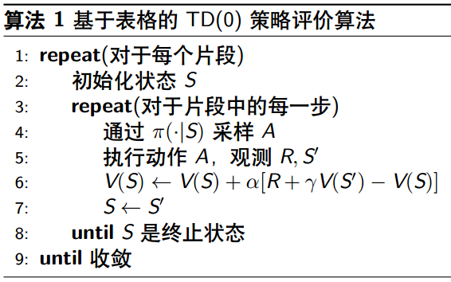

注：

* **时间差分算法在片段中的每一步都更新，而蒙特卡洛是该片段做完了统计完该片段的整个回报值Gt才会更新一次**。

* $TD(0)$是指$R_{t+1}+\gamma V(S_{t+1})$，即只考虑后面一步，而$TD(\lambda)$要考虑后面$\lambda$步。
  

---

下面将时间差分方法和动态规划以及蒙特卡洛做一个对比，通过对比来体会时间差分的**独特性**所在。

## 策略评价算法对比—时间差分VS动态规划

* 动态规划利用了贝尔曼方程去解决强化学习问题
  $$
  V(s)\leftarrow \mathbb{E}[R+\gamma V(S')|s]
  $$

* 时间差分也利用了贝尔曼方程，但是做了以下改动：

  全宽备份→样本备份：$s\rightarrow S$，并去掉了期望符号：$V(S)\leftarrow R+\gamma V(S')$。
  
  求期望有两种手段：
  
  一种是利用概率密度函数加权求和（贝尔曼方程，动态规划），所以说是一种全宽备份的方式。

  另一种是利用采样去逼近估计（时间差分，蒙特卡洛），从全宽备份（小$s$）切换到了样本备份（大$S$）。

  * 增加学习率$V(S)\leftarrow V(S)+\alpha(R+\gamma V(S')-V(S))$，因为采样的样本和真实值之间存在方差，即样本不一定那么可信，所以学习率不能设置太大。
* 收敛后$V(S)=\{\mathbb{E}\}=R+\gamma V(S')$
* 利用时间差分目标和当前值函数的差（前后学习）指导学习—时间差分

---

我们从备份图的角度来看下时间差分和动态规划之间的关系：

**动态规划备份**
$$
V(S_t)\leftarrow \mathbb{E}_{\pi}[R_{t+1}+\gamma V(S_{t+1})]
$$
全宽备份：要求解$S_t$，就必须要考虑所有可能要做的动作，以及所有可能跳转的后继状态。

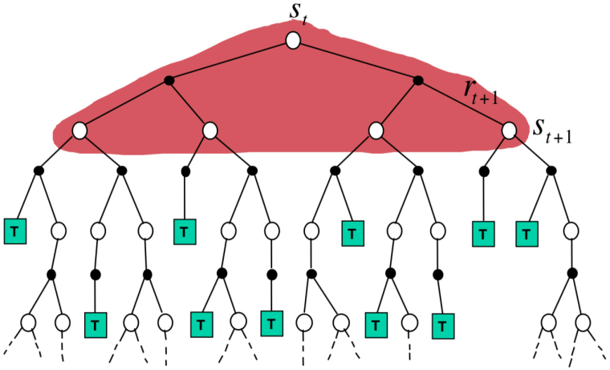

**时间差分备份**
$$
V(S_t)\leftarrow V(S_t)+\alpha\left[R_{t+1}+\gamma V(S_{t+1})-V(S_t)\right]
$$
采样备份，它是一个采样，采样到哪个状态转移，就是哪个状态转移。采样到哪个动作，它就是哪个动作。时间差分备份利用采样来更新值函数。

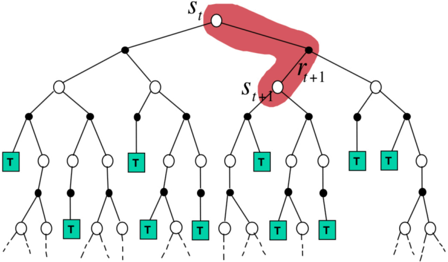

**蒙特卡洛备份**
$$
V(S_t)\leftarrow V(S_t)+\alpha(G_t-V(S_t))
$$
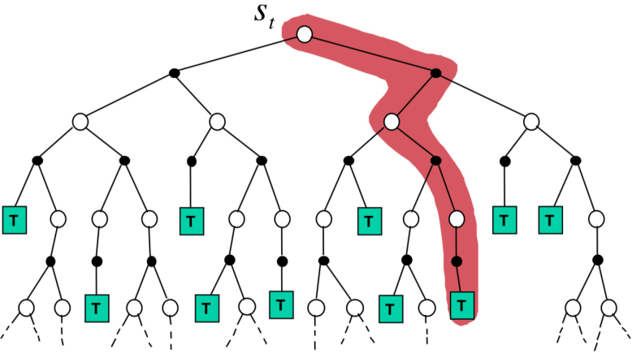

蒙特卡洛和时间差分的

相同点：

* 都是采样

不同点：

* **蒙特卡洛采样每条轨迹，一直要采样到最后的终止状态为止**

---

下面用一个下班回家的例子来说明蒙特卡洛和时间差分的区别：

| 状态      | 已消耗时间(分) | 预估到家剩余时间 | 预估总时间 |
| :------ | :------: | :------: | :---: |
| 离开办公室   |    0     |    30    |  30   |
| 离开汽车，下雨 |    5     |    35    |  40   |
| 离开高速    |    20    |    15    |  35   |
| 跟在卡车后面  |    30    |    10    |  40   |
| 到了家门口街道 |    40    |    3     |  43   |
| 到达家里    |    43    |    0     |  43   |

下图中，

* 左：蒙特卡洛方法（α=1）
* 右：时间差分方法（α=1）

* 蒙特卡洛直到该片段终止后才更新所有的状态
* 时间差分在每一次状态转移后都更新前一状态

---

### 时间差分和蒙特卡洛的优缺点（1）

* 时间差分算法在知道结果之前学习
  * 时间差分算法在每一步之后都能在线学习
  * 蒙特卡洛算法必须等待回报值得到之后（片段结束）才能学习
* 时间差分算法即便没有最终结果也能学习
  * 时间差分算法能够从不完整序列中学习，因为时间差分在每一次状态转移后都更新前一状态
  * 蒙特卡洛算法仅仅能够从完整性序列中学习，因为蒙特卡洛直到该片段终止后才更新所有的状态
  * 时间差分算法适用于连续性任务和片段性任务，因为时间差分在每一次状态转移后都更新前一状态
  * 蒙特卡洛仅仅适用于片段性任务，因为蒙特卡洛直到该片段终止后才更新所有的状态
* 时间差分算法有多个驱动力，导致时间差分的效率会更高
  * 蒙特卡洛算法只有奖励值作为更新的驱动力
  * 时间差分算法有奖励值和状态转移作为更新的驱动力

### 偏差和方差之间的权衡

**机器学习中的偏差和方差之间的权衡**

* 在监督学习中，偏差/方差有另外的理解—欠拟合和过拟合
  * 偏差大（欠拟合）：预测值和样本之间的差
  * 方差大（过拟合）：样本值之间的方差，学出的模型适用性差
* 方差大意味着样本的置信度较差
* 不同的机器学习方法会在两者之间做权衡（trade-off）

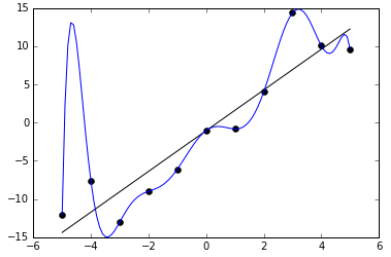

**强化学习中的偏差和方差之间的权衡**

* 回报值$G_t=R_{t+1}+\gamma R_{t+2}+...+\gamma^{T-t-1}R_T$是值函数$v_{\pi}(S_t)$的无偏估计
  
* 真实的TD目标值$R_{t+1}+\gamma v_{\pi}(S_{t+1})$是值函数$v_{\pi}(S_t)$的无偏估计。
  
* 使用的TD目标值$R_{t+1}+\gamma v(S_{t+1})$是值函数$v_{\pi}(S_t)$的有偏估计。
  
  为什么呢？主要原因在于$V(S_{t+1})$和初始值很相关，初始值本来和真实值是有一定的偏差的，这个初始值导出来的TD的目标值肯定也是和真实值有偏差的。
  
* TD目标值的方差要远小于回报值

  * 回报值依赖于很多随机变量$A_t,S_{t+1},R_{t+1},A_{t+1},S_{t+2},R_{t+2},...$
    
  * TD目标值仅仅依赖于一个随机序列$A_t,S_{t+1},R_{t+1}$
    TD中的$V(S_{t+1})$已经是一个历史的大量数据加权平均得到的，其自身的方差肯定比回报值除了当前奖励值以外的其他值要小的多的多。

### 时间差分和蒙特卡洛的优缺点（2）

* 蒙特卡洛具有高方差，零偏差
  * 收敛性较好（即使采用函数逼近）
  * 对初始值不太敏感
  * 简单，容易理解和使用
  * 随着样本数量的增加，**方差**逐渐减少，趋近于0。所以蒙特卡洛是随着采样，不断把方差降低的一个过程。
* 时间差分有低方差，和一些偏差
  * 通常比蒙特卡洛效率更高
  * 表格法下$TD(0)$收敛到$v_{\pi}(s)$（函数逼近时不一定收敛，可能会发散）
  * 对初始值更敏感
  * 随着样本数量的增加，**偏差**逐渐减少，趋近于0。所以时间差分是随着采样，逐渐减小偏差的过程。

注：函数逼近是之后要讲的一个方法

### 批（batch）蒙特卡洛和时间差分

* 随着经验采样到无穷大，蒙特卡洛和时间差分都会收敛：$V(s)\rightarrow v_{\pi}(s)$
* 但是当经验有限时，它们两个收敛的值就不一样了，和真实值就有一定的区别，那分别收敛到什么值呢？
  * 比如重复采样了$K$条轨迹
  * 对于每一条轨迹$k\in [1,K]$分别运用了蒙特卡洛和$TD(0)$算法

**AB状态例子**

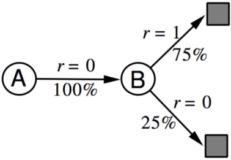

该马尔科夫决策过程有两个状态，分别是A和B，不考虑衰减（即γ=1），采样了8条轨迹：

* A, 0, B, 0
* B, 1
* B, 1
* B, 1
* B, 1
* B, 1
* B, 1
* B, 0

对于这8条轨迹，想通过TD或者MC，去求它们的值函数$V(A)$，$V(B)$。

对于求$V(B)$，TD和MC是没有区别的，因为B是一个终止状态，有2次是0，6次是1，所以加权平均是3/4，所以求$V(B)$两者没有区别。

主要区别在$V(A)$，

* 对于蒙特卡洛，会统计A出现了多少次，那么，出现A的轨迹只有一条。对这一条轨迹求一下它的回报值，那么就是V(A)的值，即0，即蒙特卡洛和样本是完全一致的。

  **蒙特卡洛的本质是对样本回报值的最佳拟合**

* 对于时间差分，更新V(A)会看轨迹“A, 0, B, 0”中的“A, 0, B”，其中V(B)是3/4，那么V(A)也就是3/4

  **时间差分的本质是对马尔科夫模型求最大似然的过程**

### 确定性等价估计

* MC收敛到最小均方误差的解

  * 是对样本回报值的最佳拟合
    $
    \sum_{k=1}^K\sum_{t=1}^{T_k}\left(G_t^k-V(s_t^k)\right)^2
    $

  * 在上面的AB例子中，V(A)=0

* TD(0)收敛到最大似然马尔科夫模型中的解

  * 是对马尔科夫链的最佳拟合，假设了数据是来自稳定的P,R
    $
    \begin{aligned}
    &\hat{P}_{ss'}^a=\frac{1}{N(s,a)}\sum_{k=1}^K\sum_{t=1}^{T_k}I(s_t^k,a_t^k,s_{t+1}^k=s,a,s')\\
    &\hat{R}_s^a=\frac{1}{N(s,a)}\sum_{k=1}^K\sum_{t=1}^{T_k}I(s_t^k,a_t^k=s,a)
    \end{aligned}
    $

  * 在AB例子中，V(A)=0+V(B)=0.75

  * 等价于内在动态过程是确定性的估计

### 时间差分和蒙特卡洛的优缺点（3）

* 时间差分利用了马尔科夫性
  * 一般来说时间差分在马尔科夫环境中更有效
* 蒙特卡洛没有利用马尔科夫性
  * 一般对非马尔科夫性环境更有效

## 其他比较维度

### 自举和采样

* 自举：使用随机变量的估计去更新，具体是指利用后继状态的估计值，去更新当前状态的值函数
  * 蒙特卡洛没有使用自举
  * 动态规划和时间差分都有自举
* 采样：通过样本估计期望
  * 蒙特卡洛和时间差分采样（无模型方法）
  * 动态规划不采样（全宽备份）

### 备份

# 时间差分优化

## 时间差分优化简介

### 时间差分中的策略迭代

* 广义策略迭代
  * 策略评价：时间差分策略评价，$Q=q_{\pi}$
  * 策略提升：ε-贪婪策略提升
* 时间差分优化相比蒙特卡洛优化有几点好处
  * 低方差。在样本数据有限的情况下，更新的置信度较高，效率较高
  * 在线更新（online）。做一步更新一步，而蒙特卡洛是必须等待整个过程（片段）做完了，才统一收集历史记录，把回报值加起来做更新。
  * 不完整序列。

## 在策略时间差分优化—SARSA

**SARSA备份**

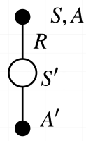
$$
Q(S_t,A_t)\leftarrow Q(S_t,A_t)+\alpha(R_{t+1}+\gamma Q(S_{t+1},A_{t+1})-Q(S_t,A_t))
$$
整个更新过程和时间差分评价几乎是一样的。唯一的区别就是把之前的V替换成了Q。

它的TD目标值就是$R_{t+1}+\gamma Q(S_{t+1},A_{t+1})$。

**采用SARSA的迭代过程：**

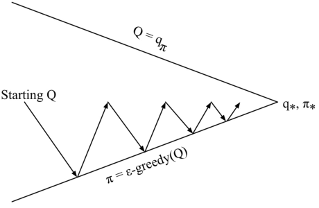

在**每个时间步骤**（值迭代）

* 策略评价：采用SARSA，Q≈qπ
* 策略提升：ε-贪婪策略提升

**SARSA算法：**

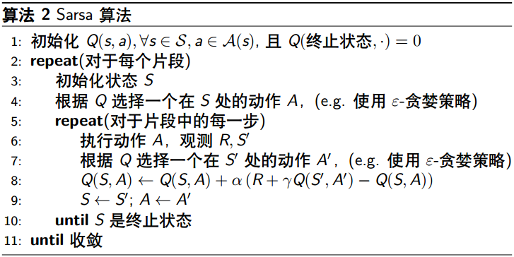

**为什么是在策略的？**

* 执行的动作 A 是来当前Q值下的ε-贪婪策略（行为策略）
* 构建TD目标值时的动作 A‘ 是来自当前Q值下的ε-贪婪策略（目标策略）
* 这两者（行为策略和目标策略）在SARSA中是同一个策略

**SARSA的收敛性**

定理：

在满足以下条件时，SARSA算法收敛到最优的状态动作值函数
$$
Q(s,a)\rightarrow q_*(s,a)
$$

* 策略序列$\pi_t(a|s)$满足GLIE（无限探索下的极限贪婪，上节课讲的）
  
* 步长序列$\alpha_t$是一个Robbins-Monro序列：$\sum_{t=1}^{\infty}\alpha_t=\infty\quad \sum_{t=1}^{\infty}\alpha_t^2<\infty$

---

* GLIE保证了（无限探索下的极限贪婪）
  * 充分的探索
  * 策略最终收敛到贪婪的策略
* Robbins-Monro保证了
  * 一阶和无穷大，保证了步长足够大，足以克服任意初始值
  * 二阶和有限，保证了步长足够小，最终收敛（常量步长不满足）

### 期望SARSA

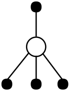

$$
\begin{aligned}
Q(S_t,A_t)&\leftarrow Q(S_t,A_t)+\alpha[R_{t+1}+\gamma\mathbb{E}[Q(S_{t+1},A_{t+1})|S_{t+1}]-Q(S_t,A_t)]\\
&\leftarrow Q(S_t,A_t)+\alpha[R_{t+1}+\gamma\sum_a \pi(a|S_{t+1})Q(S_{t+1},a)-Q(S_t,A_t)]\\
\end{aligned}
$$
这一步是不需要采样的。因为它下一刻的Q值的期望（或者说TD目标值），是可以通过策略和Q表构建出来的。

* 减少了由于 A’ 的选择带来的方差。

  我们在构建TD目标值的时候，并不需要对π进行采样，比SARSA又减小了一步方差。而反差小的好处是：

  当更新步骤是有限的时候，得到的策略的通用性能会比SARSA更好。

* 在相同更新步数时，期望SARSA比SARSA的通用性更好

* 可以在在策略和离策略中切换（SARSA是在策略的，而期望SARSA并不一定是在策略的，这取决于构建TD目标值的目标策略是否和做动作时的行为策略为同一策略）

  * 在策略：TD目标值中的
    $
    R_{t+1}+\gamma\sum_{a}\pi(a|S_{t+1})Q(S_{t+1},a)
    $
    中的策略π和采样的策略是**同一个**策略。

  * 离策略：TD目标值中的
    $
    R_{t+1}+\gamma\sum_{a}\pi(a|S_{t+1})Q(S_{t+1},a)
    $
    中的策略π和采样的策略是**不同的**策略。

* 一种特殊情况，TD目标值中的目标策略选择贪婪策略，采样的行为策略选用ε-贪婪策略，这就是：Q学习。所以说Q学习是期望SARSA的一种。

## 离策略时间差分优化—Q学习

“Q学习”是一个专有算法，并不是指学习Q函数的意思，它特指利用TD(0)算法，求解最优Q函数的算法。

### 离策略时间差分评价

* 使用行为策略μ生成样本，然后评价目标策略π。

  并没有用π去采样，因为很多时候，π是一个确定性的策略，就导致了很多样本都遍历不到，所以为了有更多的探索，会选择一个更具探索性的策略μ，

* 需要利用重要性采样对TD目标值R+γV(S')进行加权

  上节课提到了，一旦用离策略，就必须用重要性采样，去对采样值做一个校正，否则最后的估计值和真实值之间会有较大的偏差。

* 对时间差分做评价时，需要对时间差分目标值做一个加权，即策略和策略之间的比值。跟蒙特卡洛算法不同（蒙特卡洛是一连串比值的相乘），而在时间差分中，只有一次采样，后面的采样都用值函数替代了，所以这里只需要考虑一步，所以仅仅只需要一次重要性采样去矫正偏差
  $
  V(S_t)\leftarrow V(S_t)+\alpha\left(\frac{\pi(A_t|S_t)}{\mu(A_t|S_t)}(R_{t+1}+\gamma V(S_{t+1}))-V(S_t)\right)
  $

* 由于重要性采样会增加方差，而离策略时间差分评价只需要一次重要性采样，这就导致了离策略时间差分评价要比离策略蒙特卡洛评价的重要性采样方差小得多

上面讲的是对V函数的时间差分评价，下面讲Q函数

### 对Q函数的离策略学习

* 离策略的时间差分算法对比蒙特卡洛算法，重要性采样率的因子数减小到一步

* 是否能减小到0步？

* 可以的，对Q函数的离策略学习**不需要**重要性采样

  为什么？我们回想下重要性采样的定义，

* 执行的动作At来自策略μ，通过At与环境的交互得到样本$S_{t+1},R_{t+1}$，在已知$S_t,A_t$的情况下的重要性采样率为
  $
  \frac{\mathbb{P}_{\pi}[S_{t+1},R_{t+1}|S_t,A_t]}{\mathbb{P}_{\mu}[S_{t+1},R_{t+1}|S_t,A_t]}=1
  $
  就是说，这和你用策略μ还是π没有关系，只与状态转移和R的分布有关系。

  为什么V函数中就有重要性采样呢？因为V给定了St，但没有给定At，就是说它还需要对At进行一次采样，就需要在其概率分布上乘以一个At（策略）的概率分布，所以需要有π和μ的一个比值。

  为什么不需要重要性采样率，这其实与Q的定义有关，Q(S,A)的定义是在状态S下做动作A，然后再按照策略π获得的期望回报值。所以，S和A是指定的，和是什么策略（不论是π还是μ）没有关系。

  注意：这里并不是说Q和策略没关系了。Q和策略是有关系的。按照Q的定义，在状态S下做动作A，然后再按照策略π获得的期望回报值。因此Q的值跟策略是相关的。

  那为什么这里Q学习的重要性采样率和策略无关了呢？

  原因在于TD算法中，我们学习Q时，只采样了单步的S和A。而根据Q的定义，Q跟策略的关系是存在于做完A之后。而重要性采样率是作用在采样S和A的时候。因此这里的重要性采样率和策略无关。

  并不是学习Q函数就不要重要性采样，比如利用MC学习Q函数是需要重要性采样的。

  另外：“Q学习”是一个专有算法，并不是指学习Q函数的意思，它特指利用TD(0)算法，求解最优Q函数的算法。

* 时间差分目标值由之前的
  $
  R_{t+1}+\gamma Q(S_{t+1},A_{t+1}),A_{t+1}\sim\mu(\cdot,S_t)
  $
  变成了
  $
  R_{t+1}+\gamma Q(S_{t+1},A'),A'\sim\pi(\cdot|S_t)
  $
  即
  $
  Q(S_t,A_t)\leftarrow Q(S_t,A_t)+\alpha(R_{t+1}+\gamma Q(S_{t+1},A')-Q(S_t,A_t))
  $

* 如果把从π采样 A‘ 改成对π求期望，那么就变成了离策略版的期望SARSA

### Q学习

“Q学习”是一个专有算法，并不是指学习Q函数的意思，它特指利用TD(0)算法，求解最优Q函数的算法。

* 目标策略选择Q(s,a)下的贪婪策略
  $$
  \pi(S_{t+1})=\text{arg }\mathop{\text{max}}_{a'}\ Q(S_{t+1},a')
  $$

* 行为策略μ选择Q(s,a)下的ε-贪婪策略
  $$
  \begin{aligned}
  &R_{t+1}+\gamma Q(S_{t+1},A')\\
  =&R_{t+1}+\gamma Q(S_{t+1},\text{arg }\mathop{\text{max}}_{a'} Q(S_{t+1},a'))\\
  =&R_{t+1}+\mathop{\text{max}}_{a'}\gamma Q(S_{t+1},a')
  \end{aligned}
  $$

* Q学习的时间差分目标值会得到简化。不需要概率分布，直接就是max，省掉了一步采样。下式类似于贝尔曼最优方程。
  $$
  \begin{aligned}
  &R_{t+1}+\gamma Q(S_{t+1},A')\\
  =&R_{t+1}+\gamma Q(S_{t+1},\text{arg }\mathop{\text{max}}_{a'}Q(S_{t+1},a'))\\
  =&R_{t+1}+\mathop{\text{max}}_{a'}\gamma Q(S_{t+1},a')
  \end{aligned}
  $$

**Q学习优化算法**

下图就是Q学习的备份图：

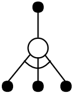

$$
Q(S,A)\leftarrow Q(S,A)+\alpha\left(R+\gamma\mathop{\text{max}}_{a'}Q(S',a')-Q(S,A)\right)
$$
构建时间差分目标值的时候，我们去选择最优的Q函数。A是通过行为策略采样得到的。

**定理**

Q学习优化算法会收敛到最优的状态动作值函数，
$$
Q(s,a)\rightarrow q_*(s,a)
$$
在理论上，Q学习是离策略，理论分析上可能比SARSA难一点，但是在实践的过程中，Q学习会更简单一点。

**Q学习优化算法：**

~~~
1: 初始化Q(S,a), ∀s∈S, a∈A(s)，且Q(终止状态,·)=0
2: repeat(对于每个片段)
3:     初始化状态S
4:     repeat(对于片段中的每一步)
5:         根据Q选择一个在S处的动作A，（e.g. 使用ε-贪婪策略）
6:         执行动作A，观测R,S'
7:         Q(S,A)←Q(S,A)+α(R+γmax_aQ(S',a)-Q(S,A))
8:         S←S'
9:     until S是终止状态
10: until 收敛
~~~

和SARSA比较像，对Q所选择的策略，做一次ε-贪婪策略采样。构建时间差分目标的时候，直接选择最大的Q函数值。

## SARSA和Qlearning的区别

SARSA和Qlearning之间的唯一区别是

* SARSA根据当前策略执行下一个操作

* qlearning采取具有下一个状态的最大效用的操作

  道理其实也很简单：因为我们需要寻着的是能获得**最多奖励**的动作，Q值就代表我们能够获得今后奖励的期望值。所以我们只会选择Q值最大的，也只有最大Q值能够代表V值。

所以大家可以对比一下SARSA和Qleanring，两者的差别仅仅在Qlearning中
$$
\begin{aligned}
&Q(S,A)\leftarrow Q(S,A)+\alpha\left(R+\gamma Q(S',A')-Q(S,A)\right)\\
&Q(S,A)\leftarrow Q(S,A)+\alpha\left(R+\gamma\mathop{\text{max}}_{a'}Q(S',a')-Q(S,A)\right)
\end{aligned}
$$
SARSA和Qlearning是多么鼎鼎大名，但直觉上理解还是很简单的。

现在我们来总结一下整个思路： 

* Qlearning和SARSA都是基于TD(0)的。不过在之前的介绍中，我们用TD(0)估算状态的V值。而Qlearning和SARSA估算的是动作的Q值。 

* Qlearning和SARSA的核心原理，是用下一个状态$S_{t+1}$的V值，估算Q值。 

* 既要估算Q值，又要估算V值会显得比较麻烦。所以我们用下一状态下的某一个动作的Q值，来代表St+1的V值。 

* Qlearning和SARSA唯一的不同，就是用什么动作的Q值替代$S_{t+1}$的V值。

  SARSA选择的是在$S_t$同一个策略产生的动作。

  Qlearning选择的是能够产生最大的Q值的动作。

# 算法小结

从贝尔曼方程的角度考虑动态规划和时间差分之间的关系。

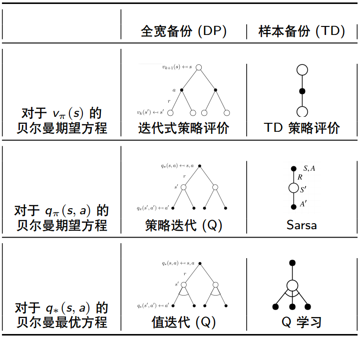

下图中，在公式上，非常非常像，公式几乎完全类似。

不同之处是：

* DP是用期望的形式作为目标值，TD是用采样值作为目标值。
* DP的小s换成了TD的大S，这也就是从全宽备份换成样本备份。TD采样到大S就是随机变量了，我们采样到哪个随机变量就用哪个随机变量更新。

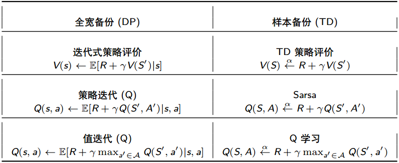

注：上图中右侧的
$$
x\leftarrow\alpha\leftarrow y
$$
是
$$
x\leftarrow x+\alpha(y-x)
$$
的简写。

---

看到这里，我们就很清楚了，时间差分TD是结合了动态规划DP和蒙特卡洛MC两者的特性。即利用了贝尔曼方程，又利用了采样。

# 参考资料

* [《强化学习理论与实践》第五章-无模型方法二：时间差分](http://www.shenlanxueyuan.com/my/course/96)

本章内容是该课程这节课的笔记。

* [[理论篇]怎样直观理解Qlearning算法？](https://zhuanlan.zhihu.com/p/110338833)

“SARSA和Qlearning的区别”参考了此知乎专栏文章。