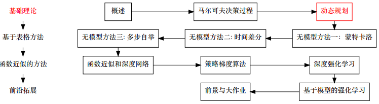
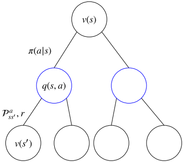
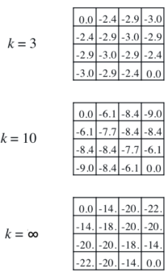
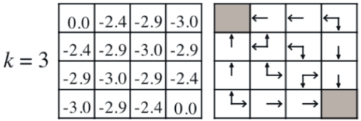

# 动态规划

* [返回上层目录](../reinforcement-learning.md)
* [本章在学习地图中的位置](#本章在学习地图中的位置)
* [前言](#前言)
  * [什么是动态规划](#什么是动态规划)
  * [动态规划可以解决什么问题](#动态规划可以解决什么问题)
  * [强化学习中的动态规划](#强化学习中的动态规划)
  * [动态规划的其他应用](#动态规划的其他应用)
* [策略评价](#策略评价)
  * [策略评价问题](#策略评价问题)
  * [利用贝尔曼期望方程的迭代式策略评价](#利用贝尔曼期望方程的迭代式策略评价)
  * [同步备份下的迭代式策略评价算法](#同步备份下的迭代式策略评价算法)
  * [策略评价例子](#策略评价例子)
* [策略提升](#策略提升)
  * [怎么改进策略π](#怎么改进策略π)
  * [策略提升定理](#策略提升定理)
* [策略迭代](#策略迭代)
  * [策略迭代算法（利用迭代式策略评价）](#策略迭代算法（利用迭代式策略评价）)
  * [迭代策略的进一步思考](#迭代策略的进一步思考)
  * [广义策略迭代](#广义策略迭代)
* [值迭代](#值迭代)
  * [强化学习中的最优性原理](#强化学习中的最优性原理)
  * [值迭代定义](#值迭代定义)
  * [值迭代算法](#值迭代算法)
  * [值迭代与策略迭代的对比](#值迭代与策略迭代的对比)
  * [同步备份下的三种算法总结](#同步备份下的三种算法总结)
* [动态规划引申](#动态规划引申)
  * [异步动态规划](#异步动态规划)
    * [就地（In-Place）动态规划](#就地（In-Place）动态规划)
    * [优先清理（Prioritised Sweeping）](#优先清理（Prioritised Sweeping）)
    * [实时动态规划](#实时动态规划)
  * [全宽备份和样本备份](#全宽备份和样本备份)
    * [全宽备份](#全宽备份)
    * [样本备份](#样本备份)
  * [压缩映射](#压缩映射)


# 本章在学习地图中的位置



上一章我们介绍了强化学习的基本假设——马尔科夫决策过程 (Markov Decision Process)。本文将介绍模型相关的强化学习算法。

有的时候，我们完全知道问题背后的马尔科夫决策过程；有的时候，我们不知道问题背后的马尔科夫决策过程 (主要指我们不知奖励函数 (R\_{s,a}) 和转移概率 (P_{s,a}^{s’}) 的全貌)。**根据马尔科夫决策过程是否可知，强化学习可以分为两类: 模型相关 (Model-based) 和模型无关 (Model-free)**。模型相关是我们知道整个马尔科夫决策过程。模型无关则是我们不知道马尔科夫决策过程，需要系统进行探索。今天我们先介绍比较简单的**模型相关**强化学习。

# 前言

## 什么是动态规划

* 之前提到解决序列决策问题有两种手段——学习与规划
* 当有一个景区的环境模型时，可以用动态规划去解
* 编程算法中也有动态规划的概念，与其相似
* 总的来说，就是讲问题分解成子问题，通过解决子问题，来解决原问题
  * **动态**：针对序列问题
  * **规划**：优化，得到策略
* **贝尔曼方程**是关键

## 动态规划可以解决什么问题

动态规划是一种解决问题的方法，什么样的问题能使用动态规划去解决呢？这样的问题具有以下两种性质：

* 最优子结构
  * 满足**最优性原理**
  * 最优的解可以被分解成子问题的最优解
* 交叠式子问题
  * 子问题能被多次重复
  * 子问题的解要能被缓存并再利用

恰好MDPs就满足这两个特征：

* 贝尔曼方程是递归的形式，把问题分解成子问题
* 值函数有效的存储了子问题的解，并能够再利用

注：什么是最优性原理？即：多阶段决策过程的最优决策序列具有这样的性质：不论初始状态和初始决策如何，对于前面决策所造成的某一状态而言，其后各阶段的决策序列必须构成最优策略。

## 强化学习中的动态规划

* 使用动态规划解决强化学习问题时，要求知道MDPs的所有元素

* 针对**评价**

  * 输入：MDP\<S,A,P,R,γ\>和策略π；

    或者，MRP\<S,Pπ,Rπ,γ\>

  * 输出：值函数vπ

* 针对**优化**

  * 输入：MDP\<S,A,P,R,γ\>
  * 输出：最优值函数v和最优策略π

## 动态规划的其他应用

动态规划不仅仅用来解决强化学习问题，是运筹学的一个分支。

* Richard Bellman在1957年出版作品《Dynamic Programming》
* 分类：线性动态规划，区域动态规划，树形动态规划，背包问题等
* 应用例子：最短路径问题，二分查找树，网络流优化问题等。

# 策略评价

## 策略评价问题

问题：给定一个策略π，求对应的值函数vπ(s)或qπ(s,a)

解决方法：

* 直接解：
  $
  v_{\pi}=(I-\gamma P^{\pi})^{-1}R^{\pi}
  $

  * 可以直接求得精确解
  * 时间复杂度O(n^3)

* 迭代解：v1→v2→...→vπ

  * 利用贝尔曼期望方程求解
  * 同样可以收敛到vπ

## 利用贝尔曼期望方程的迭代式策略评价



贝尔曼期望方程，表明了我们能够**通过后继状态 s‘ 更新s**。
$$
v_{\pi}=\sum_{a\in A}\pi(a|s)\left(R(s,a)+\gamma\sum_{s'\in S}P^a_{ss'}v_{\pi}(s') \right)
$$
因此，可以得到如下的迭代式子
$$
\begin{aligned}
&v_{k+1}=\sum_{a\in A}\pi(a|s)\left(R(s,a)+\gamma\sum_{s'\in S}P^a_{ss'}v_{k}(s') \right)\\
&v^{k+1}=R^{\pi}+\gamma P^{\pi}v^k
\end{aligned}
$$

## 同步备份下的迭代式策略评价算法

四个关键字：

* 备份（backup）：$v_{k+1}(s)$需要用到$v_k(s')$，用$v_k(s')$更新$v_{k+1}(s)$的过程称为备份。更新状态s的值函数称为备份状态s。**备份图**
* 同步（synchronous）：每次更新都要更新完所有的状态
* 策略评价
* 迭代式

**同步备份下的迭代式策略评价算法**

~~~
1: for k = 1,2,...  do
2:		for 所有的状态s∈S  do
3:			所有迭代式更新值函数v_{k+1}(s)
4:		end for 
5: end for
~~~

注：异步的版本后面会讲

## 策略评价例子


* 假设γ=1

* 14个普通状态，2个终止状态

* 走出边界的动作会导致状态不变

* 在走到终止状态前，任何动作都会导致-1的奖励

* 给定一随机策略
  $
  \pi(a|s)=0.25, \ \forall s,a
  $
  

通过贝尔曼方程验算上图第[0,1]个格子位置的值函数。
$$
\begin{aligned}
&-1.0=-1+\frac{1}{4}\times 0+\frac{1}{4}\times 0+\frac{1}{4}\times 0+\frac{1}{4}\times 0\\
&-1.7=-1+\frac{1}{4}\times (-1)+\frac{1}{4}\times  (-1)+\frac{1}{4}\times  (-1)+\frac{1}{4}\times 0\\
&-1.7=-1+\frac{1}{4}\times (-1)+\frac{1}{4}\times  (-1)+\frac{1}{4}\times  (-1)+\frac{1}{4}\times (-1)\\
\end{aligned}
$$


我们可以验证k=∞时，迭代收敛了
$$
\begin{aligned}
&-14=-1+\frac{1}{4}\times 0+\frac{1}{4}\times (-18)+\frac{1}{4}\times (-20)+\frac{1}{4}\times (-14)\\
&-18=-1+\frac{1}{4}\times (-14)+\frac{1}{4}\times  (-14)+\frac{1}{4}\times  (-20)+\frac{1}{4}\times (-20)\\
&-20=-1+\frac{1}{4}\times (-18)+\frac{1}{4}\times  (-18)+\frac{1}{4}\times  (-20)+\frac{1}{4}\times (-20)\\
&-22=-1+\frac{1}{4}\times (-22)+\frac{1}{4}\times  (-22)+\frac{1}{4}\times  (-20)+\frac{1}{4}\times (-20)\\
\end{aligned}
$$

# 策略提升

## 怎么改进策略π

* 给定一个策略π

  * **评价**策略π
    $
    v_{\pi}=\mathbb{E}_{\pi}[R_{t+1}+\gamma R_{t+2}+...|S_t=s]
    $

  * 在求得vπ之后，根据贪婪的动作**改进**策略
    $
    \pi '=\text{greedy}(v_{\pi})\Leftrightarrow a'=\text{arg }\mathop{\text{max}}_a\ q_{\pi}(s,a)
    $

* 可以证明π’≥π，即
  $
  v_{\pi'}(s)\geq v_{\pi}(s),\ \forall s
  $

* 使得更新后的策略不差于之前的策略的过程称之为**策略提升**

* 贪婪动作只是策略提升的一种方式


* 通过策略评价，和贪婪动作，策略从随机策略变成了最优策略π*
* 上述的策略比较幸运，策略提升一次就达到了最优
* 一般情况下，可能需要多次迭代（策略评价/策略提升）才能到达最优策略

## 策略提升定理

**策略提升定理：**

对于两个确定性策略 π‘ 和π，如果满足
$$
q_{\pi}(s,\pi'(s))\geq v_{\pi}(s)
$$
，那么我们可以得到
$$
v_{\pi'}\geq v_{\pi}(s)
$$
贪婪动作得到的策略是上述的特殊形式：
$$
q_{\pi}(s,\pi_{\text{贪婪}})\geq q_{\pi}(s,\pi'),\ \forall \pi'
$$
证明：

$$
\begin{aligned}
v_{\pi}(s)&\leq q_{\pi}(s,\pi'(s))\\
&=\mathbb{E}_{\pi'}[R_{t+1}+\gamma v_{\pi}(S_{t+1})|S_t=s]\\
&\leq\mathbb{E}_{\pi'}[R_{t+1}+\gamma q_{\pi}(S_{t+1},\pi'(S_{t+1}))|S_t=s]\\
&=\mathbb{E}_{\pi'}[R_{t+1}+\gamma \mathbb{E}_{\pi'}[R_{t+2}+\gamma v_{\pi}(S_{t+2})]|S_t=s]\\
&=\mathbb{E}_{\pi'}[R_{t+1}+\gamma R_{t+2}+\gamma^2 v_{\pi}(S_{t+2})|S_t=s]\\
&\leq\mathbb{E}_{\pi'}[R_{t+1}+\gamma R_{t+2}+\gamma^2R_{t+3}+\gamma^3 v_{\pi}(S_{t+3})|S_t=s]\\
&\vdots\\
&\leq\mathbb{E}_{\pi'}[R_{t+1}+\gamma R_{t+2}+\gamma^2R_{t+3}+\gamma^3 R_{t+4}+...|S_t=s]\\
&=v_{\pi'}(s)\\
\end{aligned}
$$

# 策略迭代

通过不断地交替运行策略评价和策略提升，使策略收敛到最优的策略的过程即为**策略迭代**

* **策略评价**：求vπ。使用方法：迭代式策略评价
* **策略提升**：提升策略π‘≥π。使用方法：贪婪策略提升


收敛证明：

* 提升停止时，
  $
  q_{\pi}(s,\pi'(s))=\mathop{\text{max}}_{a\in A}q_{\pi}(s,a)=q_{\pi}(s,\pi(s))=v_{\pi}(s)
  $

* 此时满足了贝尔曼方程
  $
  v_{\pi}(s)=\mathop{\text{max}}_{a\in A}q_{\pi}(s,a)
  $

* 此时，
  $
  v_{\pi}(s)=v_*(s),\ \forall s\in S
  $

* 此时，π是一个最优策略

## 策略迭代算法（利用迭代式策略评价）

算法：

```
1: 随机初始化V(s)和π(s)
2: repeat
3:     对于当前策略π，使用迭代式策略评价的算法估计vπ(s)得到V(s)
4:     使用贪婪策略提升得到π'(s)
5: until 策略保持不变π'(s)=π(s), ∀s
```

注：这里使用大写的V(s)函数，它和小写的区别在于小写的v(s)表示真实值，而大写的表示估计值

## 迭代策略的进一步思考

* 策略迭代分为两个步骤——策略评价和策略提升
* 一般策略评价需要迭代式求解。因此这里存在两个循环
* 策略评价一定要收敛到vπ，才能进行策略提升吗？
* 我们是不是可以引入提前停止的规则？
  * 例如：值函数更新的Δ足够小则停止
  * 例如：限定迭代式策略评价只迭代k次
  * 策略评价只爹带一次，就策略提升？（k=1）这就等同于**值迭代**（马上讲到）算法了



## 广义策略迭代

之前的策略迭代制定了策略评价（迭代式）和策略提升（贪婪）的方法

* 广义策略迭代（Generalised Policy Iteration， GPI）不限定两者的方法。
* 广义策略迭代（Generalised Policy Iteration GPI）不限定两者的方法，它包含
  * 策略评价：估计vπ。**任何**策略评价方法均可
  * 策略提升：提升策略π’≥π。**任何**策略提升算法均可
* 几乎所有的强化学习算法都可以用GPI（广义策略迭代）来描述
* 值函数只有在符合当前策略的情况下才稳定
* 策略只有在当前值函数下是贪婪的才稳定
* 因此稳态下，两者分别收敛到最优的v\*(s)，π\*(s)

# 值迭代

## 强化学习中的最优性原理

任何最优的策略都能被分解成两部分

* 最优的初始动作A*
* 从后继状态S‘开始沿着最优策略继续进行

**强化学习中的最优性原理**

一个策略π(a|s)能够实现从s开始的最优值函数，vπ(s)=v*(s)，当且仅当

* 对于任何从状态s开始的后继状态s'
* π能实现从状态s’开始的最优值函数vπ(s')=v*(s')

## 值迭代定义

* 根据最优性原理，只要知道v*(s')，即可以知道v\*(s)

* 我们只需要选择一步动作即可
  $
  v_*(s)\leftarrow\mathop{\text{max}}_{a\in A}\left[R(s,a)+\gamma\sum_{s'\in S}P_{ss'}^av_*(s')\right]
  $

* 上式中[.]内的部分表示进行了一步**迭代式策略评价**，max操作符表示进行了一次**策略提升**

* **值迭代**指的是利用上面的迭代式更新

* 相当于从最后的奖励函数出发，递归地求解之前的状态的值函数

**例子—最短路径**


## 值迭代算法

* 值迭代算法的额两种理解方式：
  * 策略迭代中，在策略评价阶段，只迭代一步
  * 利用贝尔曼最优方程进行迭代
* 问题仍然为找到最优的策略π
* 但是在更新的过程中并没有显式的策略

**算法 同步备份下的值迭代算法：**

~~~
1: for k = 1,2,... do
2:     for 所有的状态 s∈S do
3:         通过vk(s')更新v_{k+1}(s)
4:     end for
5: end for
~~~

* 与“同步备份下的迭代式策略算法”类似，但是有两点区别
  * 更新的公式不同
  * v_k(s)的意义不同

## 值迭代与策略迭代的对比

* 值迭代
  * v1 → v2 → v3 → ... → v*
  * 没有显式的策略
  * 迭代过程中的值函数可能不对应任何策略
  * 效率较高
  * 贝尔曼最优方程
* 策略迭代
  * π1 → v1 → π2 → v2 → π3 → v3 → ... → π* → v*
  * 有显式的策略
  * 迭代过程中的值函数对应了某个具体的策略
  * 效率较低
  * 贝尔曼方程+贪婪策略提升

## 同步备份下的三种算法总结

|  问题  |     贝尔曼方程      |   算法    |
| :--: | :------------: | :-----: |
|  评价  |    贝尔曼期望方程     | 迭代式策略评价 |
|  优化  | 贝尔曼期望方程+贪婪策略提升 |  策略迭代   |
|  优化  |    贝尔曼最优方程     |   值迭代   |

* 算法都是基于状态值函数的（V函数）
* 如果一共有动作m个，状态n个，每次迭代的复杂度为O(mn^2)
* 上述算法也可以拓展到状态动作值函数（Q函数）
* 运用到Q函数时，每次迭代的复杂度为O(m^2n^2)

# 动态规划引申

## 异步动态规划

* 之前的动态规划方法都是用了同步规划
* 也就是说，每次迭代都会同时保存所有状态的值函数
* 异步动态规划以某种顺序单独考虑每一个状态
* 能够大大减少计算量
* 只要所有的状态都能被持续的选择到，收敛性能够保证
* 常用的三种形式：
  * 就地动态规划
  * 优先清理
  * 实时动态规划

### 就地（In-Place）动态规划

* 同步值迭代存储了值函数的两个版本

  对于每一个s∈S
  $
  \begin{aligned}
  &v_{new}(s)\leftarrow\mathop{\text{max}}_{a\in A}\left(R(s,a)+\gamma\sum_{s'\in S}P_{ss'}^av_{old}(s')\right)\\
  &v_{old}\leftarrow v_{new}
  \end{aligned}
  $

* 就地动态规划仅仅存储一个副本

  对于每一个s∈S
  $
  v(s)\leftarrow \mathop{\text{max}}_{a\in A}\left(R(s,a)+\gamma\sum_{s'\in S}P_{ss'}^av(s')\right)
  $
  注：可以看出就地动态规划，每一次的更新与值遍历的顺序有关系。


### 优先清理（Prioritised Sweeping）

* 使用贝尔曼误差的大小来指导状态的选择
  $
  \left | \mathop{\text{max}}_{a\in A}\left(R(s,a)+\gamma\sum_{s'\in S}P_{ss'}^av(s')\right)  - v(s) \right |
  $

* 只备份当前贝尔曼误差最大的状态

* 每次备份完之后，更新受到影响的状态的贝尔曼误差

* 受到影响的状态分两类：

  * 1，更新的状态作为s
  * 2，更新的状态作为s‘

* 第一种情况，贝尔曼误差变为0；第二种情况，要求知道逆运动学（前驱状态）

* 在编程上，可以通过维护一个优先级队列来完成

* 可以保证每一个状态都能被遍历，因此能收敛


### 实时动态规划

* 之前的动态的规划考虑的是状态粒度读的操作

* 实时动态规划考虑了时间粒度的操作

* 仅仅和智能体相关的状态会被备份

* 用智能体的经验去指导状态的选择

* 在每一个时间步t上，智能体与环境交互了St,At,R_{t-1}

* 备份状态St
  $
  v(S_t)\leftarrow \mathop{\text{max}}_{a\in A}\left(R(S_t,a)+\gamma\sum_{s'\in S}P_{S_ts'}^av(s')\right)
  $

* 并不能保证每一个状态被遍历，需要结合一定的探索方法

## 全宽备份和样本备份

### 全宽备份


* 动态规划用的是全宽备份
* **全宽备份**表示对每一次备份都要考虑到每一个后继状态以及每一个动作
* 要求知道奖励函数R和状态转移函数P
* 当状态数量较少（数百万）时，动态规划很有效
* 当状态数量太多（维度灾难）时，即使是每一次备份都会需要很久的时间

### 样本备份


* 强化学习中主要使用样本备份——后面的章节
* 直接通过采样得到转移记录（transition）\<S,A,R,S'\>
* 通过采样代替总体
* 优点：
  * 无模型（model-free）：无需要知道R和P
  * 通过采样打破了维度灾难
  * 备份的时间复杂度固定，和状态的数量无关

## 压缩映射

证明了以下的问题

* 值迭代收敛到v*？
* 迭代式策略评价收敛到vπ？
* 策略跌倒收敛到v*？
* 解是唯一的吗？
* 算法收敛速度？

证明过程：

[如何证明迭代式策略评价、值迭代和策略迭代的收敛性？](https://zhuanlan.zhihu.com/p/39279611)

# 参考文献

* [《强化学习理论与实践》第三章：动态规划](http://www.shenlanxueyuan.com/my/course/96)

本章内容是该课程这节课的笔记。

* [强化学习通俗理解系列三：动态规划求解最优策略](https://www.zybuluo.com/Team/note/1125995)

还可以参考这篇文章，是David Sliver 强化学习公开课（b站有视频）的ppt的笔记。

* [强化学习系列之二:模型相关的强化学习](http://www.algorithmdog.com/%E5%BC%BA%E5%8C%96%E5%AD%A6%E4%B9%A0%E7%B3%BB%E5%88%97%E4%B9%8B%E4%BA%8C-%E6%A8%A1%E5%9E%8B%E7%9B%B8%E5%85%B3%E7%9A%84%E5%BC%BA%E5%8C%96%E5%AD%A6%E4%B9%A0)

这个文章也可以看下。有的时候，我们完全知道问题背后的马尔科夫决策过程；有的时候，我们不知道问题背后的马尔科夫决策过程 (主要指我们不知奖励函数 (R\_{s,a}) 和转移概率 (P\_{s,a}^{s’}) 的全貌)。根据马尔科夫决策过程是否可知，强化学习可以分为两类: 模型相关 (Model-based) 和模型无关 (Model-free)。模型相关是我们知道整个马尔科夫决策过程。模型无关则是我们不知道马尔科夫决策过程，需要系统进行探索。今天我们先介绍比较简单的模型相关强化学习。
