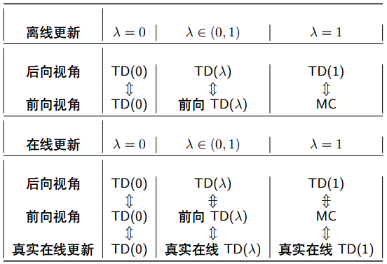

# 无模型方法三：多步自举

* [返回上层目录](../reinforcement-learning.md)
* [本章在学习地图中的位置](#本章在学习地图中的位置)
* [本章简介](#本章简介)
  * [无模型方法对比](#无模型方法对比)
  * [更通用的方法](#更通用的方法)
* [多步自举](#多步自举)
  * [多步时间差分](#多步时间差分)
  * [n步回报值](#n步回报值)
  * [n步时间差分策略评价](#n步时间差分策略评价)
* [TD（λ）](#TD（λ）)
  * [TD（λ）简介](#TD（λ）简介)
    * [将n步回报值平均](#将n步回报值平均)
    * [λ回报值](#λ回报值)
    * [TD（λ）的两种视角](#TD（λ）的两种视角)
    * [TD（λ）的前向视角](#TD（λ）的前向视角)
  * [资格迹](#资格迹)
    * [TD（λ）的后向视角](#TD（λ）的后向视角)
    * [资格迹（Eligibility Traces）](#资格迹（Eligibility Traces）)
    * [后向视角的TD（λ）](#后向视角的TD（λ）)
  * [TD（λ）的两种视角的关系](#TD（λ）的两种视角的关系)
    * [TD（λ）与TD（0）](#TD（λ）与TD（0）)
    * [TD（λ）和蒙特卡洛](#TD（λ）和蒙特卡洛)
    * [TD（1）和蒙特卡洛](#TD（1）和蒙特卡洛)
    * [对TD（λ）化简](#对TD（λ）化简)
    * [前向视角和后向视角的TD（λ）](#前向视角和后向视角的TD（λ）)
    * [两种视角下的等价性](#两种视角下的等价性)
    * [TD（λ）前后向视角关系小结](#TD（λ）前后向视角关系小结)
* [TD（λ）优化方法](#TD（λ）优化方法)
  * [n步SARSA](#n步SARSA)
  * [前向视角的SARSA（λ）](#前向视角的SARSA（λ）)
  * [后向视角的SARSA（λ）](#后向视角的SARSA（λ）)
  * [SARSA（λ）算法](#SARSA（λ）算法)

# 本章在学习地图中的位置

多步自举是蒙特卡洛和时间差分的**通用形式**。也就是说，蒙特卡洛和时间差分其实是多步自举的特殊形式而已。所以导致多步自举在学术上的理论研究比较多，因为多步自举是无模型方法中几乎可以描述所有模型的方法。

当用上节课的TD(0)有所瓶颈的时候，用今天讲的TD(λ)是有可能有所提效的。

虽然本节课叫多步自举，但是它只是本节课的一小部分，作为一个引子，引出了最关键的TD(λ)方法。TD(λ)比起多步自举，更加的通用。

今天所涉及的方法，大部分都是在策略版本，离策略比较复杂，涉及的比较少。

# 本章简介

## 无模型方法对比

蒙特卡洛和TD(0)算法存在不同的优劣

* 是否从完整片段中学习？
* 偏差和方差的权衡？
* 是否利用了马尔科夫性？
* 浅备份？深备份？
* 是否使用了自举？
* ...

## 更通用的方法

蒙特卡洛和TD(0)都是无模型的方法，能不能综合这两者的特点，得出更统一的方法呢？如何做出权衡，使它们的优点得到平衡？那么就是今天要讲的问题：

* 多步自举

* TD(λ), λ∈[0, 1]

* 资格迹

  在TD(λ)中的后向视角中会引入一个关键的概念：资格迹。理解起来比较抽象。本节可会从更通俗的角度去介绍，以及为什么它能够和以前提到的一些强化学习算法等价。

# 多步自举

## 多步时间差分

* 之前的TD(0)算法其实在多步自举里面被认为是一步时间差分，即采样1步，然后利用对应的后继状态的值函数进行备份。
* 多步自举里面讲的是一个多步的时间差分，多步的时间差分备份图如下：

上图中黑色圈圈表示Q(S,A)。

采样是智能体和环境的交互，采样分三种：

* 策略的采样：从策略中采样一个动作A
* 后继状态的采样：然后根据S和A，从状态转移概率里面，去采样一个后继状态S'。具体就是我在状态S里做了一个动作A，环境就会返回一个后继状态S'，相当于采样了一个后继状态。
* 奖励的采样：同时环境也会返回一个奖励，相当于从奖励函数里面采样了一个奖励。

一步采样是指什么呢？即采样一个动作，同时从环境里面采样一个后继状态，以及相应的奖励。这就是我们的TD(0)算法。

而蒙特卡洛呢，表示我们采样多步，把后继状态当成我们的现在状态，然后继续采样动作，采样后继状态的后继状态，再采样奖励。蒙特卡洛是一直采样到片段的终止状态为止。

而TD(0)呢，表示我采样一步之后，后继状态就不采样了，直接用过去对这个值函数的估计来结合我当前采样的一个值去更新我当前状态的值函数。即采样一步，利用对应后继状态的值函数进行备份。

那么，问题来了，我们能不能采样多步呢？

比如和对手下围棋，最简单的TD(0)的算法是：我下一步（动作A），我看对手下在哪（后继状态S’），然后根据对手的反应后的棋局，用以前的值函数来评价一下，然后更新我现在的值函数。多步采样呢，就是看两步，对弈两步以后再看这个棋局，然后用我对弈两步后的采样值和两步之后的棋局的值函数的值，做一个加权，比如在值函数前乘以一个γ，两步的话应该是乘以γ的平方，然后加权求和，就得到了现在状态的新的值函数。三步以此类推，一直到n步，如果一直采样到终止状态，那就是蒙特卡洛的方法。

所以多步自举非常简单，就是对采样和自举做一个权衡，多步采样之后再自举，通过调节备份的深度，就可以形成一个多步的时间差分。

## n步回报值

* 考虑下面的n步回报值，对于n=1,2,...,∞
  $
  \begin{aligned}
  &n=1\quad(\text{TD})\quad &G_t^{(1)}=R_{t+1}+\gamma V(S_{t+1})\\
  &n=2\quad&G_t^{(2)}=R_{t+1}+\gamma R_{t+2}+\gamma^2V(S_{t+2})\\
  &n=\infty\quad(\text{MC})\quad&G_t^{(\infty)}=R_{t+1}+\gamma R_{t+2}+...+\gamma^{T-t-1}R_T\\
  \end{aligned}
  $

* 我们可以定义**n步回报值**
  $
  G_t^{(n)}=R_{t+1}+\gamma R_{t+2}+...+\gamma^{n-1}R_{t+n}+\gamma^nV(S_{t+n})
  $

* n步时间差分学习
  $
  V(S_t)\leftarrow V(S_t)+\alpha\left(G_t^{(n)}-V(S_t)\right)
  $

**那n步到底具体是几步最好呢？**

需要自己实验，经验认为3-10步左右，要好于TD(0)和MC。

具体步数和环境非常相关。没有一个特别理论的方法说明设置几步是最好的，需要自己尝试几次。

上图的纵坐标表示和最优目标值的均方根误差的差距。

## n步时间差分策略评价

两个注意的点：

* 为了计算n步回报值，需要维护R,S的存储空间
* 对于后继状态不足n个的，使用蒙特卡洛目标值

# TD（λ）

刚说的n步自举还没有那么通用，这节课的重点是TD(λ)，TD(λ)在n步自举的基础上，再做了一层抽象，比n步自举更通用和一般化。

## TD（λ）简介

### 将n步回报值平均

* 不同的n下的n步回报值效果不同

* 将不同n下的n步回报值做加权平均，也能构成一个有效的回报值

* 比如：平均2步回报值和4步回报值
  $
  \frac{1}{2}G^{(2)}+\frac{1}{2}G^{(4)}
  $
  混合了两种信息

* 能不能有效地混合所有的n步回报值？

TD(λ)就是：不用考虑到底选多少步回报值，而是把所有的n步回报值都混合在一起。

### λ回报值

TD(λ)的备份图如下图：

* **λ回报值混合了所有的n步回报值$G_t^{(n)}$**
  
* 使用了权重$(1-\lambda)\lambda^{n-1}$（用得比较巧妙）$G_t^{\lambda}=(1-\lambda)\sum_{n=1}^{\infty}\lambda^{n-1}G_t^{(n)}$
  
* λ=0，退化成TD(0)；λ=1，退化成MC

* TD(λ)更新公式：$V(S_t)\leftarrow V(S_t)+\alpha\left(G_t^{\lambda}-V(S_t)\right)$

**TD(λ)的加权函数：**

如下图所示，各系数是以指数衰减的形式去求和的。

$$
G_t^{\lambda}=(1-\lambda)\sum_{n=1}^{\infty}\lambda^{n-1}G_t^{(n)}
$$
上图的每个小格代表的纵坐标就是不同n的加权系数。

### TD（λ）的两种视角

前向视角帮助我们理解TD(λ)和蒙特卡洛和TD(0)的关系，后向视角是我们实际在项目中用到的方法。

* 前向视角（forward-view）：主要是为了理解TD(λ)，

  但基本不会去用。上面讲的就是前向视角，即TD(λ)是将多个不同n下的回报值做一个指数加权求和的一种算法。

* 后向视角（backward-view）：真正的实用算法，

  会引入一个新的概念，叫资格迹。后向视角通过资格迹去理解。

两种视角分别提供了两种算法，但是所用的原理是一样的。

### TD（λ）的前向视角

我们希望用将来的信息来更新我当前的状态。站在当前时刻想要更新当前时刻是不行的，必须等到看到未来信息后才能更新当前时刻。

* 通过使用λ回报值来更新值函数

* 前向视角使用将来的数据$R_{t+1},S_{t+1},...$来计算$G_t^{\lambda}$

* 类似于蒙特卡洛，只能从完整的片段学习。TD(λ)和n步TD是不同的。n步TD看n步就行了，TD(λ)中包含了蒙特卡洛项，所以必须要完整片段。

  **必须等到片段结束后才能进行学习**，这就是为什么前向视角没用的原因，因为这和解蒙特卡洛是一样的，只是说还要多算几步回报值而已，反而还增加了计算量。所以在使用TD(λ)算法的时候，我们会更多地采用资格迹。

## 资格迹

这就是为什么我们要使用指数加权的形式，为什么要用TD(λ)把所有的值加起来，因为它能够导出这样一种后向视角的算法。只有导出了后向视角的算法，我们才能理解，为什么要设计成指数加权的形式。指数加权的形式会让后向算法成为一种非常有效的算法。

### TD（λ）的后向视角

* 前向视角提供理论。阐述了TD(λ)和蒙特卡洛、TD(0)以及多步自举的关系。

* 后向视角提供实用算法

* 通过后向视角，可以实现

  * 在线更新

    在线更新和离线更新的区别就是：

    前向视角只能**离线更新**：只能等到这个片段做完了，把数据都存好了，然后把这个数据用来更新我的这个状态，依次去数片段里哪些状态被遍历到了。意思就是智能体和环境交互完成之后，再把数据拿下来更新当前状态，意思就是秋后算账吧。离线更新只能用于片段性（有限）任务，万一这个任务要是无穷无尽的做下去，那么你就不能秋后算账，因为这个任务都永远做不完。

    **在新更新**：做一步，就更新一次。智能体和环境发生一次交互，就马上更新。效率会比较高。因为做一次就更新依次，那么就意味着我的策略有可能就已经得到提升，我下一步就能得到一个改进，不需要等到整个片段给做完了，才有一次改进，我每一步都可能有改进，这就会导致，哪怕是一个片段中，我都会越做越好。在线更新的好处就是虽然这个任务做不完，但是在一边做的过程中，我就在优化我的算法，即便是连续性任务，我也可以越做越好。

  * 每步更新

    在线更新指一边跟环境交互，一边更新。有时候不一定是每步的，比如每2步，每3步等。

  * 从不完整状态（片段）更新

    比如下象棋，其中一个片段性任务，你也可以优化算法。

注：通过后向视角验证了：**同一个算法使用不同的执行方法，可以获得不同的计算收益。**

### 资格迹（Eligibility Traces）

* 信度分配（Credit assignment）问题：到底是钟声还是灯光造成了最后的震动？

  由此分成了两种学派：

* **频率启发式**：归因到频数最高的状态

  认为钟响了三次，导致了最后发生了问题，因为钟响了三次，灯才亮了一次。

* **近因启发式**：归因到最近的状态

  虽然钟响了三次，但是出问题还是要找最近的因素，我还是认为灯虽然只亮了一次，但是它离我最近，我还是觉得最近发生的事件导致的因素会更大。

* 资格迹是两种学派的结合
  $
  \begin{aligned}
  E_0(s)&=0\\
  E_t(s)&=\gamma\lambda E_{t-1}(s)+I(S_t=s)\\
  \end{aligned}
  $
  一个状态，对我最终的影响，到底有多大，那么我们怎么去评价这样的影响呢？

  资格迹就是分别考虑了频率，也考虑了时间，从而去度量它的影响，是怎么度量的呢？

对于上图，类似于卷积函数和自动控制中的冲击响应，次数越多，累计的越高，但是随着时间越长，又会衰减的越多。这个衰减值就是γ（伽马）。而λ就是上面TD(λ)中的λ，这里暂时先认为是个常量。

### 后向视角的TD（λ）

有了资格迹之后，我们来看下后向视角的TD(λ)：

* 对于每一个状态s，维护一个资格迹E(s)

* 更新值函数V(s)时，会更新**每一个状态s**。本质上是用资格迹向量更新了值函数向量

  TD(0)是采样到哪个状态就更新哪个状态。

  资格迹是每一步都会更新所有状态。

* 使用时间差分误差δt和资格迹Et(s)
  $
  \begin{aligned}
  \delta _t&=R_{t+1}+\gamma V(S_{t+1})-V(S_t)\\
  V(s)&\leftarrow V(s)+\alpha\delta_tE_t(s)\\
  \end{aligned}
  $
  一次会更新完所有的状态。

  

* 资格迹本质上是记录了所有状态s对后继状态$S_{t+1}$的贡献度，被用来对时间差分误差进行加权。

  贡献大的更新的就多一点，贡献小的更新的就少一点。

  更新到t+1时刻后，来一个秋后算账，我看谁之前对我贡献比较大，贡献的大小就用资格迹去评判。资格迹考虑了谁的频率比较高，谁离我更近。

## TD（λ）的两种视角的关系

前向视角帮助我们理解TD(λ)和蒙特卡洛和TD(0)的关系，后向视角是我们实际在项目中用到的方法。

下面我们用TD(λ)的后向视角来看。

### TD（λ）与TD（0）

* 当λ=0时，只有当前状态会被更新
  $
  \begin{aligned}
  E_t(s)&=I(S_t=s)\\
  V(s)&\leftarrow V(s)+\alpha\delta_tE_t(s)\\
  \end{aligned}
  $
  资格迹只考虑当前状态，上一时刻的资格迹会马上衰减到0。所以只有当前的状态被更新资格迹，其他的状态都会是零。

* 等价于TD(0)的更新公式
  $
  V(S_t)\leftarrow V(S_t)+\alpha\delta_t
  $

### TD（λ）和蒙特卡洛

* 当λ=1时，信度分配会被延迟到终止状态

* 这里考虑片段性任务，而且考虑离线更新

* 考虑一个片段**整体**的情况下，TD(1)**总更新量**等于蒙特卡洛

  * 在每一步更新上可能有差距

* 对s的总更新量

  * TD(λ)前向视角：
    $
    \sum_{t=1}^T\alpha\left(G_t^{\lambda}-V(S_t)\right)I(S_t=s)
    $

  * TD(λ)后向视角
    $
    \sum_{t=1}^T\alpha\delta_tE_t(s)
    $

  * 不论是前向视角还是后向视角，被更新的总更新量是一样的。

### TD（1）和蒙特卡洛

* 考虑一个片段，其中在时间k处，状态s会被访问

* TD(1)算法中，对s的资格迹如下
  $
  \begin{aligned}
  E_t(s)&=\gamma E_{t-1}(s)+I(S_t=s)\\
  &=\left\{\begin{matrix}
  &0,\quad &\text{if }\ t<k\\ 
  &\gamma^{t-k},\quad &\text{if }\ t \geqslant k\\ 
  \end{matrix}\right.
  \end{aligned}
  $

* TD(1)在线更新累积误差
  $
  \sum_{t=1}^{T-1}\alpha\delta_tE_t(s)=\alpha\sum_{t=k}^{T-1}\gamma^{t-k}\delta_t=\alpha(G_k-V(S_k))
  $
  上式中的右侧的等号为什么会成立？下面马上证明。最右侧的式子就是蒙特卡洛的更新量。

* 一直到片段结束。把上式中间的式子写开的话，就是下面的形式：
  $
  \delta_k+\gamma\delta_{k+1}+\gamma^2\delta_{k+2}+...+\gamma^{T-1-k}\delta_{T-1}
  $

* 当λ=1的时候，时间差分误差的和能够简化为蒙特卡洛误差
  $
  \begin{aligned}
  &\delta_t+\gamma\delta_{t+1}+\gamma^2\delta_{t+2}+...+\gamma^{T-1-t}\delta_{T-1}\\
  =&R_{t+1}+\gamma V(S_{t+1})-V(S_t)\\
  &+\gamma R_{t+2}+\gamma^2 V(S_{t+2})-\gamma V(S_{t+1})\\
  &+\gamma^2 R_{t+3}+\gamma^3 V(S_{t+3})-\gamma^2 V(S_{t+2})\\
  &\vdots\\
  &+\gamma^{T-1-t} R_T+\gamma^{T-t} V(S_T)-\gamma^{T-1-t} V(S_{T-1})\\
  =&R_{t+1}+\gamma R_{t+2}+\gamma^2 R_{t+3}+...+\gamma^{T-1-t}R_T-V(S_t)\\
  =&G_t-V(S_t)\\
  \end{aligned}
  $

* TD(1)等价于每次拜访的蒙特卡洛算法

  因为资格迹，状态在一个轨迹里面每出现一次，就加1。而如果是首次拜访的蒙特卡洛的话，对一个轨迹里面重复出现的状态，只算一次，它们两个就不等价了。

* 区别是：

  * TD(1)是在线误差累计，是每步更新的。
  * 而如果TD(1)也等到片段结束后离线更新，那么TD(1)就是蒙特卡洛。因为其累计更新量和蒙特卡洛的目标值的更新量，是一模一样的。

### 对TD（λ）化简

刚说的TD(λ)，如果λ=0，就是TD(0)，如果λ=1，如果是离线更新，那就和蒙特卡洛是一模一样的，如果是在线更新，那么和每次拜访的蒙特卡洛是等价的。

当λ不等于0，在0和1之间，那么前向视角和后向视角是不是一个等价的关系呢？

**前向视角和后向视角下的误差等价**
$$
\begin{aligned}
G_t^{\lambda}-V(S_t)=&-V(S_t)\\
&+(1-\lambda)\lambda^0(R_{t+1}+\gamma V(S_{t+1}))\\
&+(1-\lambda)\lambda^1(R_{t+1}+\gamma R(S_{t+2})+\gamma^2 V(S_{t+3}))\\
&+(1-\lambda)\lambda^2(R_{t+1}+\gamma R(S_{t+2})+\gamma^2 R(S_{t+3})+\gamma^3 V(S_{t+3}))\\
&+...\\
=&-V(S_t)\\
&+(\gamma\lambda)^0(R_{t+1}+\gamma V(S_{t+1})-\gamma\lambda V(S_{t+1}))\\
&+(\gamma\lambda)^1(R_{t+2}+\gamma V(S_{t+2})-\gamma\lambda V(S_{t+2}))\\
&+(\gamma\lambda)^2(R_{t+3}+\gamma V(S_{t+3})-\gamma\lambda V(S_{t+3}))\\
&+...\\
=&\quad\ (\gamma\lambda)^0(R_{t+1}+\gamma V(S_{t+1})-V(S_t))\\
&+(\gamma\lambda)^1(R_{t+2}+\gamma V(S_{t+2})-V(S_{t+1}))\\
&+(\gamma\lambda)^2(R_{t+3}+\gamma V(S_{t+3})-V(S_{t+2}))\\
&+...\\
=&\delta_t+\gamma\lambda\delta_{t+1}+(\gamma\lambda)^2\delta_{t+2}+...
\end{aligned}
$$

注意：上式的第三个等号处，进行了移位操作，而最后一项是终止状态，终止状态的值函数$V(S_{t+n})$我们一般是预定义好的，比如等于0。所以，看起来是消失了。

### 前向视角和后向视角的TD（λ）

* 考虑一个片段，其中在时间k处，状态s会被访问

* TD(λ)的资格迹
  $
  \begin{aligned}
  E_t(s)&=\gamma\lambda E_{t-1}(s)+I(S_t=s)\\
  &=\left\{\begin{matrix}
  &0,\quad &\text{if }\ t<k\\ 
  &(\gamma\lambda)^{t-k},\quad &\text{if }\ t \geqslant k\\ 
  \end{matrix}\right.
  \end{aligned}
  $

* 后向视角TD(λ)在线更新累积误差和前向视角的总更新量是等价的
  $
  \sum_{t=1}^T\alpha\delta_tE_t(s)=\alpha\sum_{t=k}^T(\gamma\lambda)^{t-k}\delta_t=\alpha(G_k^{\lambda}-V(S_k))
  $

* 截止到片段结束时，能收集到λ回报值误差都是等价的

* 对s的多次拜访，Et(s)会收集多次误差

### 两种视角下的等价性

上面说的等价是离线更新等价。

* **离线**更新

  * 在整个片段里累积更新误差
  * 在片段结束后统一更新
  * 离线更新下，前向视角和后向视角等价

* **在线**更新

  * TD(λ)在片段的每一步更新

  * 此时前向视角和后向视角有一点不同。

    因为每优化一步，策略就已经发生变化了，和环境交互的采样，就已经发生变化了。

  * 这个差别可以通过资格迹进行一些修正，使两者完全等价

  * 这个差别怎么找一种在线更新的后向视角的TD(λ)算法去和前向视角TD(λ)是等价的呢？

    这个有个papper，是2014年提出来的。找到了另外一种在线更新的后向视角的TD(λ)实现算法，可以实现真正意义上的等价。

    True Online TD(λ) - Harm van Seijen, Richard S. Sutton

### TD（λ）前后向视角关系小结

# TD（λ）优化方法

这里主要介绍SARSA(λ)，即在上节课所介绍的SARSA算法上，去做一个提升，或者说做一个更通用的方法。

本节不会涉及TD(λ)的离策略版本，因为比较复杂，使用起来也不太方便。因为在TD(λ)基础上还要去结合一个重要性采样，这个就让使用变得非常复杂。

SARSA(λ)唯一区别就是把之前n步回报值的V函数的回报值换成Q函数的回报值。

## n步SARSA

- 考虑下面的n步回报值，对于n=1,2,...,∞
  $
  \begin{aligned}
  &n=1\quad(\text{SARSA})\quad &q_t^{(1)}=R_{t+1}+\gamma Q(S_{t+1},A_{t+1})\\
  &n=2\quad&q_t^{(2)}=R_{t+1}+\gamma R_{t+2}+\gamma^2Q(S_{t+2},A_{t+2})\\
  &n=\infty\quad(\text{MC})\quad&q_t^{(\infty)}=R_{t+1}+\gamma R_{t+2}+...+\gamma^{T-t-1}R_T\\
  \end{aligned}
  $

- 我们可以定义**n步Q回报值**
  $
  q_t^{(n)}=R_{t+1}+\gamma R_{t+2}+...+\gamma^{n-1}R_{t+n}+\gamma^nQS_{t+n},A_{t+n})
  $

- n步SARSA使用n步回报值更新Q(s,a)
  $
  Q(S_t,A_t)\leftarrow Q(S_t,A_t)+\alpha\left(q_t^{(n)}-Q(S_t,A_t)\right)
  $

## 前向视角的SARSA（λ）

SARSA(λ)的备份图如下图：

- **qλ回报值混合了所有的n步Q回报值**
  $
  q_t^{(n)}
  $

- 使用了权重
  $
  (1-\lambda)\lambda^{n-1}
  $

  $
  q_t^{\lambda}=(1-\lambda)\sum_{n=1}^{\infty}\lambda^{n-1}q_t^{(n)}
  $

- 得到了前向视角SARSA(λ)
  $
  Q(S_t,A_t)\leftarrow Q(S_t,A_t)+\alpha\left(q_t^{\lambda}-Q(S_t,A_t)\right)
  $

## 后向视角的SARSA（λ）

* 使用资格迹在线更新

* 但是这里的资格迹是针对\<s,a\>
  $
  \begin{aligned}
  E_0(s,a)&=0\\
  E_t(s,a)&=\gamma\lambda E_{t-1}(s,a)+I(S_t=s,A_t=a)\\
  \end{aligned}
  $

* 对**所有的s,a**更新Q(s,a)

* 利用资格迹和时间差分误差更新
  $
  \begin{aligned}
  \delta _t&=R_{t+1}+\gamma Q(S_{t+1},A_{t+1})-Q(S_t,A_t)\\
  Q(s,a)&\leftarrow Q(s,a)+\alpha\delta_tE_t(s,a)\\
  \end{aligned}
  $

## SARSA（λ）算法

-algorithm.png)

# 参考资料

* [《强化学习理论与实践》第六章-无模型方法三：多步自举](http://www.shenlanxueyuan.com/my/course/96)

本章内容是该课程这节课的笔记。

* [强化学习入门 第四讲 时间差分法（TD方法）](https://zhuanlan.zhihu.com/p/25913410)

n步预测为什么要加1-lambda可以看这里。

