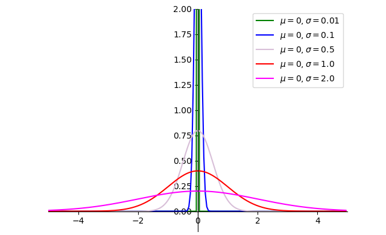

# PPO近端策略优化

- [返回上层目录](../paper.md)


PDF: [Proximal Policy Optimization Algorithms](https://arxiv.org/abs/1707.06347)

OpenAI Blog: [Proximal Policy Optimization](https://openai.com/blog/openai-baselines-ppo/)和[Proximal Policy Optimization](https://spinningup.openai.com/en/latest/algorithms/ppo.html#id3)

GitHub: [openai/baselines/ppo2](https://github.com/openai/baselines/tree/master/baselines/ppo2)


# 连续输出值的方差的选择

PPO 连续动作的sigma，其实在不同版本的实现里一共有三种
- fixed：固定 sigma，常用于一些特殊控制任务，如果对环境的 sigma 有足够的先验知识可以这样做
- independent：即为一个可优化的网络参数，但是和state无关，是一个独立参数。这是一般 PPO 常用的情形
- state conditioned：由 state 输入通过一定的网络层生成，这种情况在 SAC 中常用，PPO中较少见。不过有 paper 在mujoco环境上做过对比实验，至少在这个控制环境上差别不大

三种类型的代码对比可以参考我们这里的代码 https://github.com/opendilab/DI-engine/blob/main/ding/model/common/head.py#L965

中文版的注释详解可以看这个 https://opendilab.github.io/PPOxFamily/continuous_zh.html

## OpenAI的选择

[OpenAI Spinning Up Part 1: Key Concepts in RL](https://spinningup.openai.com/en/latest/spinningup/rl_intro.html#id2)

> A diagonal Gaussian policy always has a neural network that maps from observations to mean actions,$\mu_{\theta}(s)$. There are two different ways that the covariance matrix is typically represented.
>
> **The first way:** There is a single vector of log standard deviations,$log \sigma$, which is **not** a function of state: the $log \sigma$ are standalone parameters. (You Should Know: our implementations of VPG, TRPO, and PPO do it this way.)
>
> **The second way:** There is a neural network that maps from states to log standard deviations,$log \sigma_{\theta}(s)$. It may optionally share some layers with the mean network.


## 参考代码

刚去openailab仓库上翻了翻 https://github.com/opendilab/DI-engine/blob/0a25e46e29638a4be04654c7fd132ebdff4a556a/ding/model/common/head.py#L965
他们这里连续动作用的ReparameterizationHead就有

可以看openailab的代码  写的挺好的 固定，独立参数，模型推理三种方法都可以选择  莫烦的没有讲的很全面，感觉比较适合入门。

对于独立值：我是这么理解的，当选择的动作在这个分布上的回报高于期望，那就增大这个动作的选择概率，对应的均值向这个动作移动，方差降低。如果低于期望，那方差就调大，增加选择其他动作的概率。

一般选独立参数，比较好训练

其他的参考代码：

independent:

https://github.com/tensorlayer/tensorlayer/blob/master/examples/reinforcement_learning/tutorial_DPPO.py

固定值/线性衰减：

https://github.com/nikhilbarhate99/PPO-PyTorch/blob/master/train.py

基于state训练：

莫凡python：

https://github.com/MorvanZhou/Reinforcement-learning-with-tensorflow/blob/master/contents/12_Proximal_Policy_Optimization/DPPO.py

其他：

我的PPO用的是之前小助手分享的，37个PPO实施细节里的代码，你说的adv_norm，max_grad_norm也是在配置里的

https://github.com/vwxyzjn/ppo-implementation-details

https://iclr-blog-track.github.io/2022/03/25/ppo-implementation-details/


正态分布：
$$
f(x)=\frac{1}{\sqrt{2\pi}\sigma}\text{exp}\left(-\frac{(x-\mu)^2}{2\sigma^2}\right)
$$


代码(参考资料：[Python绘制高斯分布（正态分布）图像](https://blog.csdn.net/qq_44444503/article/details/124377863))：

```python
import numpy as np
import math
import matplotlib.pyplot as plt


def gd(x, mu=0., sigma=1.):
    # sigma是标准差
    left = 1 / (np.sqrt(2 * math.pi) * sigma)
    right = np.exp(-(x - mu) ** 2 / (2 * np.square(sigma)))
    return left * right


if __name__ == '__main__':
    # 自变量
    x = np.arange(-5, 5, 0.05)
    # 因变量（不同均值或方差）
    y_1 = gd(x, 0, 0.01)
    y_2 = gd(x, 0, 0.1)
    y_3 = gd(x, 0, 0.5)
    y_4 = gd(x, 0, 1.0)
    y_5 = gd(x, 0, 2.0)

    # 绘图
    plt.plot(x, y_1, color='green')
    plt.plot(x, y_2, color='blue')
    plt.plot(x, y_3, color='thistle')
    plt.plot(x, y_4, color='red')
    plt.plot(x, y_5, color='fuchsia')
    # 设置坐标系
    plt.xlim(-5.0, 5.0)
    plt.ylim(-0.2, 2)

    ax = plt.gca()
    ax.spines['right'].set_color('none')
    ax.spines['top'].set_color('none')
    ax.xaxis.set_ticks_position('bottom')
    ax.spines['bottom'].set_position(('data', 0))
    ax.yaxis.set_ticks_position('left')
    ax.spines['left'].set_position(('data', 0))

    plt.legend(labels=[
        '$\mu = 0, \sigma=0.01$',
        '$\mu = 0, \sigma=0.1$',
        '$\mu = 0, \sigma=0.5$',
        '$\mu = 0, \sigma=1.0$',
        '$\mu = 0, \sigma=2.0$'])
    plt.show()
```


# 连续值action训练时要不要clip

请问ppo的动作a，收集好发回给模型进行训练时，这个动作a应该去掉clip限幅，还是要保留clip限幅？
p.s.这个动作a输给env.step(a)时肯定是要做限幅的，这个没啥说的。

训练时，不要clip，clip只放在环境里面做。否则你计算时的log prob很容易过大或过小。训练时就用最原始的从概率分布里采样出来的action


## adv norm

adv norm需要考虑reward的数值范围，如果绝对值在0-100之内其实影响不大，如果绝对值大于这个范围，且reward波动的确实很明显（注意要和稀疏reward区分），那适合用adv norm

然后这种比较直接的 adv norm，应该batch越大统计量越准，所以在实现中，像dppo的话，应该是训练的多卡之间allreduce同步mean和std，然后再norm

出现nan有很多种原因，其中之一就是adv norm

如果数据多样性很差，一个batch里太相近，那么算出来的std就很接近于0，这样norm一除就炸了

mean和std计算用的样本肯定是越多越准，但因为rl本身数据分布就一直在变，所以可能有些场景里对最终性能影响不大，就跟你的实验结果一样。

你要想真正深究这个问题，应该要去可视化这两种设定下算出来的mean和std的变化情况，再分析这个变化对于智能体性能的影响，并在不同类型的环境上做对比看能不能找到普适结论

决策问题(环境)之间的差异性太大了，所以经验性结论经常变化，但是分析方法和手段掌握了之后，具体问题具体分析就好，没有什么玄学的

baseline这个地方只是说减去一项还是无偏估计，并没有说除上这样一个动态变化的std还是无偏估计

如果缩放的因子是整个训练期间都用一个固定值，那没问题，关键就是我们做adv norm是用动态统计量，这个就进入到很麻烦的领域了

# 掩码（mask）是做什么用的

有没有一些这方面的强化学习科普资料？

Musk主要是针对一些动作和参数之间的关系，通过掩码可以建立这种关系，加速收敛。

mask部分一般有两类
- 离散动作空间的 mask，用于去掉一些当前帧不可选的动作，对训练优化有一定加速作用。我们这次第二节课的作业题会涉及到。
- 混合动作空间的 mask，用于表达不同 action 部分之间的关系，例如某些动作类型对应特定的动作参数，可以参考这里的讲解例子，尤其是最后的 mask 使用部分 https://opendilab.github.io/PPOxFamily/hybrid_zh.html


# 参考资料


===

[游戏AI比赛番外篇2：为啥强化学习做游戏AI都喜欢用PPO算法？](https://zhuanlan.zhihu.com/p/550312933)

必看，因为这篇文章直观介绍了损失函数。


（Generalized Advantage Estimation）训练最稳定，调参最简单，适合高维状态 High-dimensional state，但是环境不能有太多随机因数。GAE会根据经验轨迹 trajectory 生成优势函数估计值，然后让Critic去拟合这个值。在这样的调整下，在随机因素小的环境中，不需要太

[mengwanglalala/**RL-algorithms**](https://github.com/mengwanglalala/RL-algorithms)


[进阶篇---PPO代码逐行分析](https://blog.csdn.net/qq_37395293/article/details/114254505)

A3C在每一次迭代中，都要采集T个samples(T远远小于回合长度)，计算T个n-step return，然后使用这T个数据更新评价网络：

PPO也使用了相同的思路，但是使用GAE实现


===


* [PPO算法经典论文阅读](https://blog.csdn.net/shengzimao/article/details/126493407)

* [深度增强学习PPO（Proximal Policy Optimization）算法源码走读](https://blog.csdn.net/jinzhuojun/article/details/80417179)


* [PPO强化学习如何实现多维度的动作呢？](https://www.zhihu.com/question/417161289/answer/2207316616)

个人觉得用得比较多的是输出5个均值和方差，再从这5个分布中，采样5个值。

这里给你附上一个Pytorch实现PPO的代码，对多维连续空间进行了详细的实现，代码也比较简洁稳定：

[https://github.com/XinJingHao/PPO-Continuous-Pytorch](https://github.com/XinJingHao/PPO-Continuous-Pytorch)

请问如果action是5维，并且每一维是0,1,2,3,4这样的离散的数，这种情况应该怎么处理呢？

也可以作为independent action （见Section V subsection A [arxiv.org/pdf/2105.1380](http://link.zhihu.com/?target=https%3A//arxiv.org/pdf/2105.13807.pdf)），代码可见 [github.com/vwxyzjn/PPO-](http://link.zhihu.com/?target=https%3A//github.com/vwxyzjn/PPO-Implementation-Deep-Dive/blob/lstm-and-multidiscrete/ppo_multidiscrete.py)。一般如果你的离散动作空间有很多维度，可能会有无效动作，这时候invalid action masking 很重要，见[arxiv.org/abs/2006.1417](http://link.zhihu.com/?target=https%3A//arxiv.org/abs/2006.14171), 代码可见 [github.com/vwxyzjn/PPO-Implementation-Deep-Dive](http://link.zhihu.com/?target=https%3A//github.com/vwxyzjn/PPO-Implementation-Deep-Dive/blob/lstm-and-multidiscrete/ppo_multidiscrete_mask.py)。


* [如何理解看待 OpenAI 公布PPO算法？ 莫凡](https://www.zhihu.com/question/63067895/answer/214180615)

我也实践了一下 Python 的简单 PPO 算法. 毕竟 OpenAI 开源的那个 [baselines](https://link.zhihu.com/?target=https%3A//github.com/openai/baselines) 太复杂了, 看半天源码也看不懂. 所以下定决心自己写一个比他们的简单好多倍的代码. 自己写的教程在这里: [结合了 OpenAI 和 DeepMind 的 PPO](https://link.zhihu.com/?target=https%3A//mofanpy.com/tutorials/machine-learning/reinforcement-learning/6-4-DPPO/)。额，前面这个地址打不开了，直接看这个：[Distributed Proximal Policy Optimization (DPPO)](https://mofanpy.com/tutorials/machine-learning/reinforcement-learning/DPPO)，既可以看代码，也可以看环境源码。特别推荐。

简述一下自己写代码的感想. OpenAI 的 PPO 感觉是个串行的（要等所有并行的 Actor 搞完才更新模型）, DeepMind 的 DPPO 是并行的（不用等全部 worker）, 但是代码实践起来比较困难, 需要推送不同 worker 的 [gradient](https://www.zhihu.com/search?q=gradient&search_source=Entity&hybrid_search_source=Entity&hybrid_search_extra={"sourceType"%3A"answer"%2C"sourceId"%3A214180615}). 我取了 OpenAI 和 DeepMind 两者的精华. 用 OpenAI 中性能最好的 Policy 更新策略 (clipped surrogate) + DeepMind [parallel training](https://www.zhihu.com/search?q=parallel+training&search_source=Entity&hybrid_search_source=Entity&hybrid_search_extra={"sourceType"%3A"answer"%2C"sourceId"%3A214180615}) (但不是推送 gradient, 只是推送 collected data). 让原本[单线程](https://www.zhihu.com/search?q=单线程&search_source=Entity&hybrid_search_source=Entity&hybrid_search_extra={"sourceType"%3A"answer"%2C"sourceId"%3A214180615})的 PPO 速度飞起来了.

你确定你看过OpenAI PPO的原文，原文中算法就是有N个Actor并行训练的！


* [影响PPO算法性能的10个关键技巧（附PPO算法简洁Pytorch实现）](https://zhuanlan.zhihu.com/p/512327050)

具体代码见：[https://github.com/Lizhi-sjtu/DRL-code-pytorch](https://github.com/Lizhi-sjtu/DRL-code-pytorch)


* [强化学习笔记（五）--PPO](https://zhuanlan.zhihu.com/p/48293363)

2017年7月20日，OpenAI 刚刚通过自己的研究博客介绍了一种新的优化算法 Proximal Policy Optimization（近端策略优化，PPO）。据介绍，这种算法用在强化学习中时表现能达到甚至超过现有算法的顶尖水平，同时还更易于实现和调试。所以 OpenAI 已经把PPO作为自己强化学习研究中首选的算法。

之前 OpenAI 就详细介绍过 PPO的一个变种 （[NIPS 2016 论文视频：通过策略优化进行深度强化学习](https://link.zhihu.com/?target=https%3A//channel9.msdn.com/Events/Neural-Information-Processing-Systems-Conference/Neural-Information-Processing-Systems-Conference-NIPS-2016/Deep-Reinforcement-Learning-Through-Policy-Optimization)），其中用一个自适应 Kullback–Leibler 惩罚项控制每次迭代中的策略变化程度。现在介绍的这种新变种则使用了一种其它算法中罕见的全新的目标函数：

PPO2：不用计算KL，同样可以控制θ与θ'之间差距。

说明：当A>0，也就是a是好的，我们希望增加Pθ的概率，但是，Pθ不能弄得太大，太大也就会使与Pθ'差距大，导致效果不好。反之亦然。


* [强化学习之PPO算法](https://zhuanlan.zhihu.com/p/468828804)

写的不错，参考了下面两个文章。

* [李宏毅深度强化学习(国语)课程(2018) ppo](https://www.bilibili.com/video/BV1MW411w79n?p=2&vd_source=147fb813418c7610c21b6a5618c85cb7)

  还有对应的课件：[李宏毅深度强化学习(国语)课程(2018) ppo 课件](https://speech.ee.ntu.edu.tw/~tlkagk/courses/MLDS_2018/Lecture/PPO%20(v3).pdf)。

* [Proximal Policy Optimization(PPO)算法原理及实现！ 美团文哥的笔记](https://www.jianshu.com/p/9f113adc0c50)


[The 37 Implementation Details of Proximal Policy Optimization](https://iclr-blog-track.github.io/2022/03/25/ppo-implementation-details/)

对应的中文翻译：[优化PPO](https://blog.csdn.net/CharilePuth/article/details/125555567)


[【强化学习8】PPO](https://zhuanlan.zhihu.com/p/128484325)

参考文献：

[1] TRPO: Schulman, John, et al. “Trust Region Policy Optimization.”*ArXiv Preprint ArXiv:1502.05477*, 2015.

[2] DPPO: Heess, Nicolas, et al. “Emergence of Locomotion Behaviours in Rich Environments.”*ArXiv Preprint ArXiv:1707.02286*, 2017.

[3] PPO: Schulman, John, et al. “Proximal Policy Optimization Algorithms.”*ArXiv Preprint ArXiv:1707.06347*, 2017.

[4] batchPPO: Hafner, D. , Davidson, J. , & Vanhoucke, V. . (2017). Tensorflow agents: efficient batched reinforcement learning in tensorflow.

[5] Implementation Matters in Deep Policy Gradients: a Case Study on PPO and TRPO.

关于用bootstrap法估计advantage和state value函数的内容，可参见“【CS285第6讲】Actor-critic”。