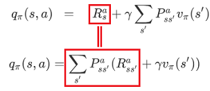

# 奖励

- [返回上层目录](../state-reward-action.md)
- [由动作价值Q公式对奖励值的困惑](#由动作价值Q公式对奖励值的困惑)
- [对奖励值的正确认知](#对奖励值的正确认知)
- [两种求动作价值Q的公式是等价的](#两种求动作价值Q的公式是等价的)

# 由动作价值Q公式对奖励值的困惑

为什么大量资料里求动作的$Q$值的公式是这么写的：
$$
q_{\pi}(s,a)=R_s^a + \gamma \sum_{s'}P_{ss'}^a v_{\pi}(s')
$$
上式看起来，好像是在说，当前时刻$s$的奖励$r$就仅仅来自于当前时刻$s$，不用到下一时刻$s'$就可以获得奖励$r$。

但是对奖励值的解释是：

> **强化学习中的奖励值，取决于当前的状态、所采取的动作、以及下一个状态**，即
> $$
> r_t=R(s_t, a_t, s_{t+1})
> $$
> 尽管上式往往会被简化为仅取决于当前状态，$r_t=R(s_t)$，或者状态-奖励对$r_t=R(s_t,a_t)$。
>
> 来自[OpenAI Spinning Up Part 1: Key Concepts in RL](https://spinningup.openai.com/en/latest/spinningup/rl_intro.html#id2)

所以**问题**来了：

按照上面对奖励值的解释，求动作的$Q$值的公式难道不应该是下面的公式吗？
$$
q_{\pi}(s,a)=\sum_{s'}P_{ss'}^a(R_{ss'}^a+\gamma v_{\pi}(s'))
$$
该公式才说明了奖励值也取决于下一个状态啊。所以到底哪个求动作$Q$值的公式对？

**解答**：

两个公式都对，是等价的，第二个公式没问题，是最正确的，**奖励就应该是$r(s,a,s')$**。像mujoco这些仿真环境的reward就是有了$s'$算出来的，而且一般自己设计的环境也是这么算的，大部分资料都是极致简化，不影响bellman update的正确性。

后面那个式子，头一项求和，就是第一个式子的那个：

要理解上图为什么是等价的，需要

* 正确认识奖励值，则会从直觉上感知到是等价的
* 对上图中的第二个公式进行推导，变为第一个公式，会从逻辑思考推导出是等价的。

下面就来完成上面两步。

# 对奖励值的正确认知

一句话解释：奖励值是期望形式的定义，所以虽然当前时刻环境的奖励看起来和下一个环境无关，但实际就是在下一个环境中多次采样得到的。

下面是对奖励值的解释，请综合起来看：

（1）[OpenAI Spinning Up Part 1: Key Concepts in RL](https://spinningup.openai.com/en/latest/spinningup/rl_intro.html#id2)中对奖励值的解释：

> **强化学习中的奖励值，取决于当前的状态、所采取的动作、以及下一个状态**，即
> $$
> r_t=R(s_t, a_t, s_{t+1})
> $$
> 尽管上式往往会被简化为仅取决于当前状态，$r_t=R(s_t)$，或者状态-奖励对$r_t=R(s_t,a_t)$。

（2）某清华大佬对奖励值的解释：

**奖励就应该是$r(s,a,s')$**。像mujoco这些仿真环境的reward就是有了$s'$算出来的，而且一般自己设计的环境也是这么算的，大部分资料都是极致简化，不影响bellman update的正确性。

（3）某AI大佬对奖励值的解释：

关于奖励的认知，$R_s^a$是对在状态$s$下执行动作$a$时可得到的**期望即时收益**的声明式数学表示，不隐含程序上的命令和动作信息，不能从这个表示方法推导出其隐含了执行$a$立刻就能收到奖励$r$或者$r$与下一时刻的状态$s'$无关的信息。强化学习中有很多不同形式的简写符号，不同地方的符号也经常不一致，比如Sutton的强化学习教材中用$r(s,a)$表示期望即时收益，其实际上是对$r(s,a)=\sum_rr\sum_{s′}⁡p(s′,r|s,a)$的简写，虽然$r$与$s'$有关，但$s'$在特定环境下本身也是由$(s,a)$决定的（比如围棋），为了表达简明跳过$s'$用$r(s,a)$表示也没什么问题，另外书中也常仅用$R_{t+1}$表示$r(s_t,a_t)$，这时一个状态和动作变量都没用，看到公式时能结合语境理解其基本含义就可以，具体的表示法和用到的变量不用过于纠结。

（4）某学强化学习的哈工程在读硕对奖励值的解释：

在Sutton的原作中关于奖励的阐述是，奖励是离开状态$s$时得到的，表示奖励是所离开状态$s$的奖励，也就是上一个状态。$R_s^a$是一个期望形式的定义。

# 两种求动作价值Q的公式是等价的

两种求动作价值$Q$的公式为：

前面已经讲了奖励的定义：

> 奖励值是期望形式的定义，所以虽然当前时刻环境的奖励看起来和下一个环境无关，但实际就是在下一个环境中多次采样得到的。

所以当你意识到奖励值是期望形式的定义，则你就会理解这两个式子其实是等价的，第二个公式是第一个公式的实际实现方式。

下面做理论推导：

（1）对于经过$s$和$a$，能得到确定性的$s'$（比如围棋下子），即$P_{ss'}^a$为1，则$Q$和$V$的转换公式可以是
$$
\begin{aligned}
q(s,a)&=P_{ss'}^a(R_{ss'}^a + \gamma v(s'))\\
&=R_{ss'}^a + \gamma v(s')\\
&=R_s^a + \gamma v(s')
\end{aligned}
$$
其中，为什么$R_{ss'}^a$可以写成$R_s^a$，是因为$s'$是由$(s,a)$决定的，比如围棋程序，所以没必要写$s'$了。

（2）对于存在环境状态转移概率的环境来说，经过$s$和$a$，得到的$s'$是不确定的，那么$Q$和$V$的转换公式为
$$
\begin{aligned}
q_{\pi}(s,a)&=\sum_{s'}P_{ss'}^a(R_{ss'}^a+\gamma v_{\pi}(s'))\\
&=\sum_{s'}P_{ss'}^a R_{ss'}^a + \gamma \sum_{s'}P_{ss'}^a v_{\pi}(s')\\
&=R_s^a + \gamma \sum_{s'}P_{ss'}^a v_{\pi}(s')
\end{aligned}
$$
看吧，即便存在下一个环境$s'$的奖励$R_{ss'}^a$，但是对于$(s,a)$来说，其奖励$R_s^a$是一个期望值，与你具体的下一个$s'$是什么没有关系，那这就可以认为在环境$s$下，一旦做出动作$a$，就马上能知道$(s,a)$的奖励$r$了，当然这只是概念上的。而实际上，这个$r$是怎么得来的呢，正如上式表示的那样，是一次次蒙特卡洛采样，对下一个环境$s'$中的得到的$(s,a)$的奖励$R_{ss'}^a$的平均（期望）值。

换句话说，可以理解为$R(s,a)$（即$R_s^a$）是一个和$s'$有关的随机变量，随机性来自于系统的状态转移概率。在对$s'$求期望后就得到了$R(s, a)$，是一个与$s'$无关的值。

再继续看上式，其中，$R_{ss'}^a$如果更严谨的说，其实也是个期望值，它的更详细的写法应该是：
$$
R_{ss'}^a=\sum_{r}\left[r\cdot p(r|s,a,s')\right]
$$
则
$$
\begin{aligned}
q_{\pi}(s,a)&=\sum_{s'}P_{ss'}^a\left(\sum_{r}\left(r\cdot p(r|s,a,s')\right)+\gamma v_{\pi}(s')\right)\\
&=\sum_{s'}P_{ss'}^a \sum_{r}\left(r\cdot p(r|s,a,s')\right) + \gamma \sum_{s'}P_{ss'}^a v_{\pi}(s')\\
&=\sum_{r}r\sum_{s'}\left(P_{ss'}^a \cdot p(r|s,a,s')\right) + \gamma \sum_{s'}P_{ss'}^a v_{\pi}(s')\\
&=\sum_{r}r\sum_{s'}p(s'|s,a)p(r|s,a,s') + \gamma \sum_{s'}P_{ss'}^a v_{\pi}(s')\\
&=\sum_{r}r\sum_{s'}\frac{p(s,a,s')}{p(s,a)}p(r|s,a,s') + \gamma \sum_{s'}P_{ss'}^a v_{\pi}(s')\ \text{可以省略，只是为了让你看的更明白}\\
&=\sum_{r}r\sum_{s'}\frac{p(r,s,a,s')}{p(s,a)} + \gamma \sum_{s'}P_{ss'}^a v_{\pi}(s')\ \text{可以省略，只是为了让你看的更明白}\\
&=\sum_{r}r\sum_{s'}p(s',r|s,a) + \gamma \sum_{s'}P_{ss'}^a v_{\pi}(s')\\
&=R_s^a + \gamma \sum_{s'}P_{ss'}^a v_{\pi}(s')
\end{aligned}
$$
上式中可以省略的那两行，依据其实是条件概率公式，即
$$
P(A|B)=\frac{P(AB)}{P(B)}
$$

# 参考资料

