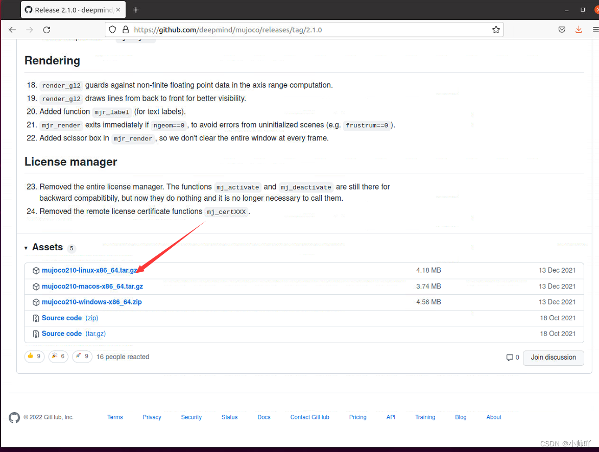
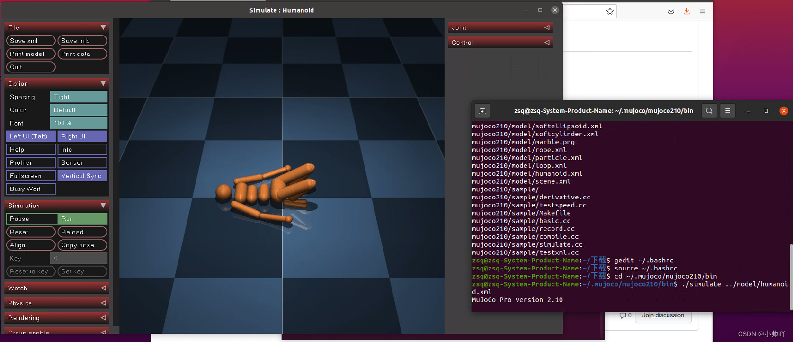
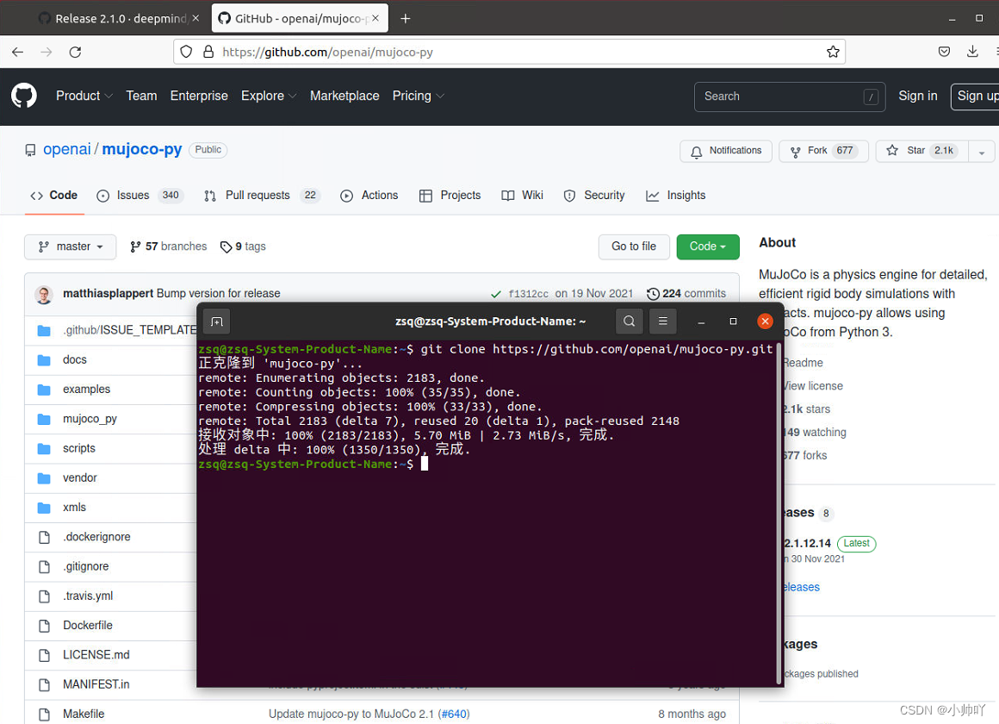
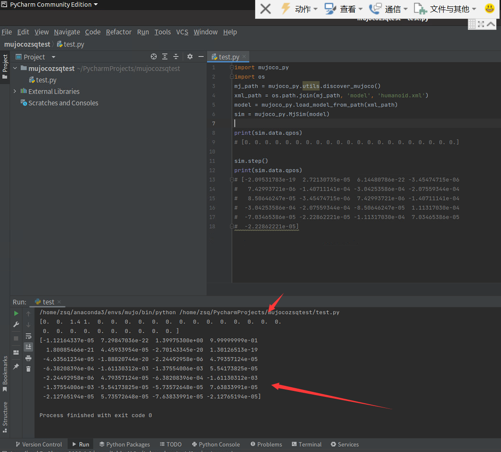

# Mujoco

* [返回上层目录](../simulation-platform.md)
* [mujoco和mujoco-py简介](#mujoco和mujoco-py简介)
* [安装mujoco](#安装mujoco)
  * [官网下载mujoco210文件](#官网下载mujoco210文件)
  * [将下载的文件解压到指定目录~/.mujoco下](#将下载的文件解压到指定目录~/.mujoco下)
  * [为mujoco配置.bashrc环境文件](#为mujoco配置.bashrc环境文件)
  * [测试mujoco安装是否成功](#测试mujoco安装是否成功)
* [安装mujoco-py](#安装mujoco-py)
  * [下载mujoco-py到本地](#下载mujoco-py到本地)
  * [开始安装mujoco-py](#开始安装mujoco-py)
  * [为mujoco-py配置.bashrc环境文件](#为mujoco-py配置.bashrc环境文件)
  * [测试mujoco-py安装是否成功](#测试mujoco-py安装是否成功)
  * [安装mujoco-py报错的解决办法](#安装mujoco-py报错的解决办法)

# mujoco和mujoco-py简介

mujoco和mujoco-py的关系：

* mujoco是一个物理引擎，主要应用于强化学习和最优化控制领域。
* mujoco-py是mujoco编程的python接口，由OpenAI Gym开发，可以使用mujoco_py方便地调用mujoco的API。

mujoco官网： https://mujoco.org/

**不同mujoco版本对应的mujoco-py版本**

Mujoco150对应的Mujoco-py版本

```shell
pip install mujoco-py==1.50.1.68
```

Mujoco200对应的Mujoco-py版本

```shell
pip install mujoco-py==2.0.2.8
```

Mujoco210对应的Mujoco-py版本

```shell
pip install mujoco-py==2.1.2.14
```

# 安装mujoco

 下面介绍Ubuntu20.04下安装mujoco210和mujoco-py。

这里[github.com/openai/mujoco-py#install-mujoco](https://github.com/openai/mujoco-py#install-mujoco)有介绍怎么装mujoco。

## 官网下载mujoco210文件

链接：https://github.com/google-deepmind/mujoco/releases/tag/2.1.0



## 将下载的文件解压到指定目录~/.mujoco下

```shell
tar -zxvf mujoco210-linux-x86_64.tar.gz -C ~/.mujoco
```

## 为mujoco配置.bashrc环境文件

```shell
vim ~/.bashrc
```

在文档最后一行加入下面代码然后保存退出文档

```shell
export LD_LIBRARY_PATH=~/.mujoco/mujoco210/bin
```

然后更新配置

```shell
source ~/.bashrc
```

## 测试mujoco安装是否成功

```shell
cd ~/.mujoco/mujoco210/bin
./simulate ../model/humanoid.xml
```



若出现上图的界面，则mujoco安装成功。

当然，如果是不带界面的linux或者远程ssh登录的linux，这一步没法做。

# 安装mujoco-py

## 下载mujoco-py到本地

```shell
git clone https://github.com/openai/mujoco-py.git
```



## 开始安装mujoco-py

```shell
cd ~/mujoco-py
pip install -U 'mujoco-py<2.2,>=2.1'
pip install -r requirements.txt
pip install -r requirements.dev.txt
python setup.py install
```

## 为mujoco-py配置.bashrc环境文件

```shell
vim ~/.bashrc
```

在最后添加下面代码然后保存退出文档

```shell
export LD_LIBRARY_PATH=$LD_LIBRARY_PATH:/usr/lib/nvidia 
```

更新配置：

```shell
source ~/.bashrc
```

## 测试mujoco-py安装是否成功

在pycharm中新建一个python文件并使用前面刚刚创建的环境

```python
import mujoco_py
import os
mj_path = mujoco_py.utils.discover_mujoco()
xml_path = os.path.join(mj_path, 'model', 'humanoid.xml')
model = mujoco_py.load_model_from_path(xml_path)
sim = mujoco_py.MjSim(model)

print(sim.data.qpos)
# [0. 0. 0. 0. 0. 0. 0. 0. 0. 0. 0. 0. 0. 0. 0. 0. 0. 0. 0. 0. 0.]

sim.step()
print(sim.data.qpos)
# [-2.09531783e-19  2.72130735e-05  6.14480786e-22 -3.45474715e-06
#   7.42993721e-06 -1.40711141e-04 -3.04253586e-04 -2.07559344e-04
#   8.50646247e-05 -3.45474715e-06  7.42993721e-06 -1.40711141e-04
#  -3.04253586e-04 -2.07559344e-04 -8.50646247e-05  1.11317030e-04
#  -7.03465386e-05 -2.22862221e-05 -1.11317030e-04  7.03465386e-05
#  -2.22862221e-05]
```



出现上图输出即mujoco-py安装成功。

## 安装mujoco-py报错的解决办法

**（1）报错distutils.errors.CompileError**

> File "/root/miniconda3/envs/tianshou/lib/python3.11/site-packages/setuptools/_distutils/unixccompiler.py", line 187, in _compile
>     raise CompileError(msg)
> distutils.errors.CompileError: command '/usr/bin/gcc' failed with exit code 1

参考：[tf_agents 下 mujoco_py 报错 CompileError 解决记录](https://www.cnblogs.com/yueshang/p/17785880.html)：

> 该原因是因为使用 pip 安装了 mujoco 和 mujoco_py , 应该从 github 上手动下载并创建目录，这里参考 <https://blog.csdn.net/qq_47997583/article/details/125400418> 即可。注意要先 pip 卸载掉 mujoco 和 mujoco_py  否则会冲突

参考：[Ubuntu20.04安装mujoco](https://blog.csdn.net/qq_47997583/article/details/125400418)：

> 如果出现Cython.Compiler.Errors.CompileError: /home/kun/.local/lib/python3.8/site-packages/mujoco_py/cymj.pyx错误，请重新安装Cython版本pip install cython==0.29.21
>
> ```shell
> pip uninstall cython
> pip install "cython<3"
> ```

**（2）报错GLIBCXX_3.4.30' not found**

> File "/root/autodl-tmp/mujoco-py/mujoco_py/builder.py", line 130, in load_dynamic_ext
>     return loader.load_module()
> ImportError: /root/miniconda3/bin/../lib/libstdc++.so.6: version `GLIBCXX_3.4.30' not found (required by /lib/x86_64-linux-gnu/libLLVM-15.so.1)

参考：[Ubuntu系统anaconda报错version `GLIBCXX_3.4.30' not found](https://blog.51cto.com/u_15642578/5736401)：

根据错误信息可以知道运行时调用C++标准库报错，显示的被调用的C++标准库地址为：

`/root/miniconda3/envs/tianshou/bin/../lib/libstdc++.so.6`

也就是说在anaconda创建的python环境中默认调用的库地址首先是自身环境的lib路径。

系统中C++标准库libstdc++.so.6文件有多个，基本是每个独立性较高的程序都在自己的环境路径下有个libstdc++.so.6文件，所以这样是因为不同的libstdc++.so.6文件可能内部的GLIBCXX版本并不相同，因此一些不需要从源码编译的软件就会采用这种方式，把符合自身版本需要的libstdc++.so.6文件放在自身的库路径下，这样在调用的时候会优先调用自身带有的libstdc++.so.6文件而不是系统自带的。

我们可以看下系统libstdc++.so.6文件中支持的GLIBCXX版本：

```shell
strings /usr/lib/x86_64-linux-gnu/libstdc++.so.6 | grep GLIBC
```

```shell
GLIBCXX_3.4
GLIBCXX_3.4.1
GLIBCXX_3.4.2
GLIBCXX_3.4.3
...
GLIBCXX_3.4.28
GLIBCXX_3.4.29
GLIBCXX_3.4.30
```

我们再看下anaconda环境下libstdc++.so.6文件中支持的GLIBCXX版本：

```shell
strings /root/miniconda3/envs/env_name/bin/../lib/libstdc++.so.6 |grep GLIBC
```

```shell
GLIBCXX_3.4
GLIBCXX_3.4.1
GLIBCXX_3.4.2
GLIBCXX_3.4.3
...
GLIBCXX_3.4.27
GLIBCXX_3.4.28
GLIBCXX_3.4.29
```

可以看到系统环境下 /usr/lib/x86_64-linux-gnu/libstdc++.so.6 文件含有GLIBCXX_3.4.30版本，而anaconda环境下/usr/lib/x86_64-linux-gnu/libstdc++.so.6文件含有的最高版本为GLIBCXX_3.4.29，因此有了前面的报错。

查看anaconda环境下libstdc++.so.6的相关文件：

```shell
cd /root/miniconda3/envs/env_name/lib
ls libstdc++.so* -al
```

```shell
libstdc++.so -> libstdc++.so.6.0.29
libstdc++.so.6 -> libstdc++.so.6.0.29
libstdc++.so.6.0.29
```

系统库路径下，libstdc++.so.6的相关文件：

```shell
cd /usr/lib/x86_64-linux-gnu/
ls libstdc++.so* -al
```

```shell
libstdc++.so.6 -> libstdc++.so.6.0.30
libstdc++.so.6.0.30
```

可以看到我们只需要将anaconda环境中libstdc++.so和libstdc++.so.6的链接地址指向系统路径中的地址即可：

```shell
cd /root/miniconda3/envs/env_name/bin/../lib
mv libstdc++.so libstdc++.so.backup
mv libstdc++.so.6 libstdc++.so.6.backup
ln -s /usr/lib/x86_64-linux-gnu/libstdc++.so.6.0.30 libstdc++.so
ln -s /usr/lib/x86_64-linux-gnu/libstdc++.so.6.0.30 libstdc++.so.6
```

那么再次查看anaconda环境下libstdc++.so.6的相关文件：

```shell
cd /root/miniconda3/envs/env_name/lib
ls libstdc++.so* -al
```

```shell
libstdc++.so -> /usr/lib/x86_64-linux-gnu/libstdc++.so.6.0.30
libstdc++.so.6 -> /usr/lib/x86_64-linux-gnu/libstdc++.so.6.0.30
libstdc++.so.6.0.29
libstdc++.so.6.backup -> libstdc++.so.6.0.29  # 旧的指向还是原来的没变
libstdc++.so.backup -> libstdc++.so.6.0.29  # 旧的指向还是原来的没变
```

发现anaconda环境中libstdc++.so和libstdc++.so.6的链接地址指向了系统路径中的libstdc++.so.6.0.30。

# 参考资料

* [Ubuntu20.04安装mujoco](https://blog.csdn.net/qq_47997583/article/details/125400418)

"安装mujoco"参考了此博客。

* [Mujoco&Mujoco-py安装教程以及常见报错解决方法](https://zhuanlan.zhihu.com/p/352304615)

"安装mujoco-py报错的解决办法"参考了此博客。

