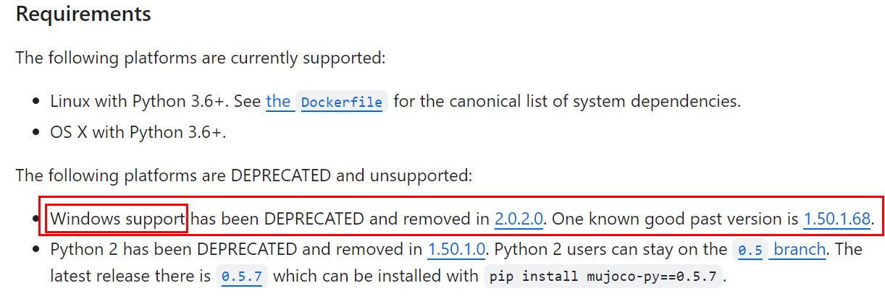
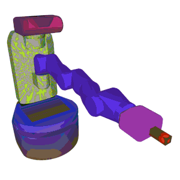
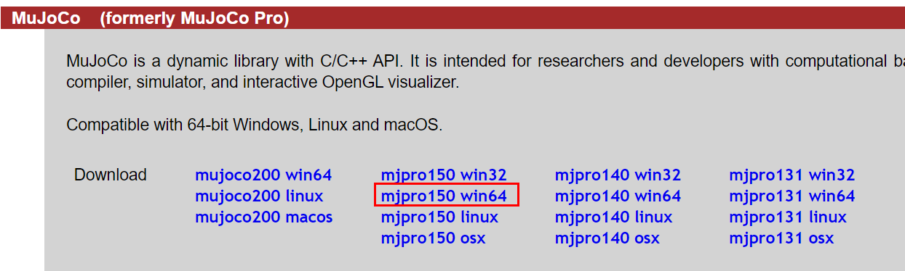
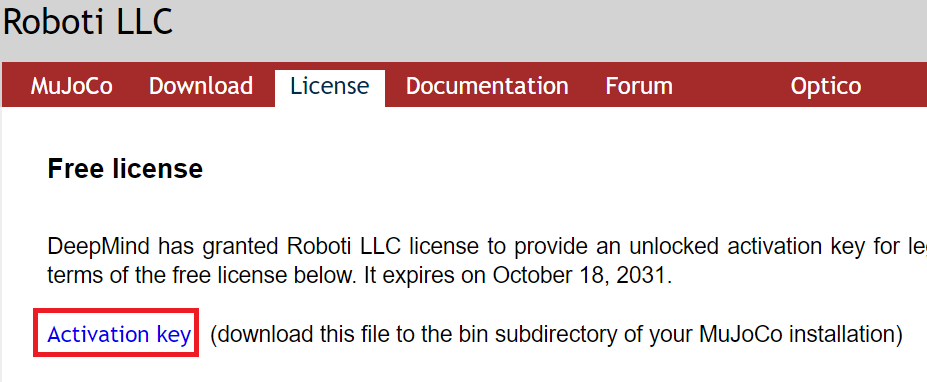
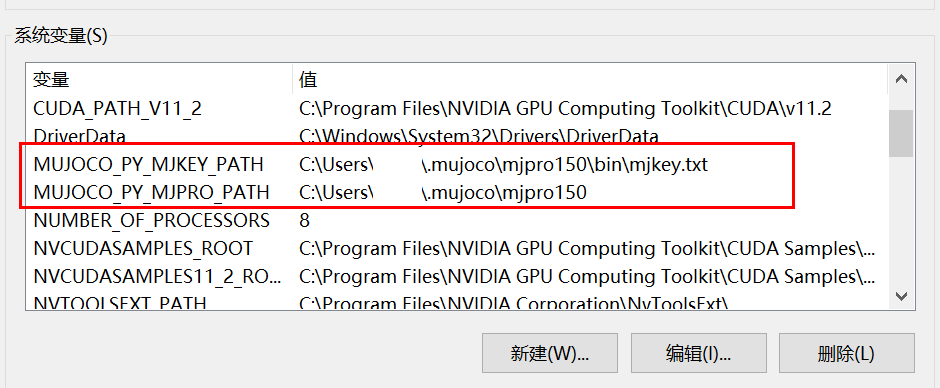
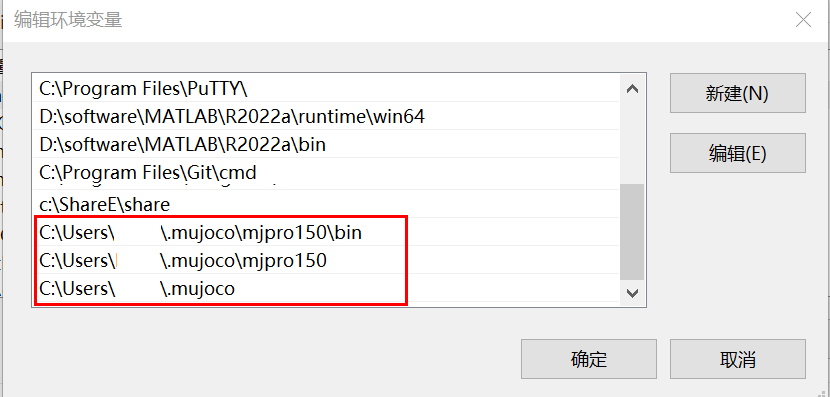
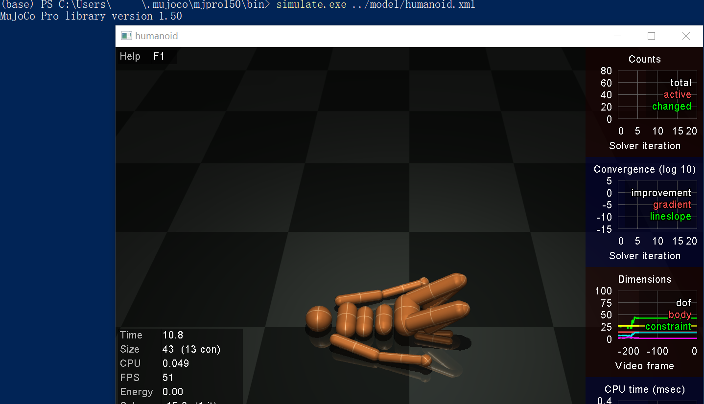
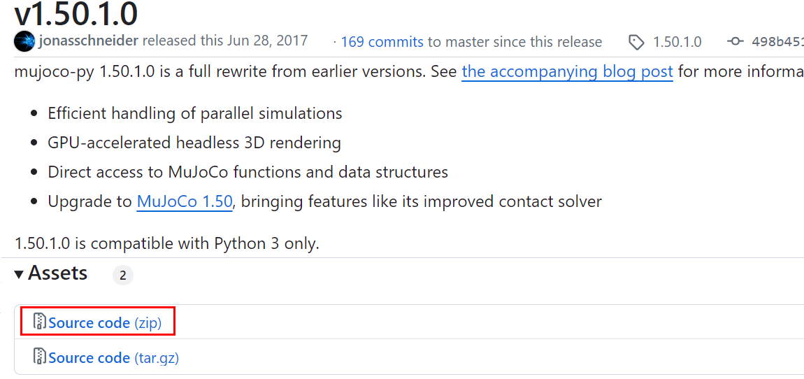
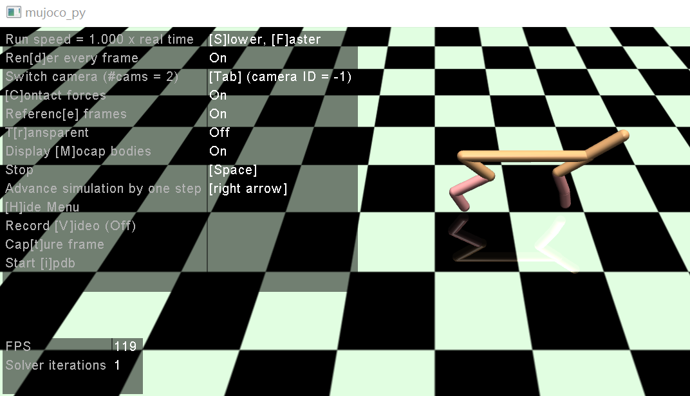

# Mujoco

* [返回上层目录](../simulation-platform.md)
* [mujoco和mujoco-py简介](#mujoco和mujoco-py简介)
* [Linux安装mujoco和mujoco-py](#Linux安装mujoco和mujoco-py)
  * [Linux安装mujoco](#Linux安装mujoco)
    * [官网下载mujoco210文件](#官网下载mujoco210文件)
    * [将下载的文件解压到指定目录~/.mujoco下](#将下载的文件解压到指定目录~/.mujoco下)
    * [为mujoco配置.bashrc环境文件](#为mujoco配置.bashrc环境文件)
    * [测试mujoco安装是否成功](#测试mujoco安装是否成功)
  * [Linux安装mujoco-py](#Linux安装mujoco-py)
    * [下载mujoco-py210](#下载mujoco-py210)
    * [安装mujoco-py210](#安装mujoco-py210)
    * [为mujoco-py配置.bashrc环境文件](#为mujoco-py配置.bashrc环境文件)
    * [测试mujoco-py安装是否成功](#测试mujoco-py安装是否成功)
    * [安装mujoco-py报错的解决办法](#安装mujoco-py报错的解决办法)
* [Win10安装mujoco和mujoco-py](#Win10安装mujoco和mujoco-py)
  * [Win10安装mujoco仿真引擎](#Win10安装mujoco仿真引擎)
    * [安装Visual-Studio-Build-Tools](#安装Visual-Studio-Build-Tools)
    * [下载mujoco安装包](#下载mujoco安装包)
    * [配置环境变量](#配置环境变量)
    * [mujoco仿真引擎测试](#mujoco仿真引擎测试)
  * [Win10安装mujoco-py](#Win10安装mujoco-py)
    * [下载mujoco-py150](#下载mujoco-py150)
    * [安装mujoco-py150](#安装mujoco-py150)
    * [测试mujoco-py150](#测试mujoco-py150)
    * [Win10安装Gym](#Win10安装Gym)

# mujoco和mujoco-py简介

MuJoCo最初由美国华盛顿大学运动控制实验室主任、神经科学家Emo Todorov开发，于2015年通过创业公司 Roboti LLC , 被打造成了商业产品。

2021年10月，DeepMind宣布收购 MuJoCo物理模拟器，并承诺将MuJoCo作为一个免费的、开源的、社区驱动的项目进行开发和维护。

mujoco官网： https://mujoco.org/


2018年4月27日，OpenAI开源了一个高性能的Python库mujoco-py，主要用于使用MuJoCo引擎进行机器人模拟。MuJoCo是一个物理引擎，是在去年的机器人研究中开发出来的。 mujoco-py是机器人模拟Python库——高效处理并行模拟，GPU加速自动3D渲染。

我们先梳理一下mujoco和它相关的一些依赖包的关系：

* mujoco是一款用C/C++写的物理仿真引擎，本身只有C语言API，主要应用于强化学习和最优化控制领域。

* mujoco-py是mujoco编程的python接口，由OpenAI Gym开发，可以使用mujoco_py方便地调用mujoco的API。如果要使用Python语言与mujoco进行互动，需要安装mujoco-py。

  > 最新版本的mujoco-py已经取消了对Windows系统的支持，官方推荐的与Windows系统兼容性较好的版本是1.50.1.68（但是官网只能下载1.50.1.0，经过测试1.50.1.0在Windows 10上也可丝滑运行），与之对应的mujoco仿真引擎的版本为mjpro150（所以不能下载mojoco210啊）。两者是我们后续安装的版本。
  >
  > mujoco-py官网https://github.com/openai/mujoco-py对windows支持的说明：
  >
  > 

* gym对mujoco-py进行了进一步地封装，提供了强化学习训练所需的标准API（reset, step等）

  > 我们的安装顺序应该是：先安装mujoco仿真引擎，再安装mujoco-py，最后安装gym。

mujoco-py源码地址

> https://github.com/openai/mujoco-py

文档地址

> https://openai.github.io/mujoco-py/build/html/index.html

该库是OpenAI深度学习机器人研究的核心工具之一，现作为mujoco-py的主要版本发布。mujoco-py1.50.1.0（初版）带来了不少新功能，性能方面也有了明显的提升，具体新功能包括：

- 可高效处理并行模拟
- GPU加速自动3D渲染
- 可直接获取MuJoCo函数和数据结构
- 支持所有MuJoCo1.50功能



# Linux安装mujoco和mujoco-py

## Linux安装mujoco

**不同mujoco版本对应的mujoco-py版本**

Mujoco150对应的Mujoco-py版本

```shell
pip install mujoco-py==1.50.1.68
```

Mujoco200对应的Mujoco-py版本

```shell
pip install mujoco-py==2.0.2.8
```

Mujoco210对应的Mujoco-py版本

```shell
pip install mujoco-py==2.1.2.14
```

 下面介绍Ubuntu20.04下安装mujoco210和mujoco-py。

这里[github.com/openai/mujoco-py#install-mujoco](https://github.com/openai/mujoco-py#install-mujoco)有介绍怎么装mujoco。

### 官网下载mujoco210文件

链接：https://github.com/google-deepmind/mujoco/releases/tag/2.1.0


### 将下载的文件解压到指定目录~/.mujoco下

```shell
tar -zxvf mujoco210-linux-x86_64.tar.gz -C ~/.mujoco
```

### 为mujoco配置.bashrc环境文件

```shell
vim ~/.bashrc
```

在文档最后一行加入下面代码然后保存退出文档

```shell
export LD_LIBRARY_PATH=~/.mujoco/mujoco210/bin
```

然后更新配置

```shell
source ~/.bashrc
```

### 测试mujoco安装是否成功

```shell
cd ~/.mujoco/mujoco210/bin
./simulate ../model/humanoid.xml
```


若出现上图的界面，则mujoco安装成功。

当然，如果是不带界面的linux或者远程ssh登录的linux，这一步没法做。

## Linux安装mujoco-py

### 下载mujoco-py210

```shell
git clone https://github.com/openai/mujoco-py.git
```


### 安装mujoco-py210

```shell
cd ~/mujoco-py
pip install -U 'mujoco-py<2.2,>=2.1'
pip install -r requirements.txt
pip install -r requirements.dev.txt
python setup.py install
```

### 为mujoco-py配置.bashrc环境文件

```shell
vim ~/.bashrc
```

在最后添加下面代码然后保存退出文档

```shell
export LD_LIBRARY_PATH=$LD_LIBRARY_PATH:/usr/lib/nvidia 
```

更新配置：

```shell
source ~/.bashrc
```

### 测试mujoco-py安装是否成功

在pycharm中新建一个python文件并使用前面刚刚创建的环境

```python
import mujoco_py
import os
mj_path = mujoco_py.utils.discover_mujoco()
xml_path = os.path.join(mj_path, 'model', 'humanoid.xml')
model = mujoco_py.load_model_from_path(xml_path)
sim = mujoco_py.MjSim(model)

print(sim.data.qpos)
# [0. 0. 0. 0. 0. 0. 0. 0. 0. 0. 0. 0. 0. 0. 0. 0. 0. 0. 0. 0. 0.]

sim.step()
print(sim.data.qpos)
# [-2.09531783e-19  2.72130735e-05  6.14480786e-22 -3.45474715e-06
#   7.42993721e-06 -1.40711141e-04 -3.04253586e-04 -2.07559344e-04
#   8.50646247e-05 -3.45474715e-06  7.42993721e-06 -1.40711141e-04
#  -3.04253586e-04 -2.07559344e-04 -8.50646247e-05  1.11317030e-04
#  -7.03465386e-05 -2.22862221e-05 -1.11317030e-04  7.03465386e-05
#  -2.22862221e-05]
```


出现上图输出即mujoco-py安装成功。

### 安装mujoco-py报错的解决办法

**（1）报错distutils.errors.CompileError**

> File "/root/miniconda3/envs/tianshou/lib/python3.11/site-packages/setuptools/_distutils/unixccompiler.py", line 187, in _compile
>     raise CompileError(msg)
> distutils.errors.CompileError: command '/usr/bin/gcc' failed with exit code 1

参考：[tf_agents 下 mujoco_py 报错 CompileError 解决记录](https://www.cnblogs.com/yueshang/p/17785880.html)：

> 该原因是因为使用 pip 安装了 mujoco 和 mujoco_py , 应该从 github 上手动下载并创建目录，这里参考 <https://blog.csdn.net/qq_47997583/article/details/125400418> 即可。注意要先 pip 卸载掉 mujoco 和 mujoco_py  否则会冲突

参考：[Ubuntu20.04安装mujoco](https://blog.csdn.net/qq_47997583/article/details/125400418)：

> 如果出现Cython.Compiler.Errors.CompileError: /home/kun/.local/lib/python3.8/site-packages/mujoco_py/cymj.pyx错误，请重新安装Cython版本pip install cython==0.29.21
>
> ```shell
> pip uninstall cython
> pip install "cython<3"
> ```

**（2）报错GLIBCXX_3.4.30' not found**

> File "/root/autodl-tmp/mujoco-py/mujoco_py/builder.py", line 130, in load_dynamic_ext
>     return loader.load_module()
> ImportError: /root/miniconda3/bin/../lib/libstdc++.so.6: version `GLIBCXX_3.4.30' not found (required by /lib/x86_64-linux-gnu/libLLVM-15.so.1)

参考：[Ubuntu系统anaconda报错version `GLIBCXX_3.4.30' not found](https://blog.51cto.com/u_15642578/5736401)：

根据错误信息可以知道运行时调用C++标准库报错，显示的被调用的C++标准库地址为：

`/root/miniconda3/envs/tianshou/bin/../lib/libstdc++.so.6`

也就是说在anaconda创建的python环境中默认调用的库地址首先是自身环境的lib路径。

系统中C++标准库libstdc++.so.6文件有多个，基本是每个独立性较高的程序都在自己的环境路径下有个libstdc++.so.6文件，所以这样是因为不同的libstdc++.so.6文件可能内部的GLIBCXX版本并不相同，因此一些不需要从源码编译的软件就会采用这种方式，把符合自身版本需要的libstdc++.so.6文件放在自身的库路径下，这样在调用的时候会优先调用自身带有的libstdc++.so.6文件而不是系统自带的。

我们可以看下系统libstdc++.so.6文件中支持的GLIBCXX版本：

```shell
strings /usr/lib/x86_64-linux-gnu/libstdc++.so.6 | grep GLIBC
```

```shell
GLIBCXX_3.4
GLIBCXX_3.4.1
GLIBCXX_3.4.2
GLIBCXX_3.4.3
...
GLIBCXX_3.4.28
GLIBCXX_3.4.29
GLIBCXX_3.4.30
```

我们再看下anaconda环境下libstdc++.so.6文件中支持的GLIBCXX版本：

```shell
strings /root/miniconda3/envs/env_name/bin/../lib/libstdc++.so.6 |grep GLIBC
```

```shell
GLIBCXX_3.4
GLIBCXX_3.4.1
GLIBCXX_3.4.2
GLIBCXX_3.4.3
...
GLIBCXX_3.4.27
GLIBCXX_3.4.28
GLIBCXX_3.4.29
```

可以看到系统环境下 /usr/lib/x86_64-linux-gnu/libstdc++.so.6 文件含有GLIBCXX_3.4.30版本，而anaconda环境下/usr/lib/x86_64-linux-gnu/libstdc++.so.6文件含有的最高版本为GLIBCXX_3.4.29，因此有了前面的报错。

查看anaconda环境下libstdc++.so.6的相关文件：

```shell
cd /root/miniconda3/envs/env_name/lib
ls libstdc++.so* -al
```

```shell
libstdc++.so -> libstdc++.so.6.0.29
libstdc++.so.6 -> libstdc++.so.6.0.29
libstdc++.so.6.0.29
```

系统库路径下，libstdc++.so.6的相关文件：

```shell
cd /usr/lib/x86_64-linux-gnu/
ls libstdc++.so* -al
```

```shell
libstdc++.so.6 -> libstdc++.so.6.0.30
libstdc++.so.6.0.30
```

可以看到我们只需要将anaconda环境中libstdc++.so和libstdc++.so.6的链接地址指向系统路径中的地址即可：

```shell
cd /root/miniconda3/envs/env_name/bin/../lib
mv libstdc++.so libstdc++.so.backup
mv libstdc++.so.6 libstdc++.so.6.backup
ln -s /usr/lib/x86_64-linux-gnu/libstdc++.so.6.0.30 libstdc++.so
ln -s /usr/lib/x86_64-linux-gnu/libstdc++.so.6.0.30 libstdc++.so.6
```

那么再次查看anaconda环境下libstdc++.so.6的相关文件：

```shell
cd /root/miniconda3/envs/env_name/lib
ls libstdc++.so* -al
```

```shell
libstdc++.so -> /usr/lib/x86_64-linux-gnu/libstdc++.so.6.0.30
libstdc++.so.6 -> /usr/lib/x86_64-linux-gnu/libstdc++.so.6.0.30
libstdc++.so.6.0.29
libstdc++.so.6.backup -> libstdc++.so.6.0.29  # 旧的指向还是原来的没变
libstdc++.so.backup -> libstdc++.so.6.0.29  # 旧的指向还是原来的没变
```

发现anaconda环境中libstdc++.so和libstdc++.so.6的链接地址指向了系统路径中的libstdc++.so.6.0.30。

# Win10安装mujoco和mujoco-py

需要特别说明的一点是，目前 MuJoCo主要适用于Linux系统或MacOS系统，Windows系统支持最完美的版本是 mjpro150和mujoco-py1.50.1.0。mujoco-py2以上版本已经不支持Windows。

参考资料：

[Win 10、Win 11 安装 MuJoCo 及 mujoco-py 教程](https://blog.csdn.net/alan1ly/article/details/126087866)

[【Mujoco】在Win10下的安装](https://zhuanlan.zhihu.com/p/525624530)

## Win10安装mujoco仿真引擎

### 安装Visual-Studio-Build-Tools

```
注意：因为我本人电脑上已经装了VS了，我应该之前安装VS的时候已经做过下面的操作步骤了。所以下面的我都实际没做过，只是复制过来放这里供参考。
```

该部分是程序最终能成功运行的非常重要的一环！

这一步在整个安装过程中是必不可少的，因为 mujoco仿真引擎是基于C/C++的，所以每一次运行时实际上都是通过 VS Build Tools 进行编译转换。这边先给出 Microsoft Visual Studio 的官网：[下载 Visual Studio Tools - 免费安装 Windows、Mac、Linux (microsoft.com)](https://visualstudio.microsoft.com/zh-hans/downloads/)

如果你决定安装 22 版本的 visual studio build tools，可以直接在官网页面下拉找到`所有下载-适用于 Visual Studio 2022 的工具-Visual Studio 2022 生成工具`进行下载，具体如下图所示：


其实这一步我没做，只是复制过来放这里，因为我电脑上已经装了VS了，我应该之前已经做过了。

> 有其他教程中说只需要勾选 `Windows 10 SDK` 即可完成该步骤，在我的实际安装测试中是无法正常运行程序的，所以建议还是勾选 `Visual C++ 生成工具`，整体的占用的硬盘空间也多不了多少。


### 下载mujoco安装包

官网下载`mjpro150_win64.zip`，下载链接：[Download](https://www.roboti.us/download.html)



将下载的**.zip**文件解压到一个目录，这个目录非常重要，是后续添加环境变量时需要用到的，我使用的目录为：

```shell
C:\Users\user_name\.mujoco
```

.mujoco目录下有`mjpro150`文件夹：

```shell
C:\Users\user_name\.mujoco\mjpro150
```

注意！`.mujoco`文件夹内的子文件夹必须命名为`mjpro150`，不可用其他名字，否则后面会报错！

之后，将激活文件“mjkey.txt”（从2021.10开始，mujoco已经完全免费了，不用像以前一样申请试用啦！）放入`C:\Users\user_name\.mujoco`和`C:\Users\user_name\.mujoco\mjpro150\bin`路径下。当然，你也可以去官网下载激活文件，下载链接：[License](https://www.roboti.us/license.html)。



### 配置环境变量

然后，再配置系统环境变量。先在`系统变量`中，添加以下环境变量

```shell
变量名：MUJOCO_PY_MJPRO_PATH
变量值：C:\Users\user_name\.mujoco\mjpro150

变量名：MUJOCO_PY_MJKEY_PATH
变量值：C:\Users\user_name\.mujoco\mjpro150\bin\mjkey.txt
```



然后，再在`系统变量-PATH`中添加以下路径：

```shell
C:\Users\user_name\.mujoco\mjpro150\bin
C:\Users\user_name\.mujoco\mjpro150
C:\Users\user_name\.mujoco
```



### mujoco仿真引擎测试

至此，我们已经完成了第一步--mujoco仿真引擎的安装，可以通过在cmd控制台中输入以下命令来测试：

```shell
cd C:\Users\user_name\.mujoco\mjpro150\bin
simulate.exe ../model/humanoid.xml
```

如果一切顺利，你将看到




## Win10安装mujoco-py

### 下载mujoco-py150

如果用

```shell
pip install mujoco-py
```

那么，默认装的是最新版本，比如此时默认装的是`mujoco-py-2.1.2.14`，就版本不匹配了。

实际此时对应`mujoco150`版本的是`mujoco-py==1.50.1.0`。那么可以按照下面的

```shell
pip install mujoco-py==1.50.1.0
```

来装吗？我试过了，安装不成功。

所以，就还是按照参考教程上一步步来吧：

千万不要直接pip install mujoco-py，否则各种bug会修得你怀疑人生。正确方法是去官网：

[https://github.com/openai/mujoco-py/releases](https://github.com/openai/mujoco-py/releases) 

下载`mujoco-py-1.50.1.0.tar.gz`并安装。



### 安装mujoco-py150

将压缩包内的文件解压，然后进入该文件夹，打开cmd控制台，依次执行如下指令：

```shell
conda activate env_name  # 激活虚拟环境
pip install -r requirements.txt  # 下载并安装相关依赖
pip install -r requirements.dev.txt  # 下载并安装相关依赖
python setup.py install # 安装mujoco-py
```

### 测试mujoco-py150

至此，我们已经完成了第二步--mujoco-py的安装，可以用以下py脚本来测试：

```python
import mujoco_py
import os
mj_path, _ = mujoco_py.utils.discover_mujoco()
xml_path = os.path.join(mj_path, 'model', 'humanoid.xml')
model = mujoco_py.load_model_from_path(xml_path)
sim = mujoco_py.MjSim(model)
print(sim.data.qpos)
sim.step()
print(sim.data.qpos)
```

报错：

```shell
File "C:\Users\user_name\Anaconda3\envs\torch\lib\site-packages\Cython\Build\Dependencies.py", line 1321, in cythonize_one
    raise CompileError(None, pyx_file)
Cython.Compiler.Errors.CompileError: C:\Users\user_name\Desktop\mujoco-py-1.50.1.0\mujoco_py\cymj.pyx
```

解决办法：

```shell
conda list |grep cython
# 查看cython版本，是否大于等于3.0，如果是，需要降版本，按下面的来
pip uninstall cython
pip install "cython<3"
```

再次运行上面的python代码，结果如下：

```shell
  正在创建库 C:\Users\user_name\Desktop\mujoco-py-1.50.1.0\mujoco_py\generated\_pyxbld_WindowsExtensionBuilder\temp.win-amd64-3.8\Release\Users\user_name\Desktop\mujoco-py-1.50.1.0\mujoco_py/gl\cymj.cp38-win_amd64.lib 和对象 C:\Users\user_name\Desktop\mujoco-py-1.50.1.0\mujoco_py\generated\_pyxbld_WindowsExtensionBuilder\temp.win-amd64-3.8\Release\Users\user_name\Desktop\mujoco-py-1.50.1.0\mujoco_py/gl\cymj.cp38-win_amd64.exp
正在生成代码
已完成代码的生成
[0.  0.  1.4 1.  0.  0.  0.  0.  0.  0.  0.  0.  0.  0.  0.  0.  0.  0.
 0.  0.  0.  0.  0.  0.  0.  0.  0.  0. ]
[-1.27161562e-06  8.11077220e-22  1.39996033e+00  1.00000000e+00
 -3.03194099e-22  5.72581843e-06  4.82416781e-21  4.24327899e-21
  7.56543337e-06 -2.67335148e-21 -5.48340066e-07  1.11131854e-05
 -1.31327715e-04 -3.02014428e-04 -3.07930146e-04  1.38935774e-05
 -5.48340066e-07  1.11131854e-05 -1.31327715e-04 -3.02014428e-04
 -3.07930146e-04 -1.38935774e-05 -8.12365751e-06  9.97029984e-06
 -2.12264641e-06  8.12365751e-06 -9.97029984e-06 -2.12264641e-06]
```

### Win10安装Gym

打开cmd控制台，依次执行以下命令：

```shell
pip install gym[mujoco]
```

至此，所有依赖都以安装完成，可以用以下py脚本进行测试：

```python
import gym
env = gym.make('HalfCheetah-v2', render_mode='human')
# env = gym.make('CartPole-v0')
env.reset()
done = False
a = 0
while not done:
    _, _, done, _, _ = env.step(env.action_space.sample())
    env.render()
    a += 1
    print(a)
env.close()
```

发现出错：

```shell
distutils.errors.DistutilsFileError: could not create 文件名太长
```

找到解决办法：

[distutils.errors.DistutilsFileError: could not create...mujoco_py-1.50.1.0-py3.7.egg‘: 文件名或扩展名太长问题解决](https://blog.csdn.net/li1873997/article/details/130810816)

把C:\Users\luckyli\anaconda3\envs\py37\Lib\site-packages\mujoco_py-1.50.1.0-py3.7.egg下面的mujoco_py文件夹整体复制到C:\Users\luckyli\anaconda3\envs\py37\Lib\site-packages下面。该bug解决能运行出结果，虽然报了一些乱码。



Enjoy！

# 参考资料

* [Ubuntu20.04安装mujoco](https://blog.csdn.net/qq_47997583/article/details/125400418)

"安装mujoco"参考了此博客。

* [Mujoco&Mujoco-py安装教程以及常见报错解决方法](https://zhuanlan.zhihu.com/p/352304615)

"安装mujoco-py报错的解决办法"参考了此博客。

