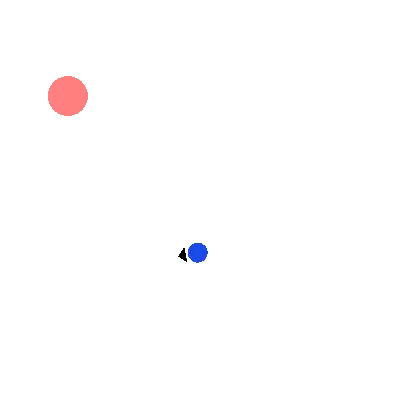

# OpenAI的Gym

* [返回上层目录](../simulation-platform.md)
* [Gym介绍](#Gym介绍)
  * [gymnasium](#gymnasium)
  * [gym](#gym)
* [动作空间](#动作空间)
  * [离散动作空间（Discrete）](#离散动作空间（Discrete）)
  * [连续动作空间（Box）](#连续动作空间（Box）)
* [基于GYM的环境](#基于GYM的环境)
  * [gym-hybrid](#gym-hybrid)


# Gym介绍

## gymnasium

现在更推荐用`gymnasium` 代替 `gym` 包， 即

```python
import gymnasium as gym  # 使用 gymnasium 包

env = gym.make("CartPole-v1")  # 创建一个环境
env.reset()  # 重置环境
action = env.action_space.sample()  # 从动作空间随机采样一个动作
observation, reward, done, truncated, info = env.step(action)  # 采取一个动作并获得反馈
```

理由：

- `gymnasium` 是 `gym` 包的继承版本，旨在提供更好的维护和支持，解决一些旧版 `gym` 包中的问题。
- `gymnasium` 包已经成为 `gym` 的替代品，并且是当前强化学习社区推荐使用的版本。
- 使用 `gymnasium` 可以享受到更活跃的开发和长期支持，且与 `gym` 保持高兼容性。

因此，如果你正在开始一个新项目或在已有项目中更新库，建议使用 `gymnasium` 而不是 `gym`。

## gym

[OpenAI Gym 官网](https://www.gymlibrary.dev/)

大家可以到官网上看一下GYM包含的环境。包含了从简单的Classic control、Toy text，到更复杂的MuJoCo、Robotics，当然包括Atari游戏。 环境还在不断扩展，现在也包括一些第三方的环境，例如围棋等。 所以我们经常用它来检验算法的有效性。

Gym的安装方式：

```shell
pip --default-timeout=100 install gym -i https://pypi.tuna.tsinghua.edu.cn/simple
```

# 动作空间

```python
from gymnasium import spaces
```

在使用 `gymnasium` 库时，`spaces` 模块提供了多种方式来定义动作空间，其中最常用的是通过 `Discrete` 或 `Box` 类来定义离散空间或连续空间。

根据你的问题，假设你想要定义一个动作空间，并且从这个空间中随机采样。下面是如何做的：

## 离散动作空间（Discrete）

如果你的动作空间是离散的，比如选择一个从 `0` 到 `n-1` 的整数值，那么你可以使用 `spaces.Discrete(n)` 来定义这个空间，其中 `n` 是可能的动作数量。

定义一个离散空间并随机采样：

```python
import gymnasium as gym
from gymnasium import spaces

# 定义一个动作空间，假设我们有 3 个可能的动作：0, 1, 2
action_space = spaces.Discrete(3)

# 随机采样一个动作
random_action = action_space.sample()

print("随机选择的动作:", random_action)
# 2
```

## 连续动作空间（Box）

如果你的动作是连续的，比如一个浮动范围内的数值，可以使用 `spaces.Box(low, high, shape, dtype)` 来定义这个动作空间。`low` 和 `high` 分别是动作值的最小值和最大值，`shape` 是空间的维度，`dtype` 是数据类型（通常为 `float32` 或 `float64`）。

定义一个连续动作空间并随机采样：

假设你的动作空间是一个二维连续空间，其中第一个动作值在 `[0, 10]` 范围内，第二个动作值在 `[-1, 1]` 范围内。

```python
import gymnasium as gym
from gymnasium import spaces
import numpy as np

# 定义一个二维连续空间，第一个维度范围是 [-1, 1]，第二个维度范围是 [-2, 2]
action_space = spaces.Box(low=np.array([-1, -2]), high=np.array([1, 2]), dtype=np.float32)

# 随机采样一个动作
random_action = action_space.sample()

print("随机选择的连续动作:", random_action)
# np.array([-0.6607042 , -0.49352086], dtype=float32)
```

还有一种不是很常用的用法，当每个维度的界限相同时，即一个空间的每个维度在相同的范围内：

例如，如果你有一个连续的空间（如 `Box` 类型），并且每个维度的最小值和最大值都是一样的，那么就可以说是“每个维度的界限相同”。但是此时的动作空间是二维数组，不是一维向量。

```python
import gymnasium as gym
from gymnasium import spaces
import numpy as np

action_space = spaces.Box(low=-1.0, high=2.0, shape=(3, 4), dtype=np.float32)

# 随机采样一个动作
random_action = action_space.sample()

print("随机选择的连续动作:", random_action)
# [[ 0.49343497  0.7641615   0.9541908  -0.4882543 ]
#  [ 1.7855189  -0.12472776  1.2340772  -0.05208393]
#  [ 0.2806511  -0.28801662  1.667343   -0.38314575]]
```

## 离散连续混合动作空间

因为在**复杂环境**中：

- 动作往往不是一个单一的离散决策
- 你可能需要：
  - 选择动作类型（Discrete）
  - 为每种动作类型提供参数（Box）
  - 多维度组合、条件动作、多模态输出……

这时候动作空间的结构一般是 `gym.spaces.Tuple` 或 `gym.spaces.Dict`，必须**显式处理各个子空间**。

```python
from gym.spaces import Tuple, Discrete, Box

self.action_space = Tuple((
    Discrete(3),                 # 动作类型：加速、减速、拐弯
    Box(low=-1, high=1, shape=(4,))  # 动作参数（加速度、减速度，拐弯角度等）
))
```

你就不能再用 `env.action_space.n` 了，而是：

```python
discrete_part = env.action_space[0]
param_part = env.action_space[1]

n_discrete_actions = discrete_part.n  # ✅ 输出 2
param_shape = param_part.shape  # ✅ 输出 (3,)
```

`env.action_space.n` 是强化学习新手入门时的“甜蜜糖果”，但一旦环境复杂了，就得自己动手处理每个动作子空间了。


如果是 `Dict` 类型：

```python
from gym.spaces import Dict

self.action_space = Dict({
    "action_type": Discrete(3),
    "params": Box(low=-1.0, high=1.0, shape=(2,))
})

env.action_space["action_type"].n  # ✅ 输出 3
env.action_space["params"].shape  # ✅ 输出 (2,)
```


# 基于GYM的环境

## 常见环境

### 常见使用场景：

| 场景                         | 是否使用 `env.action_space.n` | 说明                              |
| ---------------------------- | ----------------------------- | --------------------------------- |
| `CartPole-v1`（左右移动）    | ✅ 是                          | 动作是 `Discrete(2)`              |
| `MountainCar-v0`             | ✅ 是                          | 动作是 `Discrete(3)`              |
| `Atari` 游戏环境             | ✅ 是                          | 动作是 `Discrete(n)`，n取决于游戏 |
| 自定义简单环境               | ✅ 是                          | 纯离散动作可直接用 `.n`           |
| **复杂策略（混合动作空间）** | ❌ 否                          | 动作结构复杂，不适用 `.n`         |
| 多智能体、参数化策略         | ❌ 否                          | 动作空间可能是 `Dict`, `Tuple` 等 |


## 非官方自带环境

## gym-hybrid

GitHub地址：[thomashirtz/gym-hybrid](https://github.com/thomashirtz/gym-hybrid)



# 参考资料


===

[Gym小记（二） 浅析Gym中的env](https://blog.csdn.net/u013745804/article/details/78397106)

对倒立摆环境[Pendulum-v0](https://github.com/openai/gym/blob/master/gym/envs/classic_control/pendulum.py)做了分析。

[gym例子及二次开发](https://zhuanlan.zhihu.com/p/462248870)

给出一个最简单的例子，剖析了gym环境构建

[如何创建gym环境](https://blog.csdn.net/stanleyrain/article/details/127880978)

这就比较复杂了