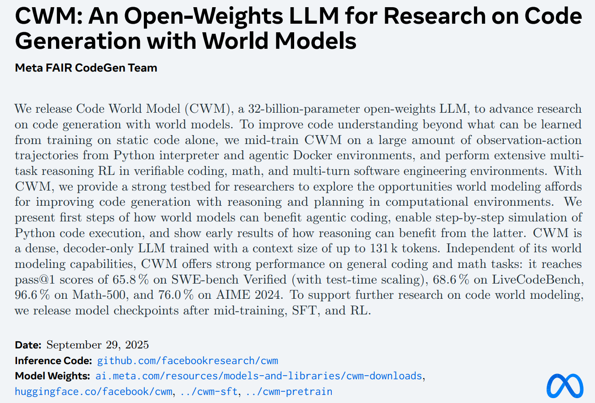
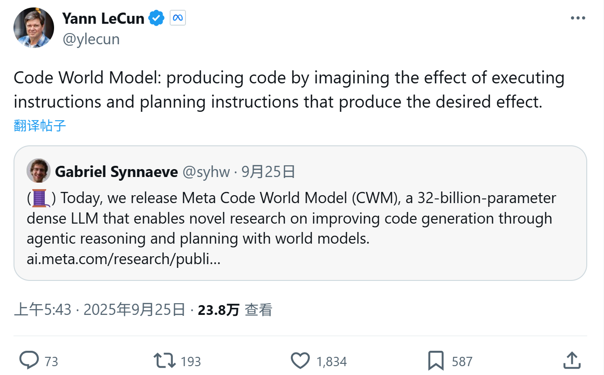

# CWM: Code World Models

* [返回上层目录](../meta.md)

# CWM: An Open-Weights LLM for Research on Code Generation with World Models

[Meta官方发表的文章网页版](https://ai.meta.com/research/publications/cwm-an-open-weights-llm-for-research-on-code-generation-with-world-models/)，[pdf 下载地址](https://scontent-sin11-2.xx.fbcdn.net/v/t39.2365-6/557661924_1786317938658057_6511429830363523883_n.pdf?_nc_cat=101&ccb=1-7&_nc_sid=3c67a6&_nc_ohc=3GQUU4R9xVkQ7kNvwHkbXgU&_nc_oc=AdnGo96FzNAUwwjPeuRXQJIH0UkYvTgcNEgFAq118xVHBEUfJuGG93DEll00jnDi7NE&_nc_zt=14&_nc_ht=scontent-sin11-2.xx&_nc_gid=JR55bNZiyqpFOLOuFdiF0g&oh=00_AfeHrRrsCMiKX-6Yw7iKdh1s30PwkzmVHrh1xjG0Qf9IRw&oe=68F6E269)

GitHub: [facebookresearch/cwm](https://github.com/facebookresearch/cwm)

Lecun的X推特发帖：

# 参考资料

* [重磅开源！LeCun团队推出全球首个代码世界模型，编程范式彻底变革](https://mp.weixin.qq.com/s/m2V1MKSg9x9i9CTcCMpV0A)
